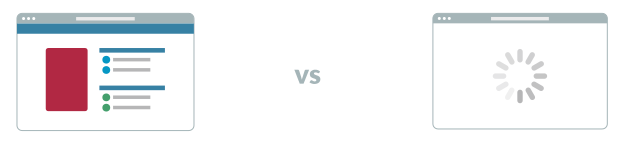
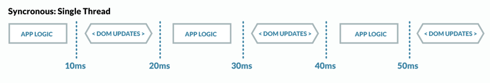
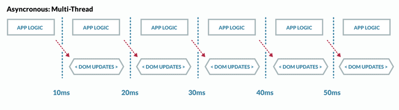
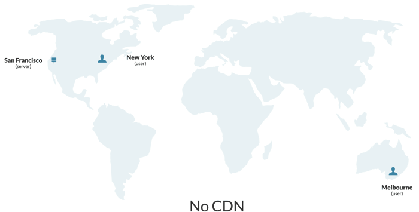
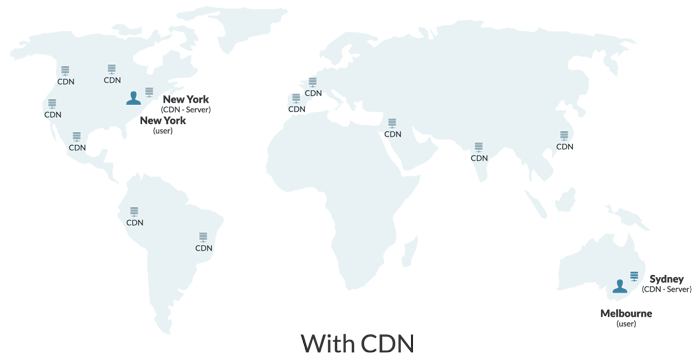
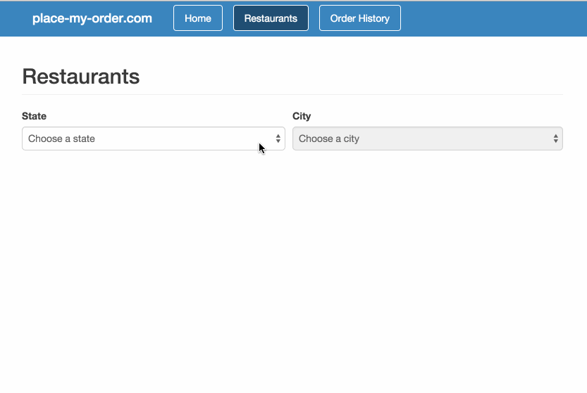

@page Features
@parent DoneJS
@hide sidebar
@outline 2 ol

@description Learn what DoneJS can do for your application and developers.

@body

## Performance Features

### Server Side Rendered

DoneJS applications are written as [Single Page Applications](http://en.wikipedia.org/wiki/Single-page_application),
and are able to be rendered on the server by running the same code. This is known as [Isomorphic JavaScript](http://isomorphic.net/javascript) aka [Universal JavaScript](https://medium.com/@mjackson/universal-javascript-4761051b7ae9). Server side rendering comes with great benefits:

#### Speed
A user sees their content immediately. No spinners necessary.



DoneJS brings server side rendering with an incredibly fast, single context virtual DOM.

Running a single context on the server (default, but optional), no additional processes or memory is used per request. You don't even have to reload the application. This eliminates all of the overhead baggage you used to expect from a server request, and gets it done as fast as possible.

#### SEO
While [Google can execute JavaScript](http://googlewebmastercentral.blogspot.ca/2014/05/understanding-web-pages-better.html), it's not perfect and there are many other search engines that want to scrape your site and drive traffic your way.

Rendering requests in DoneJS uses a virtual DOM that only implements the fundamental apis that jQuery needs to manipulate the DOM. That means the rendering here is *fast* and your markup is ready to serve with the SEO benefits a static page would have.

#### DoneJS compared to alternatives
Other solutions to server side rendering force you to get all the data manually, to know when the page is done loading, and make it difficult to have components load their own data. DoneJS takes care of all of this and makes it incredibly easy to make your most important components immediately visible to the user and to the bots crawling your site. And because DoneJS renders using a [virtual DOM](https://github.com/canjs/can-simple-dom), it's super fast and only carrying a fraction of the weight an approach using a full headless browser has.

#### How easy?
Just add one line to your most important components:
```
this.attr( "%root" ).waitFor( promise );
```
and the component will be rendered with its data from the resolved promise before it's served up!

```
can.Component.extend({
  tag: "user-name",
  template: can.stache( "{{user.name}}" ),
  viewModel: {
    init: function () {
      var promise = User.getOne( { id: this.attr( "id" ) } );
      this.attr( "%root" ).waitFor( promise );
      promise.then( ( user ) => { this.attr( "user", user ); } );
    }
  }
});
```

View the documentation for can-ssr [here](https://github.com/canjs/can-ssr).

[Follow the Guide](./place-my-order.html) to see how to set up server side rendering in your app!


### Progressive Loading

DoneJS applications load only the JavaScript and CSS they need, when they need it, in highly optimized and cachable bundles. That means your application will load *fast*.

Steal analyzes the dependencies of each page and bundle them in a way that has the lowest possible wasted size across page requests. Check it out:
<iframe width="560" height="315" src="https://www.youtube.com/embed/C-kM0v9L9UY" frameborder="0" allowfullscreen></iframe>

Our algorithm is VERY smart with the optimization and doesn't require you to configure your bundles like our competitors do. For example, should jQuery and Underscore be in some "core" library? StealJS makes these decisions for you, better than you could make for yourself.

#### And it's super easy to use!
Progressive loading is done simply by specifying it directly in your templates. Here, as the page changes, it will begin loading the additional JS needed and briefly show "Loading..." until it completes:

```
<div>
  {{#eq page 'chat'}}
    <can-import from="donejs-chat/messages/">
      {{#if isPending}}
        Loading...
      {{else}}
        <chat-messages/>
      {{/if}}
    </can-import>
  {{else}}
    <can-import from="donejs-chat/home.component!">
      {{#if isPending}}
        Loading...
      {{else}}
        <chat-home/>
      {{/if}}
    </can-import>
  {{/eq}}
</div>
```

That's it! No need for additional configuration in your JavaScript.


### Caching and Minimal Data Requests

DoneJS applications are able to do variety of performance improvements by intelligently managing the data 
layer.  Example techniques:

 - Fall through cache - Show data in localStorage cache immediately, but in the background, look for updates on the server.
 - Combine requests - Instead of making multiple, independent requests, combine them into a single request.
 - Request difference - Only request data that hasn't already loaded.
 - Inline cache - Provide response data for all initial JavaScript requests.
 - Service worker background caching - Use a service worker to load and cache data in the background so it is ready when the
   user visits the page.


### Minimal DOM Updates

Keeping the DOM updated is one of the most expensive aspects of a Single Page Application. However, because DoneJS uses CanJS, DOM updates occur only as often as necessary. Unlike other libraries that can run expensive digest cycles that check all bound data on a page for changes, CanJS only triggers updates when data has changed and only calculates the changes on elements bound to that data. This means overhead for making a single DOM update is as little as possible.

### Worker Thread Rendering

Worker thread rendering increases the performance of your application. It essentially allows your application to run entirely within a Web Worker, freeing the main thread to only update the DOM. Your templates first render in a lightweight Virtual DOM on the worker side and changes are diffed and sent to the window side to be applied to the actual DOM.  Only changes are ever applied to the window and the most expensive part of a web application, DOM updates, are separated from application logic, which means your application can continue to run while paints occur.


_With a single thread only one operation can occur at a time_


_Using a worker thread application logic can still occur while the DOM is rendered. This can nearly double the number of operations._

Due to this parallelization your application doesn’t have to worry so much about being doing things performantly as long as it is performant enough not to block the worker thread. For your users this means the application will always feel snappy.

If you’re already using done-autorender you only need to update one line:
```
<script src=”node_modules/steal/steal.js” main=”my-app!done-autorender”></script>
```
to
```
<script src=”node_modules/steal/steal.js” main=”my-app!done-worker-autorender”></script>
```

### Deploy to a CDN

DoneJS makes it simple to deploy your static assets to a CDN (content delivery network).

CDNs are distributed networks of servers that serve static assets (CSS, JS, and image files). You only push your files to one service, and the CDN takes care of pushing and updating your assets on different servers across the country and globe. As your app scales CDNs will keep up with the demand, and help support users regardless if they are in New York or Melbourne. 


_Without a CDN requests will take longer to fulfill if the user is located further away from your servers._


_With a CDN requests can be fulfilled much quicker. Users are served content from the servers located nearest to them._

The donejs CLI supports deploying your assets to AWS S3 and Divshot. After [configuring your CDN](./place-my-order.html#section=section_DeploytoaCDN), simply run:
```
donejs deploy
```


## Usability features

DoneJS is used to make beautiful, real-time user interfaces that can be exported to run on every platform.

### iOS, Android, and Desktop Builds

Write your application once, then run it natively on every device and operating system. You can make iOS, Android, and desktop builds of your DoneJS application with no extra effort, expanding your potential audience without having to build separate applications.


#### How it works

For iOS and Android builds, DoneJS integrates with [Apache Cordova](https://cordova.apache.org/) to generate an "app" version that is ready to be uploaded to the App Store/Google Play.

For native desktop applications, DoneJS integrates with [NW.js](https://github.com/nwjs/nw.js) to create an native OSX, Windows, or Linux application.

Adding this integration is as simple as running

```
donejs add cordova
donejs add nw
donejs build
```

[Follow the guide](./Guide.html#section_Desktopandmobileapps) to see an example in action.

### Supports All Browsers, Even IE8

DoneJS applications support Internet Explorer 8 without any additional effort. You can even write applications using [most ES6 features](http://babeljs.io/docs/advanced/caveats/) that run on IE8, using the built-in babel integration.

Many people don't care about this because IE8 is on its way out, which is a very good thing! 

But its not quite dead yet, at still [over 3%](http://gs.statcounter.com/#browser_version_partially_combined-ww-monthly-201508-201509-bar) of the browser market in September 2015. For many mainstream websites, banks, and ecommerce applications, IE8 continues to hang around the browser stats. 

And while other frameworks like AngularJS and EmberJS don't support IE8, DoneJS makes it easy to write one app that runs everywhere.

### Real Time Connected

DoneJS is designed to make it easy to build applications that connects users in real-time.

[Socket.io](https://socket.io) provides the basics to add real-time capabilities to any JavaScript application, but the challenge of integrating real-time updates into your code remains. DoneJS makes weaving Socket.io backends into your UI simple and automatic.

#### How it works

<iframe width="560" height="315" src="https://www.youtube.com/embed/w4mp4oSb6BQ" frameborder="0" allowfullscreen></iframe>

DoneJS' model layer uses set logic to maintain lists of data represented by certain rules, like a list of todos with `{'owner_id': 2}`. These lists are rendered to the UI via data bound templates.

When server-side updates are sent to the client, items are automatically removed or added to any lists they belong to. They also automatically show up in the UI because of the data bindings.

All of this happens with about 4 lines of code.

```
const socket = io('http://chat.donejs.com');
socket.on('messages created',
  order => messageConnection.createInstance(order));
socket.on('messages updated',
  order => messageConnection.updateInstance(order));
socket.on('messages removed',
  order => messageConnection.destroyInstance(order));
```

[Follow the guide](./Guide.html#section=section_Real_timeconnection) to see an example in action. View the can-connect real-time documentation [here](http://connect.canjs.com/doc/can-connect%7Creal-time.html).

### Pretty URLs with Pushstate

DoneJS applications use [pushstate](https://developer.mozilla.org/en-US/docs/Web/API/History_API#The_pushState()_method) to provide navigable, bookmarkable pages that support the back and refresh buttons, while still keeping the user in a single page. 

The use of pushstate allows your apps to have "Pretty URLs" like `myapp.com/user/1234` instead of uglier hash based URLs like `myapp.com#page=user&userId=1234` or `myapp.com/#!user/1234`.

Wiring up these pretty URLs in your code is simple and intuitive.

#### How it works

Routing works a bit differently than other libraries. In other libraries, you might declare routes and map those to controller-like actions.

DoneJS application [routes](http://canjs.com/docs/can.route.html) map URL patterns, like `/user/1`, to properties in our application state, like `{'userId': 1}`. In other words, our routes will just be a representation of the application state.

This architecture simplifies routes so that they can be managed entirely in simple data bound templates, like the following example:

```
{{#switch page}}
  {{#case "home"}}
      <pmo-home></pmo-home>
  {{/case}}
  {{#case "restaurants"}}
      <pmo-restaurant-list></pmo-restaurant-list>
  {{/case}}
  {{#case "order-history"}}
      <pmo-order-history></pmo-order-history>
  {{/case}}
{{/switch}}
```

To learn more about routing and setting up Pretty URLs visit the CanJS guide on [Application State and Routing](http://canjs.com/2.3-pre/guides/AppStateAndRouting.html) or follow along in [the guide](./place-my-order.html#section=section_Settinguprouting).

## Maintainable features

### Unit and Functional Tests

Unit tests test the view models (link to the guide) or other low-level stuff. Unit tests are best!

Functional tests test user behavior and are great for smoke tests and some integration tests between modules.

For simple unit and integration assertions, DoneJS uses [QUnit](https://qunitjs.com/) by default. For high level interaction/DOM tests someone in a QA role might define, DoneJS uses [FuncUnit](http://funcunit.com/).

FuncUnit enhances assertion libraries like QUnit and enables it to simulate user actions, easily test asynchronous behavior, and support black box testing. It uses a simple jQuery-like syntax to do the assertions:

```js
test('destroying todos', function() {
  F('#new-todo').type('Sweet. [enter]');
 
  F('.todo label:contains("Sweet.")').visible('basic assert');
  F('.destroy').click();
 
  F('.todo label:contains("Sweet.")').missing('destroyed todo');
});
```

And they're scriptable!

```
var openMenu = function ( item ) {
  F( item ).click();
  F( ".menu" ).click();
  F( ".menu-items" ).visible();
};

openMenu( ".item1" );
F( ".delete" ).click();
```

FuncUnit uses [syn](https://github.com/bitovi/syn) to provide accurate event simulation. So this:
```
F( ".menu" ).click();
```

is not just a click event; It goes through the whole motion: mousedown, blur, focus, mouseup, then click!


#### What does DoneJS do special? A lot of stuff!

DoneJS tests are modules just like all your other code. This means you don’t have to compile your app for your tests to run them.

Module-based tests means you can easily run some tests independently of all your other tests. This is the foundation for the [modlet pattern](#section_Modlets). To write a test with DoneJS, simply add:

```
import QUnit from "steal-qunit";
import myModule from "my-project/my-module";

Qunit.test( "something", function () { 
  QUnit.ok( myModule, "we have access to your module" );
});
```

Then, to create a page that runs just this test:
```
<title>My Module's Tests</title>
<script src="/node_modules/steal/steal.js" main="/my-module/my-module_test.js"></script>
<div id="qunit-fixture"></div>
```

And because these are modules, [live reload](#section_HotModuleSwapping_LiveReload) works!

It's all super simple - but it gets better! [Generators](#section_Generators) will set these up for you!

#### It's flexible too!

QUnit is the default assertion library but DoneJS works with jasmine, mocha, and others!

DoneJS also brings [testee](https://github.com/bitovi/testee) into the mix because it allows you to run your tests from the command line for [continuous integration](#section_ContinuousIntegration_Deployment)!

Plus! Unit tests should be able to run by themselves without the need for an API server, sooo:

#### Creating fake data: Fixtures!

DoneJS does even more to make testing easy and more valuable by using fixtures. Fixtures allow us to mock requests to the REST API with data that we can use in the test or in demo pages. Some default fixtures will be provided for every generated model. It's easy to set up too:

```js
import fixture from 'can-connect/fixture/';

const store = fixture.store([
  { name: 'Calisota', short: 'CA' },
  { name: 'New Troy', short: 'NT'}
],{});

fixture({
  'GET /api/states': store.findAll,
  'GET /api/states/{short}': store.findOne,
  'POST /api/states': store.create,
  'PUT /api/states/{short}': store.update,
  'DELETE /api/states/{short}': store.destroy
});

export default store;
```

That's it! Now any calls to the states api url will return faked data automatically when the store is pulled into your app with StealJS! No need to change any of your code; It just works like you've already built the backend service.

### Documentation

DoneJS applications use [DocumentJS](http://documentjs.com) to produce multi-versioned documentation.
DocumentJS lets you:

- Write documentation inline or in markdown files.
- Specify your code's behavior precisely with JSDoc and Google Closure Compiler annotations.
- Customize your site's theme and layout.
- Generate multi-version documentation.

With DocumentJS's flexibility, themeability, and customizability you can generate extremely useful documentation sites. In fact, this site is generated from it!

### Continuous Integration & Deployment

Continuous Integration (CI) and Continuous Deployment (CD) are amazing tools. With CI pull requests will trigger tests and builds to insure any new code won’t break your application. CD means that any release or merges to your release branch will trigger tests, builds and deployment. All of this is automated and can be tightly integrated into git. Popular services for continuous integration and deployment include TravisCI and Jenkins.

<imgssss>
_Example of a GitHub pull request with Travis CI integrated. Warns users in advance of merges if their changes will break builds or fail tests._

DoneJS helps you with the most important aspect of CI and CD -- Tests! (link to test feature) Our generators add tests so you can start every component of your app with proper testing. No more excuses. This is often the biggest hurdle for projects to move to CI and CD. Without proper tests and CI merging new code is risky, and automatically deploying code is just silly -- but not with DoneJS!

[Checkout our guide](./place-my-order.html#section=section_Setupautomatedtestsandcontinuousintegration_CI_) to learn how to set up testing and CI with TravisCI for your DoneJS app.

### NPM Packages

DoneJS applications can use packages published to NPM without configuration thanks to StealJS. Get more done faster by incorporating other people's code into your client side project!

It's fast and easy to install a package from the terminal:
```
npm install jquery --save
```

The dependencies for packages installed with npm are automatically loaded.

Import packages written in ES6 module syntax, AMD, or CommonJS easily:
```
import $ from "jquery";
```

#### You can create and share your own too!

DoneJS supports exporting your modules to other formats such as:
- CommonJS and Browserify
- AMD and r.js
- or even &lt;script&gt; and &lt;link&gt; tags if you're adding new ideas to old code

This makes reuse across an organization much easier! If you publish your DoneJS [modlets](#section_Modlets), you'll be building things you can use and reuse across your projects for years to come.

Just create your [export script](http://stealjs.com/docs/steal-tools.export.html), *myexport.js*:
```js
var stealTools = require("steal-tools");
stealTools.export({
  system: {
    config: __dirname+"/package.json!npm"
  },
  outputs: {
    amd: {
      format: "amd",
      graphs: true,
      dest: __dirname+"/dist/amd"
    }
});
```

and execute it from your termnial:
```
node myexport.js
```

#### Watch our demonstration video for more
<iframe width="560" height="315" src="https://www.youtube.com/embed/eIfUsPdKF4A" frameborder="0" allowfullscreen></iframe>

### ES6 Modules

DoneJS future proofs your app by not only letting you use ES6 syntax, but also by allowing you to build your app using [ES6 Modules](http://www.2ality.com/2014/09/es6-modules-final.html). ES6 modules provide a global standard for creating modules in JavaScript!

### Modlets

The secret to building large apps is never build large apps. Break up your application into small pieces. Then, assemble.

DoneJS encourages use of the modlet file organization pattern. Modlets are small, decoupled, reusable, testable mini applications.

#### How it works

Large apps have a lot of files. There are two ways to organize them: by type or by module.


```
components/
   tabs.js
   chat.js
viewmodels/
    tabs-vm.js
    chat-vm.js
templates/
   tabs.handlebars
   chat.handlebars
css/
   tabs.css
   chat.less
test/
   tabs_test.js
   chat_test.js
docs/
   tabs.markdown
   chat.markdown

vs

chat/
   chat.js          - module code
   chat.handlebars  - supporting file
   chat.css         - supporting file
   chat_test.js     - tests
   chat.markdown    - docs
   test.html        - test page
   chat.html        - demo page
 tabs/
 cart/
```

Organization by module - or modlets - make large applications easier to maintain by encouraging good architecture patterns. 

DoneJS generators create modlets to get you started quickly. Creating isolated test and demo pages for your modlet is simple and doesn't require any extra configuration.

To learn more about the modlet pattern, read this [blog post](http://blog.bitovi.com/modlet-workflows/), watch [this video](https://youtu.be/eIfUsPdKF4A?t=97), and [follow in the guide](http://donejs.com/Guide.html#section=section_Generatecustomelements) where generators are used to create modlets.

### Custom HTML Elements

One of the most important concepts in DoneJS is splitting up your application functionality into individual, self-contained modules based on custom HTML elements.

```html
<order-model findAll="{previousWeek}" [previousWeekData]="{value}"/>
<order-model findAll="{currentWeek}" [currentWeekData]="{value}"/>

<bit-graph title="Week over week">
  <bit-series data="{../previousWeekData}" />
  <bit-series data="{../currentWeekData}" color="Blue"/>
</bit-graph>
```

The functionality and content for the custom elements comes from identifying them as the tag for a component definition:
```
var Iheartdonejs = can.Component.extend({
  tag: 'i-heart-donejs',
  viewModel: can.Map.extend({
    define: {
      message: {
        value: 'I <3 DoneJS'
      },
      messages: {
        value: [
          'I <3 DoneJS',
          'DoneJS FTW',
          'Get it done, use DoneJS',
          'More time to pet the kitty!'
        ]
      }
    },
    changeMessage: function () {
      var msgs = this.attr( "messages" );
      this.attr( "message", msgs[ ~~( Math.random() * msgs.length ) ] );
    }
  }),
  template: "<div can-click='{changeMessage}'>{{message}}</div>"
});
```

DoneJS [Generators](#section_Generators) will help you get started on your components with just a few keystrokes!

Plus, if you've built something awesome, you can publish it to NPM and [use your component in other projects](#section_NPMPackages)!

### MVVM Architecture
DoneJS applications are architecturally [Model-View-ViewModel](https://en.wikipedia.org/wiki/Model_View_ViewModel) applications. DoneJS uses CanJS for custom elements and it’s MVVM architecture. CanJS is small, fast, and powerful. Where DoneJS and CanJS are really unique from other MVVM frameworks are our well articulated view models thanks to CanJS’s observable objects and their [define property](http://canjs.com/docs/can.Map.prototype.define.html).

#### Views (Templates)
DoneJS uses [stache](http://canjs.com/docs/can.stache.html) templates. Templates have no complex calculations and will therefore be easier to change and update in the future. This is good because UI will often change late in the process as user feedback comes into play.

#### Models
Models are the bare-bones representation of the data as it's stored on a server. Models are intended to be generic and used across viewModels in your app as needed. This means that you won’t ever have logic for formatting data for your views, but you may have logic to sanitize or validate data for your API endpoints.

#### ViewModels
ViewModels are the glue between views and models; They will do the complex logic and provide simple values to check and render in templates, as well as any transformations of model data to view data.
For example, if we have a page that shows user information we may create a property on our viewModel that shows a user’s full name which is derived from the user’s first and last name.

```
var Person = can.Map.extend({
define: {
     fullName: {
        get () {
           return this.attr("first") + " " + this.attr("last");
         }
    }
}
});
```

#### Define is Awesome
The example above under viewModels shows how the define property can be used to create virtual properties. Define becomes really powerful when specifying a property’s get and set functions. If we take a look at the [Place My Order App’s](./place-my-order.html) page for finding restaurants we can see how define turns a traditionally complex problem into something very simple, clear and easily tested.



A user selects their desired state and it triggers an API call to get a list of available cities for that state. If the users changes the state, the selected city is removed, and a new list of cities is loaded.

Here is a snippet from the viewModel for just the state and city:

```
export var ViewModel = Map.extend({
  define: {
    // Our list of states
    states: {
      get() {
        return State.getList({});
      }
    },
    // The selected state
    state: {
      type: 'string',
      value: null,
      set() {
        // Remove the city when the state changes
        this.attr('city', null);
      }
    },
    // The list of cities
    cities: {
      get() {
        let state = this.attr('state');

        if(!state) {
          return null;
        }

        return City.getList({ state });
      }
    },
    // The selected city
    city: {
      type: 'string',
      value: null
    }
  }
});
```

Because all the logic for this page is happening inside our viewModel writing tests are simple and can be done without even creating a view. You can see that only when a `state` is set will our viewModel fetch `cities`.  We also know to remove the selected `city` when the users sets a new `state`.  

What would normally be a pretty complex chain of logic is pretty straightforward and clear thanks to the use of getters and setters on our properties. It’s easy to know and test the expected behaviour of each property even though there are dependencies on other values.

Here is a snippet from the tests for this page:

```
QUnit.asyncTest('loads all states', function() {
  var vm = new ViewModel();
  var expectedSates = stateStore.findAll({});

  vm.attr('states').then(states => {
    QUnit.deepEqual(states.attr(), expectedSates.data, 'Got all states');
    QUnit.start();
  });
});

QUnit.asyncTest('setting a state loads its cities', function() {
  var vm = new ViewModel();
  var expectedCities = cityStore.findAll({data: {state: "CA"}}).data;

  QUnit.equal(vm.attr('cities'), null, '');
  vm.attr('state', 'CA');
  vm.attr('cities').then(cities => {
    QUnit.deepEqual(cities.attr(), expectedCities);
    QUnit.start();
  });
});

QUnit.asyncTest('changing a state resets city', function() {
  var vm = new ViewModel();
  var expectedCities = cityStore.findAll({data: {state: "CA"}}).data;

  QUnit.equal(vm.attr('cities'), null, '');
  vm.attr('state', 'CA');
  vm.attr('cities').then(cities => {
    QUnit.deepEqual(cities.attr(), expectedCities);
    vm.attr('state', 'NT');
    QUnit.equal(vm.attr('city'), null);
    QUnit.start();
  });
});
```
As you can see we only need to work with the view model to test the functionality of our UI.

And finally, here is the very simple template for our page (removing some bootstrap boilerplate):
```
<label>State</label>
<select can-value="{state}" {{#if states.isPending}}disabled{{/if}}>
  {{#if states.isPending}}
    <option value="">Loading...</option>
  {{else}}
    {{^if state}}
    <option value="">Choose a state</option>
    {{/if}}
    {{#each states.value}}
    <option value="{{short}}">{{name}}</option>
    {{/each}}
  {{/if}}
</select>
<label>City</label>
<select can-value="city" {{^if state}}disabled{{/if}}>
  {{#if cities.isPending}}
    <option value="">Loading...</option>
  {{else}}
    {{^if city}}
    <option value="">Choose a city</option>
    {{/if}}
    {{#each cities.value}}
    <option>{{name}}</option>
    {{/each}}
  {{/if}}
</select>
```
Our template elegantly handles disabled and loading states, and the markup is incredibly simple and concise.

Check out our guide for a full walk through of the Place My Order app.

### Hot Module Swapping & Live Reload

DoneJS applications keep developers focused because they enable super fast updates when code changes. Live-reload
listens to when source files change, and update only the modules that need to change. Developers speend less time
waiting for refreshes and builds.

When you save your work, Steal doesn’t refresh the page, but only re-imports modules that are marked as dirty. This is hot swapping with live-reload. The result is a blazing fast development experience:

<video name="media" class="animated-gif" style="width: 100%;" autoplay="" loop="" src="https://pbs.twimg.com/tweet_video/CDx8_5cW0AAzvqN.mp4"><source video-src="https://pbs.twimg.com/tweet_video/CDx8_5cW0AAzvqN.mp4" type="video/mp4" class="source-mp4" src="https://pbs.twimg.com/tweet_video/CDx8_5cW0AAzvqN.mp4"></video>

<br>
When you begin working on your DoneJS application, just run
```
donejs develop
```
in your terminal to start using live-reload!


### Generators

Hit the ground running ( in the right direction ) with DoneJS's generators. They'll set everything up to be written the right way and eliminate the boilerplate in getting started and adding components.

#### donejs init

Hello World! This will get you all set up, install the DoneJS projects, and take care of all the little details.

Pop open a terminal in your project's folder and run
```
donejs init
```
Give your project an name and answer the other basic info prompts. That's it! Ready to roll!

```
create package.json
create readme.md
create documentjs.json
create .gitignore
create build.js
create production.html
create development.html
create src/test.html
create src/app.js
create src/index.stache
create src/index.md
create src/styles.less
create src/test/test.js
create src/test/functional.js
create src/models/fixtures/fixtures.js
create src/models/test.js
```

#### donejs generate component

And once you're ready to work on a component, DoneJS will get you started quickly!

```
donejs generate component suchwin such-win
```

which gives you all of this organized as a modlet!

```
create src/suchwin/suchwin.html
create src/suchwin/suchwin.js
create src/suchwin/suchwin.md
create src/suchwin/suchwin.less
create src/suchwin/suchwin.stache
create src/suchwin/suchwin_test.js
create src/suchwin/test.html
```

#### There are other generators too!

For simple components:
```
donejs generate component soeasy.component so-easy
```

and you'll get a simple starter file like this:

```
<can-component tag="so-easy">
  <style>
    p { font-weight: bold; }
  </style>
  <template>
    <p>{{message}}</p>
  </template>
  <view-model>
    import Map from 'can/map/';
    import 'can/map/define/';

    export default Map.extend({
      define: {
        message: {
          value: 'This is the so-easy component'
        }
      }
    });
  </view-model>
</can-component>
```

that you can import into your templates!

```
  <can-import from="src/soeasy.component!">
    {{#if isPending}}
      Loading...
    {{else}}
      <so-easy/>
    {{/if}}
  </can-import>
```

But wait there's "[super models](/place-my-order.html#section=section_Creatingarestaurantsconnection)" too!

Plus, you can even customize these and add more as you see fit!
