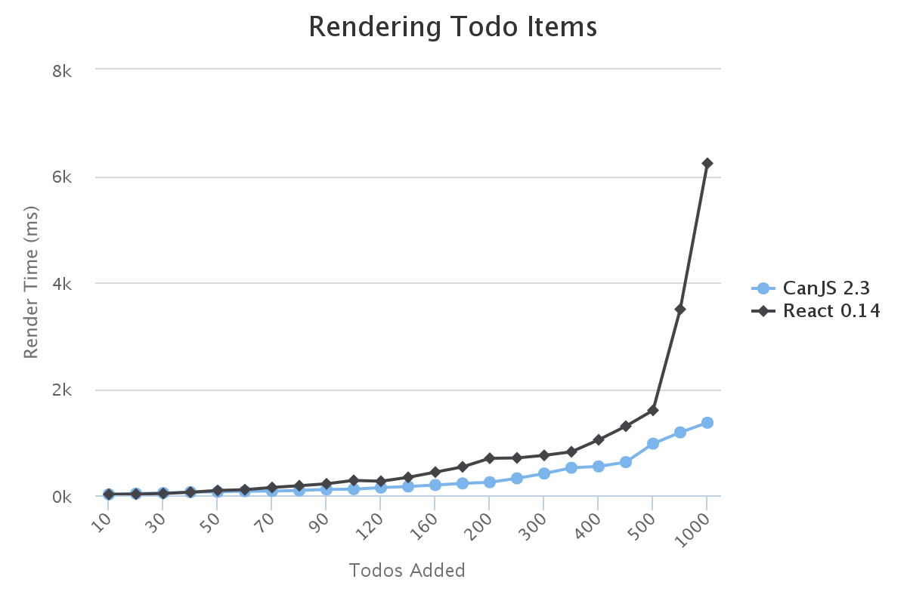
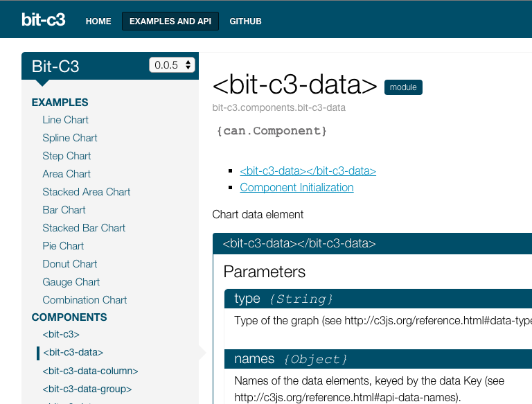
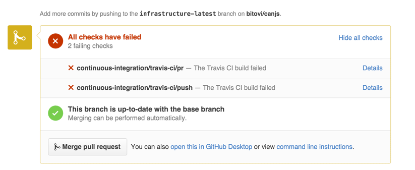
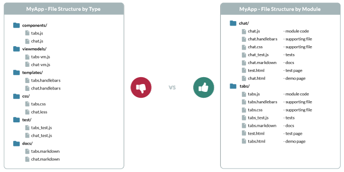
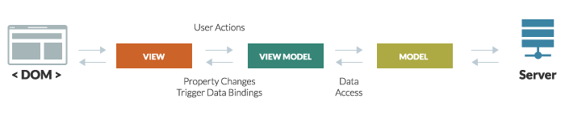

@page Features
@parent DoneJS
@hide sidebar
@outline 2 ol

@description

Learn about the features that will help you get your app done.

### All-in-one stack

DoneJS offers everything you need to build a modern web app. It comes with a module loader, build system, MVVM utilities, full testing layer, documentation generator, server side rendering utilities, a data layer, and more. Its completeness is itself a feature.

There's no mixing and matching pieces of your stack. Just `npm install` and get started.

Choosing a modern stack is not at all simple or straightforward.

1. *What types of tools do you want?*   Server-side rendering? What is a virtual DOM? Do I need one? MVVM or Flux? Should I set up testing infrastructure? Documentation?

2. *Choose all your pieces.* The good news is, you have [many choices](http://microjs.com/#). The bad news is, you have many choices. React, Angular, or Backbone? Require.js, browserify, or jspm? Jasmine or QUnit? What tool will run my tests?

3. *Finally, you have to make sure your chosen tools work together effectively.* Does require.js work well with Angular? Does Karma work with Browserify? What about React and Babel?

DoneJS gives you a full solution. It's our mission to eliminate any ambiguity around choosing technology for building an app, so you spend less time tinkering with your stack, and more time actually building your app.

And as we've proven [over the last 8 years](./About.html#evolve), we'll keep updating the stack as the state of the art evolves over time.

### Integrated layers

Just like Apple integrates the hardware and software for its devices, DoneJS integrates different technologies in a way that creates unique advantages that you can only get from using an integrated solution.

#### Cross-layer features

DoneJS makes it easier to do things that are not possible, or at best DIY, with competitor frameworks, by spanning technology layers. Here are a couple examples:

##### 1. [Server-side rendering](#server-side-rendered)

Server-side rendering (SSR), which you can read about in more detail in its [section](#server-side-rendered) below, spans many layers to make setup and integration simple.

It uses hooks in data components to automatically notify the server to delay rendering, [hot module swapping](#hot-module-swapping) automatically integrates (no need to restart the server while developing), data is collected in an [inline cache](#how-it-works-2) automatically and used to prevent duplicate AJAX requests. Support for these features is only possible because of code that spans layers, including can-connect, can-ssr, CanJS, and StealJS.

By contrast, React supports SSR, but you're left to your own devices to support delaying rendering, hot module swapping, and inline caching.

##### 2. [Progressive enhancement](#how-it-works-1)

You can mark a section of your template to be progressively loaded by wrapping it with `<can-import>`, like:

```
<can-import from="components/home">
  {{#if isResolved}}
  <home-page/>
  {{/if}}
</can-import>
```

and then running `donejs build`.

`<can-import>` has hooks that notify the build time algorithm to create a bundle for this template fragment and its dependencies. This feature spans StealJS, steal-build, CanJS, and done-cli.

#### Story-level solutions

Another advantage of the integration between DoneJS' parts is the ability to solve development problems on the level of [**stories**](http://searchsoftwarequality.techtarget.com/definition/user-story) rather than just features.

Solving a story means a packaged solution to a development problem, where several features across layers converge to solve the problem from start to finish. Here are several examples of stories that DoneJS solves:

1. [Modular workflow](#modular-workflow) - DoneJS makes it possible for teams to design and share components easily. Starting with [generators](#generators), users can create [modlets](#modlets) that encapsulate everything a [custom elements](#custom-html-elements) needs, easily add [documentation](#documentation) and [testing](#comprehensive-testing), then use [NPM import and export](#npm-packages) to easily share the modules with other developers, no matter what module format they're using.

2. [Performance](#performance-features) - DoneJS was designed from the start to solve the performance story, packaging [server-side rendering](#server-side-rendered), [progressive loading](#progressive-loading), [worker thread rendering](#worker-thread-rendering), [data layer caching](#caching-and-minimal-data-requests), and more, all under one roof.

3. [Maintainability](#maintainability-features) - [testing](#comprehensive-testing), [docs](#documentation), [MVVM](#mvvm-architecture)

4.  Developer efficiency - [zero-config NPM imports](#npm-packages), [hot module swapping](#hot-module-swapping), [ES6 support](#es6-modules)

### Feature comparison

<div class="matrix-wrapper">
  <div class="matrix-legend" id="js-matrix-legend-affix">
    <div class="title">SOLUTION LEGEND</div>
    <ul>
      <li>
        
        <div>EASY</div>
      </li>
      <li>
        
        <div>GOOD</div>
      </li>
      <li>
        
        <div>DIFFICULT</div>
      </li>
      <li>
        
        <div>THIRD-PARTY</div>
      </li>
      <li>
        
        <div>NO</div>
      </li>
    </ul>
  </div>
  <div class="table-wrapper">
    <div class="scrollable">
      <table id="js-matrix-table-affix" class="matrix-table responsive">
      <thead>
        <tr>
          <th class="features">FEATURES</th>
          <th></th>
          <th></th>
          <th></th>
        </tr>
      </thead>
        <tbody>
          <tr>
            <td class="features">
              <div class="feature-description"><a href="#server-side-rendered">Server-Side Rendering</a></div>
            </td>
            <td>
              
            </td>
            <td>
              <div class="has-popover" data-toggle="popover" data-placement="bottom" data-html="true" data-content="Requires some <a href='https://universal.angular.io/' target='_blank'>manual setup</a>." title="Requires some <a href='https://universal.angular.io/' target='_blank'>manual setup</a>.">
                <span class="asterisk"></span>
              </div>
            </td>
            <td>
              <div class="has-popover" data-container="matrix-wrapper" data-toggle="popover" data-placement="bottom" data-html="true" data-content="Requires some <a href='http://reactjsnews.com/isomorphic-javascript-with-react-node' target='_blank'>manual setup</a> and lacks most of the features/support DoneJS has." title="Requires some manual setup and lacks most of the features/support DoneJS has.">
                <span class="asterisk"></span>
              </div>
            </td>
          </tr>
          <tr>
            <td class="features">
              <div class="feature-description"><a href="#progressive-loading">Progressive Dependency Loading</a></div>
            </td>
            <td>
              
            </td>
            <td>
              
            </td>
            <td>
              
            </td>
          </tr>
          <tr>
            <td class="features">
              <div class="feature-description"><a href="#caching-and-minimal-data-requests">Caching & Minimal Data Requests</a></div>
            </td>
            <td>
              
            </td>
            <td>
              
            </td>
            <td>
              
            </td>
          </tr>
          <tr>
            <td class="features">
              <div class="feature-description"><a href="#minimal-dom-updates">Minimal DOM Updates</a></div>
            </td>
            <td>
              
            </td>
            <td>
              <div class="has-popover" data-toggle="popover" data-placement="bottom" data-html="true" data-content="Updates DOM quickly, but only after expensive dirty check calculation." title="Updates DOM quickly, but only after expensive dirty check calculation.">
                <span class="asterisk"></span>
              </div>
            </td>
            <td>
              
            </td>
          </tr>
          <tr>
            <td class="features">
              <div class="feature-description"><a href="#worker-thread-rendering">Worker Thread Rendering</a></div>
            </td>
            <td>
              
            </td>
            <td>
              
            </td>
            <td>
              <div class="has-popover" data-toggle="popover" data-placement="bottom" data-html="true" data-content="There is a virtual dom. So, Its possible, but there is no support out of the box." title="There is a virtual dom. So, Its possible, but there is no support out of the box.">
                <span class="asterisk"></span>
              </div>
            </td>
          </tr>
          <tr>
            <td class="features">
              <div class="feature-description"><a href="#deploy-to-a-cdn">Deploy to a CDN</a></div>
            </td>
            <td>
              
            </td>
            <td>
              
            </td>
            <td>
              
            </td>
          </tr>
          <tr>
            <td class="features">
              <div class="feature-description"><a href="#ios-android-and-desktop-builds">iOS, Android, and Desktop Builds</a></div>
            </td>
            <td>
              
            </td>
            <td>
              <div class="has-popover" data-toggle="popover" data-placement="bottom" data-html="true" data-content="While native app builds are possible, it requires the use of NativeScript." title="While native app builds are possible, it requires the use of NativeScript.">
                <span class="asterisk"></span>
              </div>
            </td>
            <td>
              <div class="has-popover" data-toggle="popover" data-placement="bottom" data-html="true" data-content="While native app builds are possible, there's no infrastructure to make it easy." title="While native app builds are possible, there's no infrastructure to make it easy.">
                <span class="asterisk"></span>
              </div>
            </td>
          </tr>
          <tr>
            <td class="features">
              <div class="feature-description"><a href="#supports-all-browsers-even-ie9">Browser Support</a></div>
            </td>
            <td>
              
            </td>
            <td>
              <div class="has-popover" data-toggle="popover" data-placement="bottom" data-html="true" data-content='<a href="https://docs.angularjs.org/guide/ie" target="_blank">Supports IE9+</a>' title="Supports IE9+">
                <span class="asterisk"></span>
              </div>
            </td>
            <td>
              
            </td>
          </tr>
          <tr>
            <td class="features">
              <div class="feature-description"><a href="#real-time-connected">Real-Time</a></div>
            </td>
            <td>
              
            </td>
            <td>
              <div class="has-popover" data-toggle="popover" data-placement="bottom" data-html="true" data-content="While connecting to real time data is possible, there is no built in support to make it easy." title="While connecting to real time data is possible, there is no built in support to make it easy.">
                <span class="asterisk"></span>
              </div>
            </td>
            <td>
              <div class="has-popover" data-toggle="popover" data-placement="bottom" data-html="true" data-content="While connecting to real time data is possible, there is no built in support to make it easy." title="While connecting to real time data is possible, there is no built in support to make it easy.">
                <span class="asterisk"></span>
              </div>
            </td>
          </tr>
          <tr>
            <td class="features">
              <div class="feature-description"><a href="#pretty-urls-with-pushstate">Pretty URLs</a></div>
            </td>
            <td>
              
            </td>
            <td>
              <div class="has-popover" data-toggle="popover" data-placement="bottom" data-html="true" data-content="Built-in routing is difficult to configure and maintain." title="Built-in routing is difficult to configure and maintain.">
                <span class="asterisk"></span>
              </div>
            </td>
            <td>
              <div class="has-popover" data-toggle="popover" data-placement="bottom" data-html="true" data-content="React-router supports this, but is not part of the core library." title="React-router supports this, but is not part of the core library.">
              <span class="asterisk"></span>
              </div>
            </td>
          </tr>
          <tr>
            <td class="features">
              <div class="feature-description"><a href="#comprehensive-testing">Comprehensive Testing</a></div>
            </td>
            <td>
              <div class="has-popover" data-toggle="popover" data-placement="bottom" data-html="true" data-content="Includes built-in support for every part of the testing lifecycle" title="Includes built-in support for every part of the testing lifecycle">
                <span class="asterisk"></span>
              </div>
            </td>
            <td>
              <div class="has-popover" data-toggle="popover" data-placement="bottom" data-html="true" data-content="Supports dependency injection and end-to-end testing." title="Supports dependency injection and end-to-end testing.">
                <span class="asterisk"></span>
              </div>
            </td>
            <td>
              <div class="has-popover" data-toggle="popover" data-placement="bottom" data-html="true" data-content="Includes some basic test utilities and mocks, but no support for other parts of the testing lifecycle." title="Includes some basic test utilities and mocks, but no support for other parts of the testing lifecycle.">
                
                <span class="asterisk"></span>
              </div>
            </td>
          </tr>
          <tr>
            <td class="features">
              <div class="feature-description"><a href="#documentation">Documentation</a></div>
            </td>
            <td>
              
            </td>
            <td>
              
            </td>
            <td>
              
            </td>
          </tr>
          <tr>
            <td class="features">
              <div class="feature-description"><a href="#continuous-integration--deployment">Continuous Integration & Deployment</a></div>
            </td>
            <td>
              
            </td>
            <td>
              
            </td>
            <td>
              
            </td>
          </tr>
          <tr>
            <td class="features">
              <div class="feature-description"><a href="#npm-packages">NPM Packages - Imports & Exports</a></div>
            </td>
            <td>
              
            </td>
            <td>
              
            </td>
            <td>
              
            </td>
          </tr>
          <tr>
            <td class="features">
              <div class="feature-description"><a href="#es6-modules">ES6 modules</a></div>
            </td>
            <td>
              
            </td>
            <td>
              <span class="asterisk"></span>
            </td>
            <td>
              <span class="asterisk"></span>
            </td>
          </tr>
          <tr>
            <td class="features">
              <div class="feature-description"><a href="#custom-html-elements">Custom HTML Elements</a></div>
            </td>
            <td>
              
            </td>
            <td>
              
            </td>
            <td>
              
            </td>
          </tr>
          <tr>
            <td class="features">
              <div class="feature-description"><a href="#mvvm-architecture">MVVM Architecture</a></div>
            </td>
            <td>
              
            </td>
            <td>
            <div class="has-popover" data-toggle="popover" data-placement="top" data-html="true" data-content="Not explicitly MVVM, but could be implemented" title="Not explicitly MVVM, but could be implemented">
                <span class="asterisk"></span>
              </div>
            </td>
            <td>
              <div class="has-popover" data-toggle="popover" data-placement="top" data-html="true" data-content="React is just the view layer. You'll need to implement your own MVVM architecture." title="React is just the view layer. You'll need to implement your own MVVM architecture.">
                <span class="asterisk"></span>
              </div>
            </td>
          </tr>
          <tr>
            <td class="features">
              <div class="feature-description"><a href="#hot-module-swapping">Hot Module Swapping</a></div>
            </td>
            <td>
              
            </td>
            <td>
              <div class="has-popover" data-toggle="popover" data-placement="top" data-html="true" data-content="Third-party libraries available for some support." title="Third-party libraries available for some support.">
                <span class="asterisk"></span>
              </div>
            </td>
            <td>
              <div class="has-popover" data-toggle="popover" data-placement="top" data-html="true" data-content="Third-party libraries available for some support." title="Third-party libraries available for some support.">
                <span class="asterisk"></span>
              </div>
            </td>
          </tr>
          <tr>
            <td class="features">
              <div class="feature-description"><a href="#generators">Generators</a></div>
            </td>
            <td>
              
            </td>
            <td>
              
            </td>
            <td>
              
            </td>
          </tr>
        </tbody>
      </table>
    </div>
  </div>
</div>

@body

## Performance Features

DoneJS is configured for maximum performance right out of the box.

### Server-Side Rendered

DoneJS applications are written as [Single Page Applications](http://en.wikipedia.org/wiki/Single-page_application),
and are able to be rendered on the server by running the same code. This is known as [Isomorphic JavaScript](http://isomorphic.net/javascript), or [Universal JavaScript](https://medium.com/@mjackson/universal-javascript-4761051b7ae9).

Server-side rendering (SSR) provides two large benefits over traditional single page apps: much better page load performance and SEO support.

SSR apps return fully rendered HTML. Traditional single page apps return a page with a spinner. The benefit to your users is a noticeable difference in perceived page load performance:


Compared to other server-side rendering systems, which require additional code and infrastructure to work correctly, DoneJS is uniquely designed to make turning on SSR quick and easy, and the server it runs is lightweight and fast.

#### Page load performance

Server-side rendered SPAs can load pre-rendered HTML immediately. They can also cache HTML and serve it from a CDN.

Traditional SPAs must load the JS, execute, request data, and render before the user sees content.

#### SEO

Search engines can't easily index SPAs. Server-side rendering fixes that problem entirely. Even if [Google can understand some JavaScript now](http://googlewebmastercentral.blogspot.ca/2014/05/understanding-web-pages-better.html), many other search engines cannot.

Since search engines see the HTML that your server returns (if you want search engines to find your pages) you'll want Google and other search engines seeing fully rendered content, not the spinners that normally show after initial SPAs load.

#### How it works

DoneJS implements SSR with a single-context virtual DOM utilizing [zones](https://davidwalsh.name/can-zone).

**Single context** means every request to the server reuses the same context: including memory, modules, and even the same instance of the application.

**Virtual DOM** means a virtual representation of the DOM: the fundamental browser APIs that manipulate the DOM, but stubbed out.

A **zone** is used to isolate the asynchronous activity of one request. Asynchronous activity like API requests are *tracked* and DoneJS' SSR will wait for all to complete, ensuring that the page is fully rendered before showing HTML to the user.

When using DoneJS SSR, the same app that runs on the client is loaded in Node. When a request comes in:
 1. The server handles the incoming request by reusing the application that is already running in memory. It doesn't reload the application which means the initial response is very fast.
 1. The app renders content the same way it would in the browser, but with a mocked out virtual DOM, which is much faster than a real DOM.
 1. The server creates a new zone to wait for all your asynchronous data requests to finish before signaling that rendering is complete.
 1. When rendering is complete, the virtual DOM renders the string representation of the DOM, which is sent back to the client.


Since SSR produces fully rendered HTML, it's possible to insert a caching layer, or use a service like Akamai, to serve most requests. Traditional SPAs don't have this option.

Rather than a virtual DOM, some other SSR systems use a headless browser on the server, like PhantomJS, which uses a real DOM. These systems are much slower and require much more intensive server resources.

Some systems, even if they do use a virtual DOM, require a new browser instance entirely, or at the very least, reloading the application and its memory for each incoming request, which also is slower and more resource intensive than DoneJS SSR.

##### Prepping your app for SSR

Any app that is rendered on the server needs a way to notify the server that any pending asynchronous data requests are finished, and the app can be rendered.

React and other frameworks that support SSR don't provide much in the way of solving this problem. You're left to your own devices to check when all asynchronous data requests are done, and delay rendering.

In a DoneJS application asynchronous data requests are tracked automatically. Using can-zone, DoneJS keeps a count of requests that are made and waits for all of them to complete.

<a class="btn" href="https://github.com/donejs/done-ssr"><span>View the Documentation</span></a>
<a class="btn" href="./Guide.html"><span>View the Guide</span></a>

_Server-side rendering is a feature of [done-ssr](https://github.com/donejs/done-ssr)_

### Progressive Loading

When you first load a single page app, you're typically downloading all the JavaScript and CSS for every part of the application. These kilobytes of extra weight slow down page load performance, especially on mobile devices.

DoneJS applications load only the JavaScript and CSS they need, when they need it, in highly optimized and cacheable bundles. That means your application will load *fast*.

There is no configuration needed to enable this feature, and wiring up progressively loaded sections of your app is simple.

#### How it works

<div class="youtube-container"><div class="youtube-player" data-videoid="C-kM0v9L9UY"></div></div>

Other build tools require you to manually configure bundles, which doesn't scale with large applications.

In a DoneJS application, you simply mark a section to be progressively loaded by wrapping it in your template with `<can-import>`.

```
{{#eq page 'home'}}
<can-import from="components/home">
  {{#if isResolved}}
  <home-page/>
  {{/if}}
</can-import>
{{/eq}}
{{#eq page 'chat'}}
<can-import from="components/chat">
  {{#if isResolved}}
  <chat-page/>
  {{/if}}
</can-import>
{{/eq}}
```

Then you run the build.

```
donejs build
```

A build time algorithm analyzes the application's dependencies and groups them into bundles, optimizing for minimal download size.

That's it! No need for additional configuration in your JavaScript.

<a class="btn" href="http://stealjs.com/docs/steal-tools.guides.progressive_loading.html"><span>View the Documentation</span></a>
<a class="btn" href="./Guide.html#switch-between-pages"><span>View the Guide</span></a>

_Progressive Loading is a feature of [StealJS](http://stealjs.com/) with additional support via the [`<can-import>` tag](http://canjs.com/docs/can%7Cview%7Cstache%7Csystem.import.html) of [CanJS](http://canjs.com/)_

### Caching and Minimal Data Requests

DoneJS improves performance by intelligently managing the data layer, taking advantage of various forms of caching and request reduction techniques.

Undoubtedly, the slowest part of any web application is round trips to the server. Especially now that [more than 50% of web traffic comes from mobile devices](http://searchengineland.com/its-official-google-says-more-searches-now-on-mobile-than-on-desktop-220369), where connections are notoriously slow and unreliable, applications must be smart about reducing network requests.

Making matters worse, the concerns of maintainable architecture in single page applications are at odds with the concerns of minimizing network requests. This is because independent, isolated UI widgets, while easier to maintain, often make AJAX requests on page load. Without a layer that intelligently manages those requests, this architecture leads to too many AJAX requests before the user sees something useful.

With DoneJS, you don't have to choose between maintainability and performance.

DoneJS uses the following strategies to improve perceived performance (reduce the amount of time before users see content rendered):

 - [Fall through caching](#fall-through-caching) - Cache data in localStorage. Automatically show cached data immediately, but look for updates on the server in the background and merge changes.
 - [Combining requests](#combining-requests) - Instead of making multiple, independent requests to the same API, combine them into a single request.
 - [Request caching](#request-caching) - Reduce the number and size of server requests by intelligently using cached datasets.
 - [Inline cache](#inline-cache) - Use data embedded in the page response instead of making duplicate requests.

#### How it works

[can-connect](http://connect.canjs.com/) makes up part of the DoneJS model layer. Since all requests flow through this data layer, by making heavy use of set logic and localStorage caching, it's able to identify cache hits, even partial hits, and make the most minimal set of requests possible.

It acts as a central hub for data requests, making decisions about how to best serve each request, but abstracting this complexity away from the application code. This leaves the UI components themselves able to make requests independently, and with little thought to performance, without actually creating a poorly performing application.

##### Fall through caching

Fall through caching serves cached data first, but still makes API requests to check for changes.

The major benefit of this technique is improved perceived performance. Users will see content faster. Most of the time, when there is a cache hit, that content will still be accurate, or at least mostly accurate.

This benefits two types of situations. First is page loads after the first page load (the first page load populates the cache). This scenario is less relevant when using server-side rendering. Second is long lived applications that make API requests after the page has loaded. These types of applications will enjoy improved performance.

By default, this is turned on, but can easily be deactivated for data that should not be cached.

Here's how the caching logic works:

1. When the application loads, it checks for available cache connections.
1. When a request is made, it checks for a cache hit.
1. If there is a hit, the request is completed immediately with the cached data.
1. Regardless of a hit or miss, a request is made in the background to the actual API endpoint.
1. When that response comes back, if there was a difference between the API response data and the cache hit data, the initial request promise's data is updated with the new data. Template data bindings will cause the UI to update automatically with these changes.
1. Updated response data is automatically saved in the cache, to be used for future requests - whether that's in the current page session, or when the user comes back in the future.

<video style="width:100%;" controls poster="static/img/poster-fall-thru-caching.jpg" preload="none">
    <source src="static/img/donejs-fallthrough-caching.webm" type="video/webm">
    <source src="static/img/donejs-fallthrough-caching.ogg" type="video/ogg">
    <source src="static/img/donejs-fallthrough-caching.mp4" type="video/mp4">
</video>

##### Combining requests

Combining requests combines multiple incoming requests into one, if possible. This is done with the help of [set algebra](https://en.wikipedia.org/wiki/Algebra_of_sets).

DoneJS collects requests that are made within a few milliseconds of each other, and if they are pointed at the same API, tries to combine them into a single superset request.

For example, the video below shows an application that shows two filtered lists of data on page load - a list of completed and incomplete todos. Both are subsets of a larger set of data - the entire list of todos.

Combining these into a single request reduces the number of requests. This optimization is abstracted away from the application code that made the original request.

<video style="width:100%;" controls poster="static/img/poster-combine-requests.jpg" preload="none">
    <source src="static/img/donejs-combine-requests.webm" type="video/webm">
    <source src="static/img/donejs-combine-requests.ogg" type="video/ogg">
    <source src="static/img/donejs-combine-requests.mp4" type="video/mp4">
</video>

##### Request caching

Request caching is a type of caching that is more aggressive than fallthrough caching. It is meant for data that doesn't change very often. Its advantage is it reduces both the number of requests that are made, and the size of those requests.

There are two differences between request and fallthrough caching:

1. Cached data is not invalidated.

Once data is in the cache, no more requests to the API for that same set of data are made. You can write code that invalidates the cache at certain times, or after a new build is released.

2. The smallest possible request is made, based on the contents of the cache, and merged into a complete result set.

The request logic is more aggressive in its attempts to find subsets of the data within the cache, and to only make an API request for the subset NOT found in the cache. In other words, partial cache hits are supported.

The video below shows two example scenarios. The first shows the cache containing a supserset of the request. The second shows the cache containing a subset of the request.

<video style="width:100%;" controls poster="static/img/poster-request-caching.jpg" preload="none">
    <source src="static/img/donejs-request-caching.webm" type="video/webm">
    <source src="static/img/donejs-request-caching.ogg" type="video/ogg">
    <source src="static/img/donejs-request-caching.mp4" type="video/mp4">
</video>


##### Inline cache

Server-side rendered single page apps (SPAs) have a problem with wasteful duplicate requests. These can cause the browser to slow down, waste bandwidth, and reduce perceived performance.

1. When a page is rendered server-side, it makes data requests on the server to various APIs.
1. After the page's rendered HTML loads in the client, the SPA is loaded in the client, so that subsequent requests are handled within the SPA.
1. The SPA will want to re-request for the same data that was already requested on the server.

DoneJS solves this problem with an inline cache - embedded inline JSON data sent back with the server rendered content, which is used to serve the initial SPA data requests.

DoneJS uniquely makes populating and using the inline cache easy. Using plain XHR:

1. Tells the SSR server to wait for a promise to resolve before rendering.
1. Collects data from each promise and uses it to populate the inline cache.

For example:

```
Component.extend({
  tag: "user-name",
  view: stache("{{user.name}}"),
  ViewModel: {
    init: function () {
      User.get({ id: this.id });
    }
  }
});
```

The model layer seamlessly integrates the inline cache in client side requests, without any special configuration.

While this flow would be possible in other SSR systems, it would require manually setting up all of these steps.

This video illustrates how it works.

<video style="width:100%;" controls poster="static/img/poster-inline-cach.jpg" preload="none">
    <source src="static/img/donejs-inline-cache.webm" type="video/webm">
    <source src="static/img/donejs-inline-cache.ogg" type="video/ogg">
    <source src="static/img/donejs-inline-cache.mp4" type="video/mp4">
</video>


<a class="btn" href="http://connect.canjs.com/"><span>View the Documentation</span></a>
<a class="btn" href="./Guide.html#messages-page"><span>View the Guide</span></a>

_Caching and minimal data requests is a feature of [can-connect](https://github.com/canjs/can-connect)_

### Minimal DOM Updates

The rise of templates, data binding, and MV* separation, while boosting maintainability, has come at the cost of performance. Many frameworks are not careful or smart with DOM updates, leading to performance problems as apps scale in complexity and data size.

DoneJS' view engine touches the DOM more minimally and specifically than competitor frameworks, providing better performance in large apps and a "closer to the metal" feel.

Take the TodoMVC application as an example. If you measure how long it takes DoneJS and React to render the same number of todos you'll see the performance advantage of minimal DOM updates. In fact we did just that and here's the result:


_For a small set of todos the difference is negligible but as the number increases the gap widens to the point where React is 6 times slower than DoneJS when rendering 1000 todos._

You can run this test for yourself at <a href="https://output.jsbin.com/zigovul/7" target="_blank">JS Bin</a>.

#### How it works

Consider the following template:

```html
{{#rows}}
<div>{{name}}</div>
{{/rows}}
```

And the following change to its data:

```
rows[0].name = 'changed'; // change the first row's name
```

In DoneJS, which uses the [can-stache](http://canjs.com/doc/can-stache.html) view engine, that would:

 1. Trigger an event (because of the [DefineMap](http://canjs.com/doc/can-define/map/map.html) object observe API)
 1. The event invokes a data binding event handler in the template layer
 1. The handler immediately results in the following code being run:
```
textNode.nodeValue = 'changed';
```

In Backbone, you would need to manually re-render the template or roll your own rendering library.

In Angular, at the end of the current $digest cycle, that would result in an expensive comparison between the old rows array and the new one to see what properties have changed. After the changed property is discovered, the specific DOM node would be updated.

In React, that would result in the virtual DOM being re-rendered. A diff algorithm comparing the new and old virtual DOM would discover the changed node, and then the specific DOM node would be updated.

Of these four approaches, DoneJS knows about the change the quickest, and updates the DOM the most minimally.

To see this in action run the test embedded below that shows how DoneJS, React and Angular compare when updating the DOM when a single property changes:


You can run this test yourself at <a href="https://output.jsbin.com/wotevub/2" target="_blank">JS Bin</a>

With synchronously observable objects and data bindings that change mimimal pieces of the DOM, DoneJS aims to provide the best possible mix between powerful, yet performant, templates.

<a class="btn" href="http://canjs.com/doc/can-stache.html"><span>can-stache Documentation</span></a>
<a class="btn" href="http://canjs.com/doc/can-define.html"><span>can-map Documentation</span></a>

_Minimal DOM updates is a feature of [CanJS](http://canjs.com/)_

### Memory Safety

Preventing memory leaks is a critical feature of any client-side framework. The biggest source of memory leaks in client-side applications is event handlers. When adding an event handler to a DOM node you have to be sure to remove that handler when the node is removed. If you do not, that DOM node will never be garbage collected by the browser.

#### How it works

When event listeners are created in a DoneJS application using template event binding or by binding using Controls, internally these handlers are stored. This looks like:

```
<a href="/todos/new" $(click)="newTodo()">New Todo</a>
```

for templates and:

```
var TodoPage = Control.extend({
  "a click": function(){
    this.addTodo();
  }
})
```

for controls. Internally CanJS listens for this element's "removed" event. The "removed" event is a synthetic event that will be used to:

* Remove all event listeners.
* Remove DOM data associated with the element.
* Remove any template bindings, such as computes bound to text within the template.

CanJS is different from other frameworks in that it will clean up its own memory event when not using the framework to tear down DOM. For example if you were to do:

```
todoAnchor.parentNode.removeChild(todoAnchor);
```

The event listener created would still be torn down. This is because CanJS uses a [MutationObserver](https://developer.mozilla.org/en-US/docs/Web/API/MutationObserver) to know about all changes to the DOM. When it sees an element was removed it will trigger the "removed" event, cleaning up the memory.

### Worker Thread Rendering

Worker thread rendering increases the performance of your application. It essentially allows your application to run entirely within a Web Worker, freeing the main thread to only update the DOM.

Since much of the work is offloaded from the main thread, applications will feel snappy, even while heavy computations are taking place.

#### How it works

Templates first render in a lightweight Virtual DOM in a [Web Worker](https://developer.mozilla.org/en-US/docs/Web/API/Web_Workers_API/Using_web_workers). Changes are diffed and sent to the main thread to be applied to the real DOM. The main thread is only notified when there are changes to the DOM.

The most expensive part of a web application - DOM updates - are separated from application logic, which means your application can continue to run while DOM reflows occur.

By default, browsers use only a single thread of execution.


_With a single thread only one operation can occur at a time_

This means that performance problems in any area (expensive computations, DOM rendering, processing a large AJAX response, etc) can block the entire application, leaving the browser feeling "frozen".

With worker thread rendering, DOM updates and application logic are run in parallel threads.


_Using a worker thread application logic can still occur while the DOM is rendered. This could nearly double the number of operations per second._

Due to this parallelization, performance problems that may have caused noticeable issues in a single thread will likely not cause any noticeable issues while running in separate threads.

Adding worker thread rendering only requires changing one line. Change the main attribute of your page's script tag from:
```
<script src=”node_modules/steal/steal.js” main=”my-app!done-autorender”></script>
```
to
```
<script src=”node_modules/steal/steal.js” main=”my-app!done-worker-autorender”></script>
```

At this time, no other framework besides DoneJS, including Angular or React, supports worker thread rendering out of the box.

<blockquote class="fun-quotes">
  <div class="fun-intro">You spend less time worrying about performance micro-optimizations,</div>
    <div class="fun-link">...and more time <a href="javascript:void(0)" data-toggle="popover" data-placement="top" data-html="true" data-content='<div class="youtube-container"><div class="youtube-player" data-videoid="vrgMUi8-7r4" data-params="start=28"></div></div>'>working on epic pool dunk videos.</a></div>
    
</blockquote>


<a class="btn" href="https://github.com/canjs/worker-render"><span>View the Documentation</span></a>

_Worker Thread Rendering is a feature of the [worker-render](https://github.com/canjs/worker-render) project._

### Deploy to a CDN

DoneJS makes it simple to deploy your static assets to a CDN (content delivery network).

CDNs are distributed networks of servers that serve static assets (CSS, JS, and image files). You only push your files to one service, and the CDN takes care of pushing and updating your assets on different servers across the country and globe. As your app scales CDNs will keep up with the demand, and help support users regardless if they are in New York or Melbourne.


_Without a CDN, requests will take longer to fulfill if the user is located further away from your servers._
<hr />


_With a CDN, requests can be fulfilled much quicker. Users are served content from the servers located nearest to them._

#### How it works

It's widely known that CDNs offer the best performance for static assets, but most apps don't use them, mainly because its annoying: annoying to automate, configure, and integrate with your build process.

DoneJS comes with integrations with [S3](https://aws.amazon.com/s3/) and [Firebase](https://www.firebase.com) (popular CDN services) that make configuring and deploying to a CDN dirt simple.

 1. You sign up for Firebase.
 2. You run: `donejs add firebase` in your terminal. It asks a few questions, most of which you can accept the default answer.
 3. You run `donejs deploy`.

That's it. Now when you run your server in production mode, all static assets (CSS, JS, images, etc) are served from the CDN.

Even better, you can set up [continuous deployment](./place-my-order.html#continuous-deployment), so that TravisCI or other tools will deploy your code, including pushing out your latest static files to the CDN, automatically.

<a class="btn" href="./Guide.html#deploy"><span>View the Guide</span></a>

## Usability features

DoneJS is used to make beautiful, real-time user interfaces that can be exported to run on every platform.

### iOS, Android, and Desktop Builds

Write your application once, then run it natively on every device and operating system. You can make iOS, Android, and desktop builds of your DoneJS application with no extra effort.


_Our DoneJS Chat App running as a OS X desktop app and inside an iOS emulator._

#### How it works

For iOS and Android builds, DoneJS integrates with [Apache Cordova](https://cordova.apache.org/) to generate a mobile app that is ready to be uploaded to Apple's App Store or Google Play.

For native desktop applications, DoneJS integrates with [Electron](https://electron.atom.io/) or [NW.js](https://github.com/nwjs/nw.js) to create an native OSX, Windows, or Linux application.

Adding this integration is as simple as running

```
donejs add cordova
donejs add nw
donejs add electron
donejs build
```

With these simple integrations, you can expand your potential audience without having to build separate applications.

<a class="btn" href="https://github.com/stealjs/steal-cordova"><span>View the Documentation</span></a>
<a class="btn" href="./Guide.html#desktop-and-mobile-apps"><span>View the Guide</span></a>

_Cordova, Electron, and NW.js integration are features of the [steal-electron](https://github.com/stealjs/steal-electron), [steal-cordova](https://github.com/stealjs/steal-cordova), and [steal-nw](https://github.com/stealjs/steal-nw) projects._

### Supports All Browsers, Even IE9+

DoneJS applications support Internet Explorer 8 minimal additional configuration. You can even write applications using [most ES6 features](http://babeljs.io/docs/advanced/caveats/) that run on IE9+, using the built-in babel integration.

Many people won't care about this because IE9+ is on its way out, which is a very good thing!

But it's [not quite dead yet](https://youtu.be/grbSQ6O6kbs?t=61). For many mainstream websites, banks, and ecommerce applications, IE9+ continues to hang around the browser stats.

And while other frameworks like AngularJS and EmberJS don't support IE9+, DoneJS makes it easy to write one app that runs everywhere.

<a class="btn" href="./Guide.html"><span>View the Guide</span></a>

### Real Time Connected

DoneJS is designed to add real-time behavior to applications using any backend technology stack.

[Socket.io](https://socket.io) provides the basics to add real-time capabilities to any JavaScript application, but the challenge of integrating real-time updates into your code remains.

When new data arrives, how do you know what data structures to add it to? And where to re-render? Code must be written to send socket.io data across your application, but that code becomes aware of too much, and therefore is brittle and hard to maintain.

DoneJS makes weaving Socket.io backends into your UI simple and automatic.

#### How it works

<div class="youtube-container"><div class="youtube-player" data-videoid="w4mp4oSb6BQ"></div></div>

DoneJS' model layer uses set logic to maintain lists of data represented by JSON properties, like a list of todos with `{'ownerId': 2}`. These lists are rendered to the UI via data bound templates.

When server-side updates are sent to the client, items are automatically removed or added to any lists they belong to. They also automatically show up in the UI because of the data bindings.

All of this happens with about 4 lines of code.

```
const socket = io('http://chat.donejs.com');
socket.on('messages created',
  order => messageConnection.createInstance(order));
socket.on('messages updated',
  order => messageConnection.updateInstance(order));
socket.on('messages removed',
  order => messageConnection.destroyInstance(order));
```

[Follow the guide](./Guide.html#enable-a-real-time-connection) to see an example in action. View the can-connect real-time documentation [here](http://connect.canjs.com/doc/can-connect%7Creal-time.html).

<a class="btn" href="http://connect.canjs.com/doc/can-connect%7Creal-time.html"><span>View the Documentation</span></a>
<a class="btn" href="./Guide.html#enable-a-real-time-connection"><span>View the Guide</span></a>

_Real time connections is a feature of the [can-connect](http://connect.canjs.com) project._

### Pretty URLs with Pushstate

DoneJS applications use [pushstate](https://developer.mozilla.org/en-US/docs/Web/API/History_API#The_pushState()_method) to provide navigable, bookmarkable pages that support the back and refresh buttons, while still keeping the user in a single page.

The use of pushstate allows your apps to have "Pretty URLs" like `myapp.com/user/1234` instead of uglier hash based URLs like `myapp.com#page=user&userId=1234` or `myapp.com/#!user/1234`.

Wiring up these pretty URLs in your code is simple and intuitive.

#### How it works

<div class="youtube-container"><div class="youtube-player" data-videoid="aHA504Vx0eU"></div></div>

Routing works a bit differently than other libraries. In other libraries, you might declare routes and map those to controller-like actions.

DoneJS application [routes](http://canjs.com/doc/can-route.html) map URL patterns, like `/user/1`, to properties in our application state, like `{'userId': 1}`. In other words, our routes will just be a representation of the application state.

This architecture simplifies routes so that they can be managed entirely in simple data bound templates, like the following example:

```
{{#switch page}}
  {{#case "home"}}
      <myapp-home></myapp-home>
  {{/case}}
  {{#case "users"}}
    {{#if slug}}
      <myapp-user-detail user-id="{slug}"></myapp-user-detail>
    {{else}}
      <myapp-users></myapp-users>
    {{/if}}
  {{/case}}
{{/switch}}
```

<a class="btn" href="./place-my-order.html#setting-up-routing"><span>View the Guide</span></a>

_Pretty URLs and routing are features of the [CanJS](http://canjs.com/) project._

## Maintainability features

DoneJS helps developers get things done quickly with an eye toward maintenance.

### Comprehensive Testing

Nothing increases the maintainability of an application more than good automated testing. DoneJS includes a comprehensive test layer that makes writing, running, and maintaining tests intuitive and easy.

DoneJS provides tools for the entire testing lifecycle:

* [Generators](#generators) - create boilerplate tests to get started quickly
* [Unit testing](#unit-tests) - assertion libraries to test your module interfaces
* [Functional testing](#functional-tests) - scripting the browser, simulating user actions, and testing your UI modules
* [User action event simulation](#event-simulation-accuracy) - accurate event simulation for clicks, types, drags, and other user actions
* [A command line test runner](#running-tests-from-the-command-line) - invoke the same tests from the CLI
* [A browser launcher](#running-tests-from-the-command-line) - launch several browsers and target your tests against them
* [A reporting tool](#running-tests-from-the-command-line) - report results, including code coverage, to the CLI, in various formats
* [Simple integration with continuous integration tools](#continuous-integration--deployment) - one step to hook into TravisCI or other CI systems
* [A mock layer](#mocking-server-apis) - mock out your server APIs so you can test your app in isolation from a server

<div class="maintainable wrapper">
  <div class="background video">
    <video tabindex="0" preload="none" class="img-responsive" poster="static/img/donejs-testing.jpg">
        <source src="static/img/donejs-testing-no-fade-in.mov" type="video/mp4">
        <source src="static/img/donejs-testing-no-fade-in.mp4" type="video/mp4">
        <source src="static/img/donejs-testing-no-fade-in.ogg" type="video/mp4">
        <source src="static/img/donejs-testing-no-fade-in.webm" type="video/webm">
    </video>
  </div>
</div>

#### How it works

Testing JavaScript apps is complex unto itself. To do it right, you need many tools that have to work together seamlessly. DoneJS provides everything you need - the whole stack.

##### Generators

The DoneJS app generator command `donejs add app` creates a working project-level test HTML and JS file. Component generators via `donejs add component cart` create a test script and individual test page for each test.

##### Unit tests

Unit tests are used to test the interface for modules like models and view models. You can choose between BDD style unit tests with Jasmine or Mocha, or a more traditional TDD assertion style with QUnit.

##### Functional tests

Functional tests are used to test UI components by simulating user behavior. The syntax for writing functional tests is jQuery-like, chainable, and asynchronous, simulating user actions and waiting for page elements to change asynchronously.

```js
test('destroying todos', function() {
  F('#new-todo').type('Sweet. [enter]');

  F('.todo label:contains("Sweet.")').visible('basic assert');
  F('.destroy').click();

  F('.todo label:contains("Sweet.")').missing('destroyed todo');
});
```

##### Event simulation accuracy

User action methods, like click, type, and drag, simulate exactly the sequence of events generated by a browser when a user performs that action. For example this:
```
F( ".menu" ).click();
```

is not just a click event. It triggers a mousedown, then blur, then focus, then mouseup, then click. The result is more accurate tests that catch bugs early.

Even further, there are differences between how IE and Safari handle a click. DoneJS tests take browser differences into account when running functional tests.

##### Running tests from the command line

DoneJS comes with a command line test runner, browser launcher, and reporting tool that integrates with any [continuous integration](#continuous-integration--deployment) environment.

No setup required, running a DoneJS project's test is as simple as running:

```
donejs test
```

You can run launch your unit and functional tests from the cli, either in headless browser mode, or via multiple real browsers. You can even launch browserstack virtual machines to test against any version of Android, Windows, etc.

The reporting tool gives detailed information about coverage statistics, and lets you choose from many different output formats, including XML or JSON files.

##### Mocking server APIs

Automated frontend testing is most useful when it has no external dependencies on API servers or specific sets of data. Thus a good mock layer is critical to write resilient tests.

DoneJS apps use fixtures to emulate REST APIs. A default set of fixtures are created by generators when a new model is created. Fixtures are very flexible, and can be used to simulate error states and slow performing APIs.

```js
import fixture from 'can-fixture';

const store = fixture.store([
  { name: 'Calisota', short: 'CA' },
  { name: 'New Troy', short: 'NT'}
],{});

fixture('/api/states/{short}', store);

export default store;
```

##### Simple authoring

Several DoneJS features converge to make authoring tests extremely simple.

Because of [ES6 Module](#es6-modules) support, everything in a DoneJS app is a module, so a test can simply import the modules it needs - such as fixtues and module under test:

```
import restaurantStore from 'place-my-order/models/fixtures/restaurant';
import { ViewModel } from './list';
```

This means the test is small, isolated, and simple. Tests themselves are modules too, so they can be collected easily into sets of tests.

Because of the [modlet](#modlets) pattern, each component contains its own working test script and test file, which can be worked on in isolation.

Because of [hot module swapping](#hot-module-swapping), you can write, debug, and run tests without constantly reloading your page.

Other frameworks require a build step before tests can be run. These builds concatenate dependencies and depend on specific order of tests running, which is a brittle and inefficient workflow.

Because DoneJS uses a client side loader that makes it simple to start a new page that loads its own dependencies, there is no build script needed to compile and run tests.

You just run the generator, load your modules, write your test, and run it - from the browser or CLI.

<blockquote class="fun-quotes">
  <div class="fun-intro">You spend less time messing with test infrastructure,</div>
    <div class="fun-link">...and more time <a href="javascript:void(0)" data-toggle="popover" data-placement="top" data-html="true" data-content='<div class="youtube-container"><div class="youtube-player" data-videoid="s4faD0fox_s" data-params="start=261"></div></div>'>mud ridin'.</a></div>
    
</blockquote>

##### More information

The DoneJS testing layer involves many pieces, so if you want to learn more:

 * follow along in the [Unit testing view model and fixtures](./place-my-order.html#creating-a-unit-tested-view-model) section of the guide
 * see how to run tests and set up CI automation in the [CI section](./place-my-order.html#continuous-integration) of the guide
 * read about [FuncUnit](http://funcunit.com/), the functional testing and asynchronous user action simulating library
 * read about [syn](https://github.com/bitovi/syn) - the synthetic event library
 * read about the [Testee.js](https://github.com/bitovi/testee) browser launcher, test runner, and reporting tool
 * read the [can-fixture](http://canjs.com/doc/can-fixture.html) docs

### Documentation

Documentation is critical for maintainability of any complex application. When your team adds developers, docs ensure minimal ramp up time and knowledge transfer.

Yet most teams either don't write docs, or they'll do it "later" - a utoptian future period that is always just out of reach. Why? Because it's extra work to set up a tool, configure it, create and maintain separate documentation files.

DoneJS comes with a documentation tool built in, and it generates multi-versioned documentation from inline code comments. It eliminates the barrier to producing docs, since all you have to do is comment your code (which most people already do) and run `donejs document`.

<div class="maintainable wrapper">
  <div class="background video">
    <video tabindex="0" preload="none" class="img-responsive" poster="static/img/done-js-documentation.jpg">
        <source src="static/img/donejs-documentation-no-fade-in.mov" type="video/mp4">
        <source src="static/img/donejs-documentation-no-fade-in.mp4" type="video/mp4">
        <source src="static/img/donejs-documentation-no-fade-in.ogg" type="video/mp4">
        <source src="static/img/donejs-documentation-no-fade-in.webm" type="video/webm">
    </video>
  </div>
</div>

#### How it works

You write comments above the module, method, or object that you want to document:

```js
/**
 * @module {function} utils/add
 * @parent utils
 *
 * The module's description is the first paragraph.
 *
 * The body of the module's documentation.
 *
 * @param {Number} first This param's description.
 * @param {Number} second This param's description.
 * @return {Number} This return value's description.
 */
export default function(){ ... };
```

Then run `donejs document`. A browsable documentation website will be generated.



DoneJS applications use [DocumentJS](http://documentjs.com) to produce multi-versioned documentation. It lets you:

- Write docs inline or in markdown files.
- Specify your code's behavior precisely with JSDoc and [Google Closure Compiler annotations](https://developers.google.com/closure/compiler/docs/js-for-compiler?hl=en) - a well known documentation syntax.
- Customize your site's theme and layout.
- Generate multi-versioned documentation.
- Document CSS alongside JavaScript. You can even make a [live style guide](http://documentjs.com/examples/styles/index.html).

You can keep it simple like the example above, or you can customize your docs with many powerful features. In fact, this entire site and the [CanJS](http://canjs.com/docs/index.html) site are generated using DocumentJS.

<blockquote class="fun-quotes">
  <div class="fun-intro">You spend less time messing with Documentation generators,</div>
    <div class="fun-link">...and more time <a href="javascript:void(0)" data-toggle="popover" data-placement="top" data-html="true" data-content='<div class="youtube-container"><div class="youtube-player" data-videoid="7WaLCWaTo8"></div></div>'>perfecting your moonwalk.</a></div>
    
</blockquote>

<a class="btn" href="http://documentjs.com/docs/index.html"><span>View the Documentation</span></a>
<a class="btn" href="./place-my-order.html#create-documentation"><span>View the Guide</span></a>

_DoneJS Documentation is a feature of [DocumentJS](http://documentjs.com/)_

### Continuous Integration & Deployment

Continuous Integration (CI) and Continuous Deployment (CD) are must have tools for any modern development team.

CI is a practice whereby all active development (i.e. a pull request) is checked against automated tests and builds, allowing problems to be detected early (before merging the code into the release branch).


_Example of a GitHub pull request with Travis CI integrated. Warns users in advance of merges if their changes will break builds or fail tests._

CD means that any release or merges to your release branch will trigger tests, builds and deployment.

Paired together, CI and CD enable automatic, frequent releases. CD isn't possible without CI. Good automated testing is a must to provide the confidence to release without introducing bugs.

DoneJS provides support for simple integration into popular CI and CD tools, like TravisCI and Jenkins.

<div class="maintainable wrapper">
  <div class="background video">
    <video tabindex="0" preload="none" class="img-responsive" poster="static/img/continuous-integration0deployment.jpg">
        <source src="static/img/donejs-continuous-integration0deployment-no-fade-in.mov" type="video/mp4">
        <source src="static/img/donejs-continuous-integration0deployment-no-fade-in.mp4" type="video/mp4">
        <source src="static/img/donejs-continuous-integration0deployment-no-fade-in.ogg" type="video/mp4">
        <source src="static/img/donejs-continuous-integration0deployment-no-fade-in.webm" type="video/webm">
    </video>
  </div>
</div>

#### How it works

Setting up continuous integration and deployment involves several steps:
 1. Writing tests
 1. Setting up a test harness that runs tests from the command line
 1. Creating simple scripts for running a build, test, and deploy
 1. Integrating with a service that runs the scripts at the proper times

Steps 1, 2, and 3 are the hard parts. Step 4 is simple. DoneJS supports  in two main ways: proper test support and simple CLI commands.

##### Proper test support

DoneJS comes with comprehensive support for testing. The [Testing](#comprehensive-testing) section contains much more detail about testing support.

[Generators](#generators) create working test scripts right off the bat, and the plumbing for test automation is built into each project. Each [modlet](#modlets) contains a skeleton for unit tests. All that is left for the developer to do is write tests.

##### Simple CLI commands

Another hurdle is creating automated build, test, and deployment scripts. Every DoneJS app comes with a build, test, and deployment one-liner: `donejs build`, `donejs test`, and `donejs deploy`.

##### Tool integration

Once the tests are written and the scripts are automated, integrating with the tools that automatically runs these scripts is quite simple. For instance, setting up Travis CI involves signing up and adding a `.travis.yml` file to the project:

```
language: node_js
node_js: node
script: npm start & npm test
before_install:
  - "export DISPLAY=:99.0"
  - "sh -e /etc/init.d/xvfb start"
```

<a class="btn" href="./place-my-order.html#continuous-integration"><span>View the CI Guide</span></a>
<a class="btn" href="./place-my-order.html#continuous-deployment"><span>View the CD Guide</span></a>

### Modlets

The secret to building large apps is to never build large apps. Break up your application into small pieces. Then, assemble.

DoneJS encourages use of the modlet file organization pattern. Modlets are small, decoupled, reusable, testable mini applications.

#### How it works

Large apps have a lot of files. There are two ways to organize them: by type or by module.



Organization by module - or modlets - make large applications easier to maintain by encouraging good architecture patterns. The benefits include:

 * Each modlet contains its own demo page and its own test page. Getting a demo page running forces separation of concerns and isolated modules - hallmarks of good design. A standalone demo and test page makes it easy to work on pieces of your application in isolation.
 * Developers are more likely to update tests and documentation if they are sitting right next to the module they are editing. The test is not hidden in a `tests` folder that is more easily ignored.
 * You can develop the application without having to load the entire application and all of its tests on every change.

An example modlet from the [in-depth guide](./place-my-order.html) is the [order/new](https://github.com/donejs/place-my-order/tree/master/src/restaurant/list) component. It has its own [demo page](http://www.place-my-order.com/src/order/new/demo.html) and [test page](http://www.place-my-order.com/src/order/new/test.html).

DoneJS generators create modlets to get you started quickly. To learn more about the modlet pattern, read this [blog post](http://blog.bitovi.com/modlet-workflows/).

<a class="btn" href="https://youtu.be/eIfUsPdKF4A?t=97"><span>View the Video</span></a>
<a class="btn" href="./Guide.html#generate-custom-elements"><span>View the Guide</span></a>

_Modlets are a feature of DoneJS [generators](#generators)._

### NPM Packages

DoneJS makes it easy to share and consume modules via package managers like NPM and Bower.

You can import modules from any package manager in any format - CommonJS, AMD, or ES6 - without any configuration. And you can convert modules to any other format.

The goal of these features is to transform project workflows, making it easier to share and reuse ideas and modules of functionality across applications, with less hassle.


<div class="maintainable wrapper">
  <div class="background video">
    <video tabindex="0" preload="none" class="img-responsive" poster="static/img/donejs-npm-packaging-custom-elements.jpg">
        <source src="static/img/donejs-npm-packaging-custom-elements-no-fade-in.mov" type="video/mp4">
        <source src="static/img/donejs-npm-packaging-custom-elements-no-fade-in.mp4" type="video/mp4">
        <source src="static/img/donejs-npm-packaging-custom-elements-no-fade-in.ogg" type="video/mp4">
        <source src="static/img/donejs-npm-packaging-custom-elements-no-fade-in.webm" type="video/webm">
    </video>
  </div>
</div>

#### How it works

DoneJS apps use [StealJS](http://stealjs.com/) to load modules and install packages. This video introduces NPM import and export in StealJS:

<div class="youtube-container"><div class="youtube-player" data-videoid="eIfUsPdKF4A"></div></div>

##### Zero config package installation

Unlike Browserify or Webpack, StealJS is a client side loader, so you don't have to run a build to load pages.

Installing a package in a DoneJS app via npm or bower involves no configuration. Install your package from the command line:

```
npm install jquery --save
```

Then immediately consume that package (and its dependencies) in your app:

```
import $ from "jquery";
```

Using require.js or other client side loaders, you'd have to add pathing and other information to your configuration file before being able to use your package. In DoneJS, this step is bypassed because of scripts that add config to your package.json file as the package is installed.

You can import that package in any format: CommonJS, AMD, or ES6 module format.

##### Convert to any format

DoneJS supports converting a module to any other format: CommonJS, AMD, or ES6 module format, or script and link tags.

The advantage is that you can publish your module to a wider audience of users. Anyone writing JavaScript can use your module, regardless of which script loader they are using (or if they aren't using a script loader).

Just create an [export script](http://stealjs.com/docs/steal-tools.export.html) that points to the output formats you want, along with some options:
```js
var stealTools = require("steal-tools");
stealTools.export({
  system: {
    config: __dirname+"/package.json!npm"
  },
  outputs: {
    amd: {
      format: "amd",
      graphs: true,
      dest: __dirname + "/dist/amd"
    }
});
```

and run it from your command line:
```
node myexport.js
```

##### Modular workflow

In combination with other DoneJS features, NPM module import and export make it possible for teams to design and share components easily.

[Generators](#generators) make it easy to bootstrap new modules of functionality quickly, and the [modlet pattern](#modlets) makes it easy to organize small, self-contained modules. Its even easy to create tests and documentation for each module.

DoneJS enables a modular workflow, where pieces of small, reusable functionality can be easily created, shared, and consumed.

 1. Use generators to create a modlet
 1. Develop rich functionality
 1. Write tests and docs
 1. Export and publish it - internally or externally
 1. Consume it across applications

Similar to the way that the [microservices](http://microservices.io/patterns/microservices.html) architecture encourages reuse of APIs across applications, the modular workflow encourages reuse of self-contained modules of JavaScript across applications.

Imagine an organization where every app is broken into many reusable pieces, each of which are independently tested, developed, and shared. Over time, developers would be able to quickly spin up new applications, reusing previous functionality. DoneJS makes this a real possibility.

<a class="btn" href="http://stealjs.com/docs/steal.html"><span>View the Documentation</span></a>
<a class="btn" href="./place-my-order.html#importing-other-projects"><span>View the Guide</span></a>

_NPM package support is a feature of [StealJS](http://stealjs.com/)_

### ES6 Modules

DoneJS supports the compact and powerful [ES6 module](http://www.2ality.com/2014/09/es6-modules-final.html) syntax, even for browsers that don't support it yet. Besides future proofing your application, writing ES6 modules makes it easier to write modular, maintainable code.

````
import { add, subtract } from "math";

export function subtract(a, b) {
  return a - b;
}
````

#### How it works

DoneJS applications are actually able to import or export any module type: ES6, AMD and CommonJS. This means you can slowly phase in ES6, while still using your old code. You can also use any of the many exciting [ES6 language features](https://github.com/lukehoban/es6features).

A compiler is used to convert ES6 syntax to ES5 in browsers that don't yet support ES6. During development, the compiler runs in the browser, so changes are happening live without a build step. During the build, your code is compiled to ES5, so your production code will run native in every browser. You can even run your [ES6 application in IE9+](#supports-all-browsers-even-ie9)!

<a class="btn" href="http://stealjs.com/docs/syntax.es6.html"><span>View the Documentation</span></a>
<a class="btn" href="./place-my-order.html"><span>View the Guide</span></a>

_Pretty URLs and routing are features of the [stealjs/transpile](https://github.com/stealjs/transpile) project._

### Custom HTML Elements

One of the most important concepts in DoneJS is splitting up your application functionality into independent, isolated, reusable custom HTML elements.

The major advantages of building applications based on custom HTML elements are:

 1. **Ease of page composition** - Designers can do it! Non-developers can express complex behavior with little to no JavaScript required. All you need to build a new page or feature is HTML.
 1. **Forced modularity** - Because the nature of HTML elements are isolated modules, custom HTML elements must be designed as small, isolated components. This makes them easier to test, debug, and understand.
 1. **Reuse** - Custom elements are designed to be reusable across pages and applications.

Consider the following example:

```html
<order-model get-list="{ period='previous_week' }" {^value}="*previousWeek" />
<order-model get-list="{ period='current_week' }" {^value}="*currentWeek" />

<bit-c3>
  <bit-c3-data>
    <bit-c3-data-column key="Last Week" {value}="*previousWeek.totals" />
    <bit-c3-data-column key="This Week" {value}="*currentWeek.totals" />
  </bit-c3-data>
</bit-c3>
```
This code demonstrates:

 1. An element that can load data
 1. Composable widget elements (a graph with a line-series)

If our designer wanted to add another period, all they would need to do is add another `<order-model>` and `<bit-c3-data-column>` element.

Here’s a working version of the same example in a JSBin.

<a class="jsbin-embed" href="//jsbin.com/puwesa/embed?html,output">Custom HTML Elements on jsbin.com</a><script src="//static.jsbin.com/js/embed.min.js?3.35.2"></script>

Just like HTML’s natural advantages, composing entire applications from HTML building blocks allows for powerful and easy expression of dynamic behavior.

#### How it works

First, it's important to understand the background of custom elements and their advantages. Then, we'll discuss the details of creating powerful custom elements in specifically DoneJS, and why they're special.

##### Benefits of custom elements

Before custom HTML elements existed, to add a datepicker to your page, you would:

 1. Load a datepicker script
 1. Add a placeholder HTML element

```
<div class='datepicker' />
```
 3. Add JavaScript code to instantiate your datepicker

```
$('.datepicker').datepicker()
```
 4. Gather your stone tipped spears and forage for small animals to feed your family for the night.

With custom HTML elements, to add the same datepicker, you would:

 1. Load a datepicker script
 1. Add the datepicker to your HTML or template:

```
<datepicker value="{date}"/>
```

That might seem like a subtle difference, but it is actually a major step forward. The custom HTML element syntax allows for instantiation, configuration, and location, all happening at the same time.

Custom HTML elements are another name for [Web Components](http://webcomponents.org/), a browser spec that has [yet to be implemented](http://caniuse.com/#search=components) across browsers.

##### Benefits of DoneJS custom elements

DoneJS uses CanJS' [can-component](http://canjs.com/doc/can-component.html) to provide a modern take on web components.

Components in DoneJS have three basic building blocks:

 * a template
 * a viewModel object
 * event handlers

There are several unique benefits to DoneJS custom elements:

 * [Easily construct custom elements](#defining-a-custom-element) - you can define them within a single `.component` file, or a modlet
 * [Load data from custom elements](#data-elements--visual-elements--expressive-templates)
 * [Simple progressive loading with can-import](#in-template-dependency-declarations)

##### Defining a custom element

One way to define a component is with a [web component](https://github.com/donejs/done-component) style declaration, using a single file with a `.component` extension:

```html
<can-component tag="hello-world">
    <style type="less">
        i {
            color: red;
        }
    </style>
    <view>
        {{#if visible}}<b>{{message}}</b>{{else}}<i>Click me</i>{{/if}}
    </view>
    <script type="view-model">
        import DefineMap from "can-define/map/map";

        export default DefineMap.extend({
            visible: { value: true },
            message: { value: "Hello There!" }
        });
    </script>
    <script type="events">
        export default {
            click: function(){
                this.viewModel.visible = !this.viewModel.visible;
            }
        };
    </script>
</can-component>
```

This simple form of custom elements is great for quick, small widgets, since everything is contained in one place.

Another way to organize a custom element is a [modlet](#modlets) style file structure: a folder with the element broken into several independent pieces. In this pattern, the custom element's ViewModel, styles, template, event handlers, demo page, tests, and test page are all located in separate files. This type of custom element is well suited for [export and reuse](#modular-workflow).

DoneJS [Generators](#generators) will create both of these types of custom elements so you can get started quickly.

##### Data elements + visual elements = expressive templates

The beauty and power of custom HTML elements is most apparent when visual widgets (like graphing) is combined with elements that express data.

Back to our original example:

```html
<order-model get-list="{previousWeek}" [previousWeekData]="{value}"/>
<order-model get-list="{currentWeek}" [currentWeekData]="{value}"/>

<bit-graph title="Week over week">
  <bit-series data="{../previousWeekData}" />
  <bit-series data="{../currentWeekData}" color="Blue"/>
</bit-graph>
```

This template combines a request for data with an element that expresses it. It's immediately obvious how you would add or remove features from this, allowing for quick changes and easy prototyping. Without custom elements, the same changes would require more difficult code changes and wiring those changes up with widget elements that display the data.

Data custom elements are part of DoneJS via can-connect's [can-tag feature](http://connect.canjs.com/doc/can-connect%7Ccan%7Ctag.html).

##### Custom element libraries

Custom elements are designed to be easily shareable across your organization. DoneJS provides support for simple [NPM import and export](#section_NPMPackages) and creating [documentation](#documentation) for elements. Together with custom element support, these features make it easier than ever to create reusable bits of functionality and share them.

Some open source examples of DoneJS custom elements:

<a class="btn" href="http://bitovi-components.github.io/bit-c3/docs/index.html"><span>bit-c3</span></a>
<a class="btn" href="https://github.com/bitovi-components/bit-tabs"><span>bit-tabs</span></a>
<a class="btn" href="http://bitovi-components.github.io/bit-autocomplete/"><span>bit-autocomplete</span></a>

Check out [their source](https://github.com/bitovi-components/bit-tabs) for good examples of shareable, documented, and tested custom elements.

##### In-template dependency declarations

[can-import](http://canjs.com/docs/can%7Cview%7Cstache%7Csystem.import.html) is a powerful feature that allows templates to be entirely self-sufficient. You can load custom elements, helpers, and other modules straight from a template file like:

```
<can-import from="components/my_tabs"/>
<can-import from="helpers/prettyDate"/>
<my-tabs>
  <my-panel title="{{prettyDate start}}">...</my-panel>
  <my-panel title="{{prettyDate end}}">...</my-panel>
</my-tabs>
```

The `<can-import>` element also plays a key role in [Progressive Loading](#progressive-loading). Simply by wrapping a section in a closed can-import, it signals to the build that the enclosed section's dependencies should be progressively loaded.

```
{{#eq location 'home'}}
<can-import from="components/home">
  {{#if isResolved}}
  <my-home/>
  {{/if}}
</can-import>
{{/eq}}
{{#eq location 'away'}}
<can-import from="components/chat">
  {{#if isResolved}}
  <my-chat/>
  {{/if}}
</can-import>
{{/eq}}
```

<a class="btn" href="http://canjs.com/doc/can-component.html"><span>View the Documentation</span></a>
<a class="btn" href="./place-my-order.html#creating-custom-elements"><span>View the Guide</span></a>

_Custom HTML elements are a feature of [CanJS](http://canjs.com/)_

### MVVM Architecture

DoneJS applications employ a [Model-View-ViewModel](https://en.wikipedia.org/wiki/Model_View_ViewModel) architecture pattern, provided by [CanJS](http://canjs.com/).



The introduction of a strong ViewModel has some key advantages for maintaining large applications:

 * **Decouples the presentation from its business logic** - A ViewModel is essentially an object and methods representing the state of a View. This separation of concerns enables simple, dumb HTML-based Views containing minimal logic, while the ViewModel manages the complexities of application logic.
 * **Enables designer/developer cooperation** - Because the view is stripped of code and application logic, designers can safely and comfortably change the View without fear of breaking things.
 * **Enables easier [testing](#section=section_ComprehensiveTesting)** - ViewModels can be unit tested easily. Because they represent the view's state without any knowledge of the DOM, they provide a simple interface for testing.

#### How it works

The following video introduces MVVM in DoneJS, focusing on the strength of the ViewModel with an example.

<div class="youtube-container"><div class="youtube-player" data-videoid="kCM03jujKy4"></div></div>

DoneJS has a uniquely strong ViewModel layer compared to other frameworks. We'll discuss how it works and compare it to other frameworks.


##### MVVM overview

**Models** in DoneJS are responsible for loading data from the server. They can be reused across ViewModels. They often perform data validation and sanitization logic. Their main function is to represent data sent back from a server. Models use intelligent set logic that enables [real time](#real-time-connected) integration and [caching](#caching-and-minimal-data-requests) techniques.

**Views** in DoneJS are templates. Specifically, templates that use handlebars syntax, but with data bindings and rewritten for better performance. Handlebars templates are designed to be logic-less.

**ViewModels** will be covered in detail below.

##### Independent ViewModels

The first reason DoneJS ViewModels are unique is their independence. ViewModels and Views are completely decoupled, and can be developed completely isolated from a template.

For example, here's a typical ViewModel, which is often defined in its own separate file like `viewmodel.js` and exported as its own module:

```
export const ViewModel = DefineMap.extend({
  get fullName() {
    return this.first + " " + this.last;
  }
})
```

The template (view) lives in its own file, so a designer could easily modify it without touching any JavaScript. This template renders the ViewModel property from above:

```
<div>{{fullName}}</div>
```

A [custom HTML element](#custom-html-elements), also known as a component, would be used to tie these layers together:

```
import Component from 'can-component';
import ViewModel from "./viewmodel";
import view from './view.stache';

Component.extend({
  tag: 'my-component',
  viewModel,
  view
});
```

The ViewModel is defined as its own module and exported as an ES6 module, so it can be imported into a unit test, instantiated, and tested in isolation from the DOM:

```
import ViewModel from "./viewmodel";

QUnit.test('fullName works', function() {
  var vm = new ViewModel();
  vm.first = John;
  vm.last = Doe;
  QUnit.equal(vm.fullName, 'John Doe');
});
```

In other frameworks, ViewModels don't enjoy this level of independence. Every React class has a render function, which is essentially a template, so the View, ViewModel, and component definition are typically part of the same module. Every Angular directive is a ViewModel. In DoneJS, separating the ViewModel, template, and custom element is encouraged, making each module more decoupled and easier to unit test.

##### Powerful observable data layer

A powerful observable data layer binds the layers together with very minimal code.

DoneJS supports the following features:

1. **Direct observable objects** - changes to a property in an object or array immediately and synchronously notify any event listeners.

1. **Computed properties** - ViewModels can define properties that depend on other properties, and they'll automatically recompute only when their dependent properties change.

1. **Data bound templates** - templates bind to property changes and update the DOM as needed.

In the simple ViewModel example above, `fullName`'s value depends on `first` and `last`. If something in the application changes `first`, `fullName` will recompute.

```
export const ViewModel = DefineMap.extend({
    get fullName() {
      return this.first + " " + this.last;
    }
})
```

`fullName` is data bound to the view that renders it:

```
<div>{{fullName}}</div>
```

If `first` is changed:

```
viewModel.first = Jane;
```

`fullName` recomputes, then the DOM automatically changes to reflect the new value.

The interplay of these layers provides amazing power to developers. ViewModels express complex relationships between data, without regard to its display. Views express properties from the ViewModel, without regard to how the properties are computed. The app then comes alive with rich functionality.

Without automatic ties connecting these layers, achieving the same `fullName` functionality would require more code explicitly performing these steps. There would need to be communication between layers, removing the isolation achieved above. Any change to `first` would need to notify ViewModel's `fullName` of a change. Any change to `fullName` would need to tell the view to re-render itself. These dependencies grow and quickly lead to unmaintainable code.

In Angular, there are no direct observables. It uses dirty checking with regular JavaScript objects, which means at the end of the current $digest cycle, it will run an algorithm that determines what data has changed. This has performance drawbacks, as well as making it harder to write simple unit tests.

In React, there is no observable data layer. You could define a `fullName` like we showed above, but it would be recomputed every time `render` is called, whether or not it has changed. Though it's possible to isolate and unit test its ViewModel, its not quite set up to make this easy.

##### More information

To learn more:

 * Models - read about [can-connect](http://canjs.com/doc/can-connect.html) and [can-define](http://canjs.com/doc/can-define.html)
 * Computed properties - read about [can-compute](http://canjs.com/doc/can-compute.html)
 * Observable data layer - read about [DefineMap](http://canjs.com/doc/can-define/map/map.html) and [DefineList](http://canjs.com/doc/can-define/list/list.html)
 * Views - read about [can-stache](http://canjs.com/doc/can-stache.html)
 * [Create a unit tested ViewModel](./place-my-order.html#creating-a-unit-tested-view-model) in the in-depth guide

_The MVVM architecture in DoneJS is provided by [CanJS](http://canjs.com/)._

### Hot Module Swapping

Getting and staying in [flow](https://en.wikipedia.org/wiki/Flow_(psychology)) is critical while writing complex apps. In DoneJS, whenever you change JavaScript, CSS, or a template file, the change is automatically reflected in your browser, without a browser refresh.

<div class="maintainable wrapper">
  <div class="background video">
    <video tabindex="0" preload="none" class="img-responsive" poster="static/img/donejs-live-reload.jpg">
        <source src="static/img/donejs-live-reload-no-fade-in.mov" type="video/mp4">
        <source src="static/img/donejs-live-reload-no-fade-in.mp4" type="video/mp4">
        <source src="static/img/donejs-live-reload-no-fade-in.ogg" type="video/mp4">
        <source src="static/img/donejs-live-reload-no-fade-in.webm" type="video/webm">
    </video>
  </div>
</div>

#### How it works

Live reload servers generally watch for file changes and force your browser window to refresh. DoneJS doesn’t refresh the page, it re-imports modules that are marked as dirty, in real-time.

The correct terminology is actually [hot swapping](https://en.wikipedia.org/wiki/Hot_swapping), not live reload. Regardless of what it's called, the result is a blazing fast development experience.

There is no configuration needed to enable this feature. Just start the dev server and begin:

```
donejs develop
```

<blockquote class="fun-quotes">
  <div class="fun-intro">You spend less time waiting for refreshes and builds,</div>
    <div class="fun-link">...and more time <a href="javascript:void(0)" data-toggle="popover" data-placement="top" data-html="true" data-content='<div class="youtube-container"><div class="youtube-player" data-videoid="LbVZs80WMWI"></div></div>'>doing trust falls with giant yellow M&Ms.</a></div>
    
</blockquote>

<a class="btn" href="http://stealjs.com/docs/steal.live-reload.html"><span>View the Documentation</span></a>

_Live reload is a feature of [StealJS](http://stealjs.com/)._


### Generators

DoneJS generators help you kickstart new projects and components. They'll save you time, eliminating boilerplate by scaffolding a working project, component, or module.

Generator templates set up many of the best practices and features discussed in the rest of this page, without you even realizing it.

#### How it works

The DoneJS generator uses Yeoman to bootstrap your application, component, or model.

There are four generators by default (and you can easily create your own).

##### Project generator

From the command line, run:

```
donejs add app
```

You'll be prompted for a project name, source folder, and other setup information. DoneJS' project dependencies will be installed, like StealJS and CanJS. In the folder that was created, you'll see:

```
├── .yo-rc.json
├── build.js
├── development.html
├── package.json
├── production.html
├── readme.md
├── test.html
├── src/
|   ├── app.js
|   ├── index.stache
|   ├── models/
|   |   ├── fixtures
|   |   |   ├── fixtures.js
|   |   ├── test.js
|   ├── styles.less
|   ├── test.js
├── node_modules/
```

You're now a command away from running application wide tests, generating documentation, and running a build. Start your server with `donejs develop`, open your browser, and you'll see a functioning, server-side rendered hello world page.

##### Modlet component generator

To create a [component](http://canjs.com/doc/can-component.html) organized with the [modlet](#modlets) file organization pattern:

```
donejs add component <folder-path> <component-name>
```

It will create the following files:


```
restaurant/
├── list/
|   ├── list.html
|   ├── list.js
|   ├── list.less
|   ├── list.md
|   ├── list.stache
|   ├── list_test.js
|   ├── test.html
```

This folder contains everything a properly maintained component needs: a working demo page, a basic test, and documentation placeholder markdown file.

##### Simple component generator

For simple, standalone components:

```
donejs add component <file-name>.component <component-name>
```

Which will generate a working component in a single file.

##### Model generator

To create a new [model](http://canjs.com/doc/can-connect/can/super-map/super-map.html):

```
donejs add supermodel <model-name>
```

This will create:

 - a working model in the application's `models` folder
 - a working fixture file for that model
 - a working test, and add the test as a dependency for the application's model test

<blockquote class="fun-quotes">
  <div class="fun-intro">You spend less time setting up your app,</div>
    <div class="fun-link">...and more time <a href="javascript:void(0)" data-toggle="popover" data-placement="top" data-html="true" data-content='<div class="youtube-container"><div class="youtube-player" data-videoid="xiE5AQHKj_Y" data-params="start=26"></div></div>'>searching for carrots.</a></div>
    
</blockquote>

<a class="btn" href="https://github.com/donejs/generator-donejs"><span>View the Documentation</span></a>
<a class="btn" href="./Guide.html#generate-the-application"><span>View the Guide</span></a>

_Generators are provided by the [Generator DoneJS](https://github.com/donejs/generator-donejs) project with additional support via the [donejs-cli](https://github.com/donejs/cli) project_
