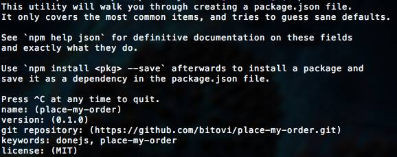

@page Guide
@parent DoneJS
@hide sidebar
@outline 2 ol
@description Learn how to create the [place-my-order](http://place-my-order.com) 
application with all of [Features DoneJS's features].

@body

## Setup

In this section we will create our DoneJS project and set up a REST API that the application can use.
You will need [NodeJS](http://www.meetup.com/yyc-js/events/222682935/?a=ra1_te) or [io.js](https://iojs.org/en/index.html) installed and your code editor of choice.

### Creating the project

To get the DoneJS application running, create a new folder and in it initialize a [package.json](https://docs.npmjs.com/files/package.json) which will contain information about your project, its dependencies and configuration:

```
mkdir place-my-order
cd place-my-order
npm init
```

`npm init` will ask a couple of questions which can all be answered by choosing the default. The final prompt looks like this:



Now we can install the DoneJS package and write it as a dependency into `package.json` so that a new copy of the application can be set up by simply typing `npm install` in the future:

```
npm install donejs --save
```

This will also install all of DoneJS's dependencies like StealJS, CanJS etc.

### Setup a service API

Single page applications usually communicate with a RESTful API and a websocket connection for real-time updates. How to create an API will not part of this guide. Instead we just install and start an existing service API module that can be used with our application:

```
npm install place-my-order-api --save
```

A good way to easily start the API (here on port `7070`) is adding it as an NPM script to the `package.json`:

```js
"scripts": {
    "api": "place-my-order-api --port 7070",
```

Which allows to start the API server with:

```
npm run api
```

The server will initialize some default data (restaurants and orders) on the first startup. Once started, you can verify that the data has been created and the service is running by going to [http://localhost:7070/restaurants](http://localhost:7070/restaurants) to see a JSON list of restaurant data.

## Setting up server side rendering

In the following paragraphs we will create the basic template and application file and start a server which hosts those files and is also responsible for pre-rendering the application on the server and proxy API calls.

### Create a template and main file

Every DoneJS application consists of at least two files: A main template (`pmo/main.stache`) which contains the main template and links to the development or production assets and a `pmo/app.js` which is the main application file that initializes the application state and routes. Add a `pmo/main.stache` to the project with the following content:

```
<html>
  <head>
    <title>Place My Order</title>
    {{asset "css"}}
  </head>
  <body>
    <can-import from="pmo/app" [.]="{value}" />
    <h1>{{message}}</h1>
    {{asset "inline-cache"}}

    {{#isProduction}}
    <script src="/node_modules/steal/steal.production.js" main="pmo/main.stache!done-autorender"></script>
    {{else}}
    <script src="/node_modules/steal/steal.js"></script>
    {{/isProduction}}
  </body>
</html>
```

This is an HTML5 template that uses the [Handlebars syntax]() compatible [can.stache]() as the view engine and renders a `message` property from the application state. The `asset` helper provides assets like CSS styles, cached data and links to scripts based on the environment (development or production).

The application main file at `pmo/app.js` looks like this:

```
// pmo/app.js
import AppMap from "can-ssr/app-map";
import 'can/map/define/';

const AppState = AppMap.extend({
  define: {
    message: {
      value: 'Hello World!'
    }
  }
});

export default AppState;
```

This initializes an `AppMap` which contains a global application state and is also responsible for caching data when rendering on the server so that it doesn't need to be requested again on the client. We will cover what `can/map/define/` does in more detail later but in the `define` object or `AppState` we can now create a `message` property with a default value `Hello World!`.

### Starting the application

With those two files available we can start the server which hosts and renders the application. We need to proxy the `place-my-order-api` server to `/api` on our server in order to avoid same origin issues. In the `scripts` section of `package.json` add:

```js
"scripts": {
    "start": "can-server --proxy http://localhost:7070 --port 8080",
```

`main` in `package.json` (by default set to `index.js`) also needs to be changed to:

```js
"main": "pmo/main.stache!done-autorender",
```

Then we can start the application with

> npm start

Go to [http://localhost:8080](http://localhost:8080) and see the hello world message.

## Creating components

One of the most important concepts in DoneJS is splitting up your application functionality into individual self-contained components. In the following section we will create four different components for the header, homepage, the restaurant list and the order history. In the next chapter we will glue them all together using routes and the globa application state.

There are two ways of creating components. For smaller components we can define all templates, styles and functionality in a single `.component` file (to learn more see [system-component])). Larger components can be split up into individual files.

### Creating a header and homepage element

The header component is fairly simple and basically consists of only the template. Create `pmo/header.component` with the following content:

```html
<can-component tag="pmo-home">
  <template>
     <can-import from="can/view/href/"/>
     <header>
       <nav>
         <h1>place-my-order.com</h1>
         <ul>
           <li class="{{#eq page 'home'}}active{{/eq}}">
             <a can-href='{page="home"}'>Home</a>
           </li>
           <li class="{{#eq page 'restaurants'}}active{{/eq}}">
             <a can-href='{page="restaurants"}'>Restaurants</a>
           </li>
           <li class="{{#eq page 'orders'}}active{{/eq}}">
             <a can-href='{page="orders"}'>Order History</a>
           </li>
         </ul>
       </nav>
     </header>
  </template>
</can-component>
```

Here we created a [can.Component]() using a web-component style declaration provided by the [system-component]() plugin. The component does not have any separate styles or functionality other than the template. `<can-import from="can/view/href/"/>` loads a `can-href` helper which allows it to easily create links to corresponding routes.

The homepage element in `pmo/home.component` is very similar:

```html
<can-component tag='pmo-home'>
  <template>
     <div class="homepage">
       
       <h1>Ordering food has never been easier</h1>
       <p>We make it easier than ever to order gourmet food from your favorite local restaurants.</p>
       <p><a class="btn" href="/restaurants" role="button">Choose a Restaurant</a></p>
     </div>
  </template>
</can-component>
```


### Creating a restaurant list element

The restaurant list will contain more functionality which is why we can split it up into separate files for the template and the component itself. When comprised of multiple files, they are put together into their own folder so that the standalone component can be easily shared and tested. We call it the [modlet pattern]().

```js
import Component from 'can/component/';
import Map from 'can/map/';
import template from './list.stache!';

export var ViewModel = Map.extend({});

export default Component.extend({
  tag: 'pmo-restaurant-list',
  viewModel: ViewModel,
  template: template
});
```

The template:

```
<a can-href="{page='home'}">Homepage</a>
<h2>Restaurants</h2>
```

### Create the order history element

As a partial?

## Setting up routing

In this part, you will create routes, two pages that are managed by custom elements,
and then make it possible to navigate between pages.

### Create Routes

Routing works slightly different than what you might be used to from other libraries Instead of declaring routes and mapping those to actions, our application will use CanJS [can.route]() which allows to map property names from a URL string to properties in our application state. As a result, our routes will just be a different representation of our application.

If you want to learn more about CanJS routing visit the CanJS guide on [Application State and Routing](http://canjs.com/2.3-pre/guides/AppStateAndRouting.html).

Change our `pmo/app.js` file to:

```
// pmo/app.js
import AppMap from "can-ssr/app-map";
import 'can/map/define/';
import route from 'can/route/';

const AppState = AppMap.extend({
  define: {
    message: {
      value: 'Hello World!'
    }
  }
});

route(':page', { page: 'home' });
route(':page/:slug', { slug: null });
route(':page/:slug/:action', { slug: null, action: null });

export default AppState;
```

### Switch between components

Update `main.stache`.

```html
{{#eq page "home"}}
  <can-import from="pmo/home/">
    <pmo-home></pmo-home>
  </can-import>
{{/eq}}
{{#eq page "restaurants"}}
  <can-import from="pmo/restaurant/list">
    <pmo-restaurant-list></pmo-restaurant-list>
  </can-import>
{{/eq}}
```

This progressively loads the modules

Update `main.stache`

```html
<can-import from="pmo/header/" />
<pmo-header page="{page}"></pmo-header>

{{#eq page "home"}}
  <can-import from="pmo/home/">
    <pmo-home></pmo-home>
  </can-import>
{{/eq}}
{{#eq page "restaurants"}}
  <can-import from="pmo/restaurant/list">
    <pmo-restaurant-list></pmo-restaurant-list>
  </can-import>
{{/eq}}
{{#eq page "order-history"}}
  <can-import from="pmo/order/history">
    <pmo-order-history></pmo-order-history>
  </can-import>
{{/eq}}
```

## Getting data from the server and showing it in the page.

### Creating a restaurants connection.

```js
import Map from 'can/map/';
import List from 'can/list/';
import connectSuperMap from 'can-connect/super-map';

export var Restaurant = can.Map.extend({});
Restaurant.List = can.List.extend({
  Map: Restaurant
});

export var restaurantConnection = superMap({
  resource: "/api/restaurants",
  idProp: '_id',
  Map: Restaurant,
  List: Restaurant.List,
  name: "restaurants"
});

window.restaurantConnection = restaurantConnection;
```

### Test the connection

```js
restaurantConnection.findAll({})
	.then(function(restaurants){
	  console.log( restaurants.attr() );
	});
```

### Add to the page

```js
export var ViewModel = Map.extend({
  define: {
    restaurants: function(){
      return restaurantConnection.findAll({});
    }
  }
});
```

```html
{{#if restaurants.isPending}}
  <div class="restaurant loading"></div>
{{/if}}
{{#if restaurants.isResolved}}
  {{#each restaurants.value}}
    <div class="restaurant">
      
      <h3>{{name}}</h3>
      {{#address}}
      <div class="address">
        {{street}}<br />{{city}}, {{state}} {{zip}}
      </div>
      {{/address}}

      <div class="hours-price">
        $$$<br />
        Hours: M-F 10am-11pm
        <span class="open-now">Open Now</span>
      </div>

      <a class="btn" can-href="{ page='restaurants' slug=slug }">Details</a>
      <br />
    </div>
  {{/each}}
{{/if}}
```

## Creating a unit-tested view model

Lets make the restaurants page let a user select a state and city and
finally see a list of restaurants for that state and city.

### Identify view model state

```js
{
 states: Promise<[State]>
 state: String "IL”,
 cities: Promise<[City]>,
 city: String "Chicago”,
 restaurants: Promise<[Restaurant]>
}
```

### Test the view model

#### Setup the test


```js
import {ViewModel as RestaurantListVM} from "./list";
import QUnit from 'steal-qunit';
import fixture from 'can/util/fixture/';

QUnit.module("pmo/restaurant/list");

QUnit.asyncTest("basics", function(){


});
```

#### Create fake data

```js
QUnit.asyncTest("basics", function(){

	var states = [{ name: "Calisota", short: "CA" }, 
                 { name: "New Troy", short: "NT"}];
	var caCities = [{state: "CA",name: "Casadina"}];
	var ntCities = [{state: "NT", name: "Alberny"}];
	var casadinaRestaurants = [{
     "_id":"1","name":
     "Cheese City","slug":"cheese-city”
    }];


});

```

#### Use fake data for Ajax requests

```js
QUnit.asyncTest("basics", function(){
	…
	var casadinaRestaurants = [{ … }];

    fixture({
	  "/api/states": ()=> ({data: states}),
	  "/api/cities": function(request){
		return request.data.state === "CA" ? caCities : ntCities;	  
      },
	  "/api/restaurants": ()=> ({data: casadinaRestaurants})
	})	


});
```

#### Create a view model instance and test its behavior

```
QUnit.asyncTest("basics", function(){
	…
	var casadinaRestaurants = [{ … }];
	fixture({…})	

    var rlVM = new RestaurantListVM();
	
	rlVM.attr("states").then(function(vmStates){
		QUnit.deepEqual(vmStates.attr(), states, "Got states");
		rlVM.attr("state","CA");
	});

   rlVM.one("cities", function( ev, citiesPromise ) {
		citiesPromise.then(function( vmCities ) {
			deepEqual(vmCities.attr(), caCities, "Got ca cities");
			rlVM.attr("city", "Casadina");
		});
	});
	
	rlVM.one("restaurants", function(ev, restaurantsPromise){
		restaurantsPromise.then(function(vmRestaurants){
			deepEqual(vmRestaurants.attr(), casadinaRestaurants);

			rlVM.attr("state","NT");			
			ok( !rlVM.attr("city"), "city selection removed" );
			rlVM.attr("cities").then(function(vmCities){
				deepEqual(vmCities.attr(), ntCities);
				start();
			});
		});
	});

});
```

### Write the view model

#### Make dependent models

State:

```
import Map from 'can/map/';
import List from 'can/list/';
import superMap from 'can-connect/super-map';

const State = Map.extend({});

State.List = List.extend({});

superMap({
  resource: '/api/states',
  idProp: 'short',
  Map: State,
  List: State.List,
  name: 'states'
});

export default State;
```

City:

```
import Map from 'can/map/';
import List from 'can/list/';
import superMap from 'can-connect/super-map';

const City = Map.extend({});

City.List = List.extend({});

superMap({
  resource: '/api/cities',
  idProp: 'name',
  Map: City,
  List: City.List,
  name: 'cities'
});

export default City;
```

#### Define stateful property behaviors

```js
import Component from 'can/component/';
import Map from 'can/map/';
import 'can/map/define/';

import City from 'pmo/models/city';
import State from 'pmo/models/state';
import Restaurant from 'pmo/models/restaurant';
import template from './list.stache!';

export const ViewModel = Map.extend({
  define: {
    states: {
      get() {
        return State.findAll({});
      }
    },
    state: {
      value: null,
      set() {
        // Remove the city when the state changes
        this.attr('city', null);
      }
    },
    cities: {
      get() {
        var state = this.attr('state');
        return state ? City.findAll({ state }) : null;
      }
    },
    city: {
      value: null
    },
    restaurants: {
      get: function(){
        var params = {},
          state = this.attr('state'),
          city = this.attr('city');

        return state && city ?
          Restaurant.findAll({
            'address.state': state,
            'address.city': city
          }) : null;
      }
    }
  }
});

export default Component.extend({
  tag: 'pmo-restaurant-list',
  viewModel: ViewModel,
  template
});
```

#### Verify the test

Open some page.

### Create a demo page

- ¿ What fixtures should be used ?

```html
<script type='text/stache' can-autorender>
  <can-import from="pmo/restaurant/list/" />
  <can-import from="pmo/models/fixtures/" />
  <pmo-order slug="spago"></pmo-order>
</script>
<script src="../../node_modules/steal/steal.js"
        main="can/view/autorender/"></script>
```

### Write the template

- ¿ Are all the class names necessary ?
- ¿ Should we show creating a helper for a `<select>` ?

```
<h2 class="page-header">Restaurants</h2>
  <form class="form">
  <div class="form-group">
    <label>State</label>
    <select class="form-control" can-value="{state}" {{#if states.isPending}}disabled{{/if}}>
      {{#if states.isPending}}
        <option value="">Loading...</option>
      {{else}}
        {{^if state}}
        <option value="">Choose a state</option>
        {{/if}}
        {{#each states.value}}
        <option value="{{short}}">{{name}}</option>
        {{/each}}
      {{/if}}
    </select>
  </div>
  <div class="form-group">
    <label>City</label>
    <select class="form-control" can-value="city" {{^if state}}disabled{{/if}}>
      {{#if cities.isPending}}
        <option value="">Loading...</option>
      {{else}}
        {{^if city}}
        <option value="">Choose a city</option>
        {{/if}}
        {{#each cities.value}}
        <option>{{name}}</option>
        {{/each}}
      {{/if}}
    </select>
  </div>
</form>

{{#if restaurants.isPending}}
<div class="restaurant loading"></div>
{{/if}}

{{#if restaurants.isResolved}}
  {{#each restaurants.value}}
  <div class="restaurant">
    
    <h3>{{name}}</h3>
    {{#address}}
    <div class="address">
      {{street}}<br />{{city}}, {{state}} {{zip}}
    </div>
    {{/address}}

    <div class="hours-price">
      $$$<br />
      Hours: M-F 10am-11pm
      <span class="open-now">Open Now</span>
    </div>

    <a class="btn" can-href="{ page='restaurants' slug=slug }">Place My Order</a>
    <br />
  </div>
  {{/each}}
{{/if}}
```

### Verify the demo page and application works.

Open up the demo page.

Open up the app.

## Setup automated tests and continuous integration (CI)

## Nested routes

## Importing other projects

## Creating data

## Setup a real-time connection

## Production builds

### Bundling your app

### Building to iOS and Andriod

### Building to NW.js

## Deploying

