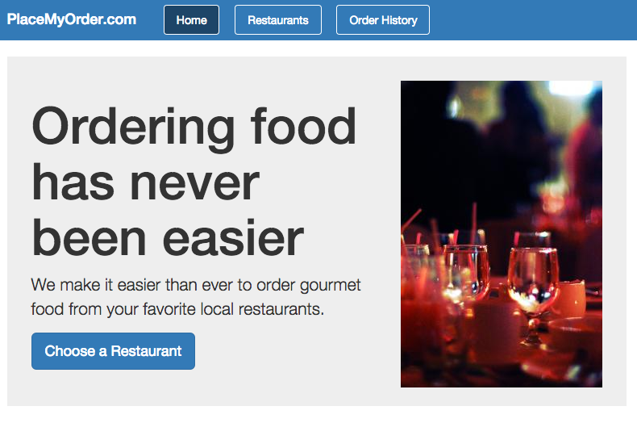
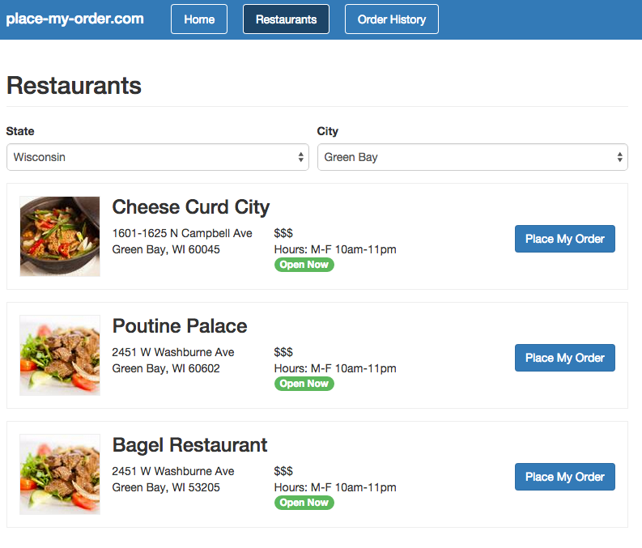

@page Guide
@parent DoneJS
@hide sidebar
@outline 2 ol
@description In this guide you will learn about all of [DoneJS features]() by creating, testing, documenting, building and deploying [place-my-order.com](http://place-my-order.com), a restaurant menu and ordering application. The final result will look like this:





After the initial application setup (including a server that hosts and pre-renders the application) we will create several custom elements and then bring them together using the application state and routes. Then we will learn how to retrieve data from the server using a RESTful API.

After that we will talk more about what a view-model is and how to identify, implement and test its functionality. Once we have unit tests running in the browser we will automate running them from the command line locally and also on a continuous integration server. In the subsequent chapters we will show how to easily import other existing modules into our application and how to set up a real-time connection.

Finally we will describe how to build and deploy your application for the web and also as a desktop application with nw.js and a mobile app with Cordova.

@body

## Setup the project

In this section we will create our DoneJS project and set up a REST API that the application can use.
You will need [NodeJS](http://www.meetup.com/yyc-js/events/222682935/?a=ra1_te) or [io.js](https://iojs.org/en/index.html) installed and your code editor of choice.

### Create the project

To get set up, create a new folder and in it initialize a [package.json](https://docs.npmjs.com/files/package.json) which will contain information about your project, its dependencies and configuration:

```
mkdir place-my-order
cd place-my-order
npm init
```

[npm init](https://docs.npmjs.com/cli/init) will ask a couple of questions which can all be answered by choosing the default.

Now we can install the DoneJS package and write it as a dependency into `package.json` so that a new copy of the application can be set up in the future by simply typing `npm install`:

```
npm install donejs --save
```

This will also install all of DoneJS's dependencies like:

- [StealJS](http://stealjs.com) - ES6, CJS, and AMD module loader and builder
- [CanJS](http://canjs.com) - Custom elements and Model-View-ViewModel utilities
- [jQuery](http://jquery.com) - DOM helpers
- [jQuery++](http://jquerypp.com) - Extended DOM helpers
- [QUnit](https://qunitjs.com/) or Mocha - Assertion library
- [FuncUnit](http://funcunit.com) - Functional tests
- Testee or Karma - Test runner
- [DocumentJS](http://documentjs.com) - Documentation
- [can-ssr](http://github.com/canjs/ssr) - Server-Side Rendering Utilities for CanJS

The initial folder structure then looks like this:

```
├── package.json
├── node_modules/
|   ├── .bin/
|   └── can/
|   └── can-connect/
|   └── can-ssr/
|   └── ...
```

### Setup a service API

Single page applications usually communicate with a RESTful API and a websocket connection for real-time updates. How to create an API will not part of this guide. Instead we just install and start an existing service API that can be used with our application:

```
npm install place-my-order-api --save
```

With the `package.json` currently lookingn similar to this:

```js
{
  "name": "place-my-order",
  "version": "0.0.1",
  "description": "The place-my-order.com frontend",
  "main": "index.js",
  "scripts": {
    "test": "echo \"Error: no test specified\" && exit 1"
  },
  "author": "Bitovi",
  "license": "MIT",
  "dependencies": {
    "can": "^2.3.0-pre.1",
    "can-connect": "0.0.1",
    "can-ssr": "^0.1.2",
    "documentjs": "^0.3.0-pre.4",
    "done-autorender": "0.0.3",
    "done-css": "0.0.6",
    "donejs": "0.0.3",
    "funcunit": "^3.0.0",
    "jquery": "^1.11.3",
    "steal": "^0.10.5",
    "steal-qunit": "0.0.4"
  }
}
```

We can add a API server start script into the `scripts` section that looks like this:

```js
"scripts": {
    "api": "place-my-order-api --port 7070",
```

Which allows to start the server with:

```
npm run api
```

At first startup, the server will initialize some default data (restaurants and orders). Once started, you can verify that the data has been created and the service is running by going to [http://localhost:7070/restaurants](http://localhost:7070/restaurants) to see a JSON list of restaurant data. Keep this server running during development.

## Setup server side rendering

In the following paragraphs we will:

- create the basic template
- create the main application file
- start a server which
  - hosts those static files
  - is responsible for pre-rendering the application
  - proxies REST API calls to avoid cross-origin issues

### Create a template and main file

Before we create the first files we also need to install the `place-my-order-assets` package which contains the images and styles for the application:

```
npm install place-my-order-assets --save
```

Every DoneJS application consists of at least two files: A main template (`pmo/index.stache`) which contains the main template and links to the development or production assets and a `pmo/app.js` which is the main application file that initializes the application state and routes. Add `pmo/index.stache` to the project with the following content:

```html
<!DOCTYPE html>
<html>
  <head>
    <title>Place My Order</title>
    {{asset "css"}}
  </head>
  <body>
    <can-import from="place-my-order-assets" />
    <can-import from="pmo/app" [.]="{value}" />
    <h1>{{message}}</h1>
    {{asset "inline-cache"}}

    {{#if isProduction}}
      <script src="/node_modules/steal/steal.production.js"
        main="pmo/index.stache!done-autorender"></script>
    {{else}}
      <script src="/node_modules/steal/steal.js"></script>
    {{/if}}
  </body>
</html>
```

This is an HTML5 template that uses the [Handlebars syntax](http://handlebarsjs.com/) compatible [can.stache](http://canjs.com/docs/can.stache.html) as the view engine and renders a `message` property from the application state. `can-import` loads dependencies of the templates. Here the `place-my-order-assets` package (which loads the LESS styles for the application) and `pmo/app` which it the main application file. The [asset]() helper provides assets like CSS styles, cached data and links to scripts based on the environment (development or production).

The application main file at `pmo/app.js` looks like this:

```
// pmo/app.js
import AppMap from "can-ssr/app-map";

const AppState = AppMap.extend({
  message: 'Hello World!'
});

export default AppState;
```

This initializes an `AppMap` which contains the application state (with a default `message` property) and is also responsible for caching data when rendering on the server so that it doesn't need to be requested again on the client.

The complete file structure of the application now looks like this:

```
├── node_modules/
├── package.json
├── pmo/
|   ├── app.js
|   └── index.stache
```

### Starting the application

With those two files available we can start the server which hosts and renders the application. We need to proxy the `place-my-order-api` server to `/api` on our server in order to avoid same origin issues. In the `scripts` section of `package.json` add:

```js
"scripts": {
    "start": "can-serve --proxy http://localhost:7070 --port 8080",
```

`main` in `package.json` (by default set to `index.js`) also needs to be changed to:

```js
"main": "pmo/index.stache!done-autorender",
```

Then we can start the application with

> npm start

Go to [http://localhost:8080](http://localhost:8080) to see the hello world message.

## Creating custom elements

One of the most important concepts in DoneJS is splitting up your application functionality into individual self-contained modules. In the following section we will create different components for the homepage, the restaurant list and the order history. After that we will glue them all together using routes and the global application state.

There are two ways of creating components. For smaller components we can define all templates, styles and functionality in a single `.component` file (to learn more see [system-component](https://github.com/stealjs/system-component))). Larger components can be split up into individual files.

### Creating a homepage element

The homepage element in `pmo/home.component` is very simple and just consists of a template:

```html
<can-component tag="pmo-home">
  <template>
     <div class="homepage">
       
       <h1>Ordering food has never been easier</h1>
       <p>We make it easier than ever to order gourmet food from your favorite local restaurants.</p>
       <p><a class="btn" href="/restaurants" role="button">Choose a Restaurant</a></p>
     </div>
  </template>
</can-component>
```

Here we created a [can.Component](http://canjs.com/docs/can.Component.html) named `pmo-home` using a [web-component](http://webcomponents.org/) style declaration. The component does not have any separate styles or functionality other than the template.

### Create the order history element

For now, the order history is very similar. In `pmo/order/history.component`:

```
<can-component tag="pmo-order-history">
  <template>
    <div class="order-history">
      <div class="order header">
        <address>Name / Address / Phone</address>
        <div class="items">Order</div>
        <div class="total">Total</div>
        <div class="actions">Action</div>
      </div>
    </div>
  </template>
</can-component>
```

### Creating a restaurant list element

The restaurant list will contain more functionality which is why we can split it into separate files for the template and the component logic. All files are put together into their own folder so that components can be easily re-used and tested individually. In `pmo/restaurant/list/list.js`:

```js
import Component from 'can/component/';
import Map from 'can/map/';
import template from './list.stache!';

export var ViewModel = Map.extend({});

export default Component.extend({
  tag: 'pmo-restaurant-list',
  viewModel: ViewModel,
  template: template
});
```

And add a simple template at `pmo/restaurant/list/list.stache`:

```
<a can-href="{page='home'}">Homepage</a>
<h2>Restaurants</h2>
```

We will add more functionality to this element in a later chapter. Your folder structure should look like this:

```
├── node_modules
├── package.json
├── pmo/
|   ├── app.js
|   └── index.stache
|   ├── order/
|   |   ├── history.component
|   ├── restaurant/
|   |   ├── list/
|   |   |   ├── list.js
|   |   |   ├── list.stache
```

## Setting up routing

In this part, we will create routes and dynamically load and bring the custom elements we created together on the main page.

### Create Routes

Routing works slightly different than what you might be used to from other libraries. Instead of declaring routes and mapping those to actions, our application will use CanJS [can.route](http://canjs.com/docs/can.route.html) which allows to map property names from a URL string to properties in our application state. As a result, our routes will just be a different representation of the application state.

If you want to learn more about CanJS routing visit the CanJS guide on [Application State and Routing](http://canjs.com/2.3-pre/guides/AppStateAndRouting.html).

To add the routes, change `pmo/app.js` to:

```
// pmo/app.js
import AppMap from "can-ssr/app-map";
import route from 'can/route/';

const AppState = AppMap.extend({});

export default AppState;

route(':page', { page: 'home' });
route(':page/:slug', { slug: null });
route(':page/:slug/:action', { slug: null, action: null });

export default AppState;
```

Now we have three routes available:

- `:page` captures urls like [http://localhost:8080/home](http://localhost:8080/home) and sets the `page` property on `AppState` to `home` (which is also the default when visiting [http://localhost:8080/](http://localhost:8080/))
- `:page/:slug` which matches restaurant links like [http://localhost:8080/restaurants/spago](http://localhost:8080/restaurants/spago) which sets `page` and `slug` (a URL friendly restaurant short name)
- `:page/:slug/:action` which will be used to show the order page for a specific restaurant e.g. [http://localhost:8080/restaurants/spago/order](http://localhost:8080/restaurants/spago/order)

### Adding a header element

Now is also a good time to add a header element at `pmo/header.component` that links to the different routes we just defined.

```html
<can-component tag="pmo-header">
  <template>
     <can-import from="can/view/href/"/>
     <header>
       <nav>
         <h1>place-my-order.com</h1>
         <ul>
           <li class="{{#eq page 'home'}}active{{/eq}}">
             <a can-href="{page='home'}">Home</a>
           </li>
           <li class="{{#eq page 'restaurants'}}active{{/eq}}">
             <a can-href="{page='restaurants'}">Restaurants</a>
           </li>
           <li class="{{#eq page 'order-history'}}active{{/eq}}">
             <a can-href="{page='order-history'}">Order History</a>
           </li>
         </ul>
       </nav>
     </header>
  </template>
</can-component>
```

Here we use the `eq` helper to make the appropriate link active and then use [can-href]() to create links based on the the application state (e.g. by setting the `page` property to `home`) which will then create the proper links based on the route ([http://localhost:8080/home](http://localhost:8080/home) in this case).

### Switch between components

Now we can glue all those individual components together in `pmo/index.stache`. What we want to do is - based on the current page (`home`, `restaurants` or `order-history`) - load the correct component and then initialize it with the information from the application state it needs. Update `pmo/index.stache` to:

```html
<!DOCTYPE html>
<html>
  <head>
    <title>Place My Order</title>
    {{asset "css"}}
  </head>
  <body>
    <can-import from="place-my-order-assets" />
    <can-import from="pmo/app" [.]="{value}" />

    <can-import from="pmo/header.component!" />
    <pmo-header page="{page}"></pmo-header>

    {{#eq page "home"}}
      <can-import from="pmo/home.component!">
        <pmo-home></pmo-home>
      </can-import>
    {{/eq}}
    {{#eq page "restaurants"}}
      <can-import from="pmo/restaurant/list/">
        <pmo-restaurant-list></pmo-restaurant-list>
      </can-import>
    {{/eq}}
    {{#eq page "order-history"}}
      <can-import from="pmo/order/history.component!">
        <pmo-order-history></pmo-order-history>
      </can-import>
    {{/eq}}

    {{asset "inline-cache"}}

    {{#if isProduction}}
      <script src="/node_modules/steal/steal.production.js"
        main="pmo/main.stache!done-autorender"></script>
    {{else}}
      <script src="/node_modules/steal/steal.js"></script>
    {{/if}}
  </body>
</html>
```

Here we use the `eq` helper to check for the page, then progressively load the component with [can-import]() and initialize it. If you now reload [http://localhost:8080/](http://localhost:8080/) you should see the header and the home component and be able to navigate.

## Getting data from the server and showing it in the page.

[can-connect]() is a powerful data layer that allows our application to connect to the RESTful API that we set up with `place-my-order-api`.

### Creating a restaurants connection.

At the beginning of this guide we set up a REST API at [http://localhost:7070](http://localhost:7070) and told `can-serve` to proxy it to [http://localhost:8080/api](http://localhost:8080/api). To get the restaurant data from [http://localhost:8080/api/restaurants](http://localhost:8080/api/restaurants) we need to do two things:

1. Create a Restaurants [can.Map](http://canjs.com/docs/can.Map.html) and [can.List](http://canjs.com/docs/can.List.html)
2. Create a connection to `/api/restaurants`

We will put the connection in `pmo/models/restaurant.js`:

```js
import superMap from 'can-connect/can/super-map/';

export const connection = superMap({
  resource: '/api/restaurants',
  idProp: '_id',
  name: 'restaurants'
});

export default connection.Map;
```

The connection is a can-connect [superMap]() and besides setting the `Map` and `List` type the connection should return we also define:

- `resource` - The URL of the REST endpoint
- `idProp` - The property name of the data unique identifier
- `name` - A short name used as an identifier when caching data

### Test the connection

To test the connection you can temporarily add the following to `pmo/app.js`:

```js
import Restaurant from './models/restaurant';

Restaurant.getList({})
	.then(function(restaurants){
	  console.log(restaurants.attr());
	});
```

After reloading the homepage you should see the restaurant information logged in the console. Once verified you can remove the test code again.

### Add to the page

Now that we know we get data from the server we can update the `ViewModel` in `pmo/restaurant/list.js` to use [can.Map.define](http://canjs.com/docs/can.Map.prototype.define.html) to load all restaurants from the restaurant connection:

```js
import Component from 'can/component/';
import Map from 'can/map/';
import 'can/map/define/';
import template from './list.stache!';
import Restaurant from 'pmo/models/restaurant';

export var ViewModel = Map.extend({
  define: {
    restaurants: {
      value(){
        return Restaurant.getList({});
      }
    }
  }
});

export default Component.extend({
  tag: 'pmo-restaurant-list',
  viewModel: ViewModel,
  template: template
});
```

And update the template at `pmo/restaurant/list.stache` to use the [Promise](http://canjs.com/docs/can.Deferred.html) returned for the `restaurants` property to render the template:

```html
<div class="restaurants">
  <h2 class="page-header">Restaurants</h2>
  {{#if restaurants.isPending}}
    <div class="restaurant loading"></div>
  {{/if}}
  {{#if restaurants.isResolved}}
    {{#each restaurants.value}}
      <div class="restaurant">
        
        <h3>{{name}}</h3>
        {{#address}}
        <div class="address">
          {{street}}<br />{{city}}, {{state}} {{zip}}
        </div>
        {{/address}}

        <div class="hours-price">
          $$$<br />
          Hours: M-F 10am-11pm
          <span class="open-now">Open Now</span>
        </div>

        <a class="btn" can-href="{ page='restaurants' slug=slug }">Details</a>
        <br />
      </div>
    {{/each}}
  {{/if}}
</div>
```

By checking for `restaurants.isPending` and `restaurants.isResolved` we are able to show a loading indicator while the data are being retrieved. Once resolved, the actual restaurant list is available at `restaurants.value`.

The current folder structure and files look like this:

```
├── node_modules
├── package.json
├── pmo/
|   ├── app.js
|   └── index.stache
|   ├── models/
|   |   ├── restaurant.js
|   ├── order/
|   |   ├── history.component
|   ├── restaurant/
|   |   ├── list/
|   |   |   ├── list.js
|   |   |   ├── list.stache
```

## Creating a unit-tested view model

In this chapter we will create a view model for the restaurant list functionality. What we want to do is to show a dropdown of all available states with a restaurants and when the user selects a state show a list of cities. Once a city is selected we will load a list of all restaurants for that city with the result looking like this:



### Identify view model state

First we need to identify the properties that our view model needs to provide. We want to load a list of states from the server (all asynchronous requests return a [Promise](https://promisesaplus.com/)) and let the user select a single state. Then we do the same for cities and finally load the restaurant list for that selection.


Which means the data model will look like this:

```js
{
 states: Promise<[State]>
 state: String "IL”,
 cities: Promise<[City]>,
 city: String "Chicago”,
 restaurants: Promise<[Restaurant]>
}
```

### Create dependent models

The API already provides a list of available [states](http://localhost:8080/api/states) and [cities](http://localhost:8080/api/cities) (`api/cities`). To load them we can create the according models just like we did for Restaurants already. In `pmo/models/state.js`:

```js
// pmo/models/state.js
import superMap from 'can-connect/can/super-map/';

export const connection = superMap({
  url: '/api/states',
  idProp: 'short',
  name: 'states'
});

export default connection.Map;
```

and `pmo/models/city.js`:

```js
// pmo/models/city.js
import superMap from 'can-connect/can/super-map/';

export const connection = superMap({
  url: '/api/cities',
  idProp: 'name',
  name: 'states'
});

export default connection.Map;
```

### Implement view model behavior

Now that we identified the view model properties we need and created the models necessary to load them we can [define](http://canjs.com/docs/can.Map.prototype.define.html) the `states`, `state`, `cities` and `city` properties in the view-model at `pmo/restaurant/list/list.js`:

```js
import Component from 'can/component/';
import Map from 'can/map/';
import 'can/map/define/';
import template from './list.stache!';
import Restaurant from 'pmo/models/restaurant';
import State from 'pmo/models/state';
import City from 'pmo/models/city';

export var ViewModel = Map.extend({
  define: {
    states: {
      get() {
        return State.getList({});
      }
    },
    state: {
      type: 'string',
      value: null,
      set() {
        // Remove the city when the state changes
        this.attr('city', null);
      }
    },
    cities: {
      get() {
        let state = this.attr('state');

        if(!state) {
          return null;
        }

        return City.getList({ state });
      }
    },
    city: {
      type: 'string',
      value: null
    },
    restaurants: {
      get() {
        let state = this.attr('state');
        let city = this.attr('city');

        if(state && city) {
          return Restaurant.getList({
            'address.state': state,
            'address.city': city
          });
        }

        return null;
      }
    }
  }
});

export default Component.extend({
  tag: 'pmo-restaurant-list',
  viewModel: ViewModel,
  template: template
});
```

Let's take a closer look at those properties:

- `states` will just return a list of all available states by calling `State.getList({})`
- `state` is a string property set to `null` by default (no selection). Additionally, when `state` is changed we will also remove the dependent `city` selection.
- `cities` will return `null` if no state has been selected, otherwise load all the cities for a given state by sending `state` as a query paramter (which will make a request like [http://localhost:8080/api/cities?state=IL](ttp://localhost:8080/api/cities?state=IL))
- `city` is a simple string, set to `null` by default
- `restaurants` will always be `null` unless both, a `city` and a `state` are selected. If both are selected, it will set the `address.state` and `address.city` query parameters which returns a list of all restaurants whose address matches those parameters.

### Create a test

Now we can set up a test for this view model to make sure that it works. We will use [QUnit](http://qunitjs.com/) as the testing framework by loading a StealJS friendly wrapper (`steal-qunit`) in `pmo/restaurants/list/list_test.js`:

```js
// pmo/restaurants/list/list_test.js
import { ViewModel } from './list';
import QUnit from 'steal-qunit';

QUnit.module('pmo/restaurant/list');

QUnit.test('basics', function(){
  ok(true, 'Test ran');
});
```

To run the test we can create a simple HTML page in the same folder (`pmo/restaurants/list/test.html`):

```html
<title>pmo/restaurant/list</title>
<script src="../../../node_modules/steal/steal.js" main="pmo/restaurant/list/list_test"></script>
<div id="qunit-fixture"></div>
```

When opening [http://localhost:8080/pmo/restaurants/list/test.html](http://localhost:8080/pmo/restaurants/list/test.html) we can see the test pass.

#### Create fake data

Unit tests should be able to run by themselves without the need for an API server. This is where [fixtures](http://canjs.com/docs/can.fixture.html) come in. Fixtures allow us to mock requests to the REST API with data that we can use in the test or in demo pages. We will put them in `pmo/models/fixtures.js`:

```js
// pmo/models/fixtures.js
import fixture from 'can/util/fixture/';

export const statesFixture = [
  { name: 'Calisota', short: 'CA' },
  { name: 'New Troy', short: 'NT'}
];

export const citiesFixture = {
  CA: [{ state: 'CA',name: 'Casadina' }],
  NT: [{ state: 'NT', name: 'Alberny' }]
}

export const restaurantsFixture = [{
  _id: 1,
  name: 'Cheese City',
  slug:'cheese-city',
  address: {
    city: 'Casadina',
    state: 'CA'
  }
}, {
  _id: 2,
  name: 'Crab Barn',
  slug:'crab-barn',
  address: {
    city: 'Alberny',
    state: 'NT'
  }
}];

fixture({
  "/api/states": function() {
    return { data: statesFixture };
  },
  "/api/cities": function(request) {
    if(request.data.state === 'CA') {
      return { data: citiesFixture.CA };
    }
    return { data: citiesFixture.NT };
  },
  "/api/restaurants": function() {
    if(data['address.city'] === 'Alberny' && data['address.state'] === 'NT') {
      return { data: [ restaurantsFixture[1] ] };
    }

    return { data: restaurantsFixture };
  }
});

export default fixture;
```

#### Test the view model

Now we can add the actual tests for our view model by changing `pmo/restaurants/list/list_test.js` to:

```
import { statesFixture, citiesFixture, restaurantsFixture } from 'pmo/models/fixtures';

QUnit.module('pmo/restaurant/list');

QUnit.asyncTest('loads all states', function() {
  var vm = new ViewModel();
  vm.attr('states').then(states => {
    QUnit.deepEqual(states.attr(), statesFixture, 'Got all states');
    QUnit.start();
  });
});

QUnit.asyncTest('setting a state loads its cities', function() {
  var vm = new ViewModel();
  assert.equal(vm.attr('cities'), null, '');
  vm.attr('state', 'CA');
  vm.attr('cities').then(cities => {
    QUnit.deepEqual(cities.attr(), citiesFixture.CA);
    QUnit.start();
  });
});

QUnit.asyncTest('changing a state resets city', function() {
  var vm = new ViewModel();
  assert.equal(vm.attr('cities'), null, '');
  vm.attr('state', 'CA');
  vm.attr('cities').then(cities => {
    QUnit.deepEqual(cities.attr(), citiesFixture.CA);
    vm.attr('state', 'NT');
    QUnit.equal(vm.attr('city'), null);
    QUnit.start();
  });
});

QUnit.asyncTest('setting state and city loads a list of its restaurants', function() {
  var vm = new ViewModel();
  vm.attr('state', 'NT');
  vm.attr('city', 'Alberny');

  vm.attr('restaurants').then(restaurants => {
    QUnit.deepEqual(restaurants.attr(), [ restaurantsFixture[1] ]);
    QUnit.start();
  });
});
```

Visit [http://localhost:8080/pmo/restaurants/list/test.html](http://localhost:8080/pmo/restaurants/list/test.html) to see all tests passing.

### Write the template

Now that our view model is implemented and tested we can use its data to update the template at `pmo/restaurant/list/list.stache` to:

```
<div class="restaurants">
  <h2 class="page-header">Restaurants</h2>
  <form class="form">
    <div class="form-group">
      <label>State</label>
      <select can-value="{state}" {{#if states.isPending}}disabled{{/if}}>
        {{#if states.isPending}}
          <option value="">Loading...</option>
        {{else}}
          {{^if state}}
          <option value="">Choose a state</option>
          {{/if}}
          {{#each states.value}}
          <option value="{{short}}">{{name}}</option>
          {{/each}}
        {{/if}}
      </select>
    </div>
    <div class="form-group">
      <label>City</label>
      <select can-value="city" {{^if state}}disabled{{/if}}>
        {{#if cities.isPending}}
          <option value="">Loading...</option>
        {{else}}
          {{^if city}}
          <option value="">Choose a city</option>
          {{/if}}
          {{#each cities.value}}
          <option>{{name}}</option>
          {{/each}}
        {{/if}}
      </select>
    </div>
  </form>

  {{#if restaurants.isPending}}
  <div class="restaurant loading"></div>
  {{/if}}

  {{#if restaurants.isResolved}}
    {{#each restaurants.value}}
    <div class="restaurant">
      
      <h3>{{name}}</h3>
      {{#address}}
      <div class="address">
        {{street}}<br />{{city}}, {{state}} {{zip}}
      </div>
      {{/address}}

      <div class="hours-price">
        $$$<br />
        Hours: M-F 10am-11pm
        <span class="open-now">Open Now</span>
      </div>

      <a class="btn" can-href="{ page='restaurants' slug=slug }">Place My Order</a>
      <br />
    </div>
    {{/each}}
  {{/if}}
</div>
```

Some things worth pointing out:

- since `states` and `cities` return a promise we can check the promise status via `isResolved` and `isPending` and once resolved get the actual value with `states.value` and `cities.value`. This also allows us to easily show loading indicators and disable the select fields while loading data.
- The `state` and `city` property are bound to their select fields via [can-value](http://canjs.com/docs/can.view.bindings.can-value.html)

### Create a demo page

With all the component files contained in the `pmo/restaurant/list/` folder we can also add a demo page at `pmo/restaurants/list/demo.html` that uses fixture to demonstrate the component:

```html
<script type="text/stache" can-autorender>
  <can-import from="pmo/models/fixtures" />
  <can-import from="pmo/restaurant/list/" />
  <pmo-restaurant-list></pmo-restaurant-list>
</script>
<script src="../../node_modules/steal/steal.js"
        main="can/view/autorender/"></script>
```

## Setup automated tests and continuous integration (CI)

In this chapter we will automate running the tests so that they can be used in a [continuous integration]() environment. We will use [TravisCI]() as the CI server.

### Creating a global test page

While we already created an individual test page in `pmo/restaurants/list/test.html` it is also useful to have another test page that loads and runs all the tests at once. Lets create `pmo/test.html` like:

```html
<title>Place my order tests</title>
<script src="node_modules/steal/steal.js" main="pmo/test"></script>
<div id="qunit-fixture"></div>
```

And `pmo/test.js` which loads all the tests as:

```js
import 'pmo/models/fixtures';
import 'pmo/restaurant/list/list_test';

window.localStorage.clear();
```

If you now go to [http://localhost:8080/test.html](http://localhost:8080/test.html) we still see all restaurant list tests passing but we will add more here later on.

### Setting up a test runner

The tests can be automated with any test runner that supports running QUnit tests. We will use [Testee]() which makes it easy to run those tests from the command line without much configuration in any browser. In our example we will use Firefox since it is also installed in the Travis CI environment.

```
npm install testee --save-dev
```

Then we can change the `test` script in `package.json` which currently shows something like

```
"test": "echo \"Error: no test specified\" && exit 1"
```

To:

```js
"scripts": {
    "test": "testee test.html --browsers firefox",
```

Now running `npm test` from the command line will open Firefox and run the tests using our fixtures. Make sure that Firefox is installed and not currently running.

### Setting up TravisCI

[TravisCI]() is a continuous integration service that is free for open source projects.


## Nested routes

Until now we used three top level routes, `home`, `restaurants` and `order-history`. We did however also define two additional routes in `pmo/app.js` which looked like:

```js
route(':page/:slug', { slug: null });
route(':page/:slug/:action', { slug: null, action: null });
```

What we want to do now is use those routes when we are in the `restaurants` page. The relevant section in `pmo/index.stache` currently looks like this:

```html
{{#eq page "restaurants"}}
  <can-import from="pmo/restaurant/list/">
    <pmo-restaurant-list></pmo-restaurant-list>
  </can-import>
{{/eq}}
```

We want to support two additional routes:

- `restaurants/:slug` which shows a details page for the restaurant with `slug` being a URL friendly short name for the restaurant
- `restaurants/:slug/order` which shows the menu of the current restaurant and allows us to make a selection and then send our order.

### Create additional components

To make this happen we need two more components. First `pmo/restaurant/details.component` which loads the restaurants (based on the `slug`) and then displays its information (with some Lorem Ipsum in the description):

```html
<can-component tag="pmo-restaurant-details">
  <template>
    <restaurant-model get="{ _id=slug }">
      {{#if isPending}}
        <div class="loading"></div>
      {{else}}
      {{#value}}
      <div class="restaurant-header"
          style="background-image: url(/{{images.banner}});">
        <div class="background">
          <h2>{{name}}</h2>

          {{#address}}
          <div class="address">
            {{street}}<br />{{city}}, {{state}} {{zip}}
          </div>
          {{/address}}

          <div class="hours-price">
            $$$<br />
            Hours: M-F 10am-11pm
            <span class="open-now">Open Now</span>
          </div>

          <br />
        </div>
      </div>

      <div class="restaurant-content">
        <h3>The best food this side of the Mississippi</h3>

        <p class="description">
          
          Description for {{name}}
        </p>
        <p class="order-link">
          <a class="btn" can-href="{ page='restaurants' slug=slug action='order'}">
            Order from {{name}}
          </a>
        </p>
      </div>
      {{/value}}
      {{/if}}
    </restaurant-model>
  </template>
</can-component>
```

The order component will be a little more complex which is why we will put it into its own folder at `pmo/order/new/`. For now we just use placeholder content and implement the functionality in the following chapters. In `pmo/order/new/new.js`:

```js
import Component from 'can/component/component';
import Map from 'can/map/';
import 'can/map/define/';
import template from './new.stache!';

export const ViewModel = Map.extend({});

export default Component.extend({
  tag: 'pmo-order-new',
  viewModel: ViewModel,
  template
});
```

And for the template at `pmo/order/new/new.stache`:

```html
<div class="order-form">
  <h2>Order here</h2>
</div>
```

### Add to the main template

Now we can add those components to the main template (at `pmo/index.stache`) with conditions based on the routes that we want to match. Change the section which contains

```html
{{#eq page "restaurants"}}
  <can-import from="pmo/restaurant/list/">
    <pmo-restaurant-list></pmo-restaurant-list>
  </can-import>
{{/eq}}
```

To:

```html
{{#eq page "restaurants"}}
  {{#if slug}}
    {{#eq action 'order'}}
      <can-import from="pmo/order/new/">
        <pmo-order-new slug="{slug}"></pmo-order-new>
      </can-import>
    {{/eq}}

    {{^if action}}
      <can-import from="pmo/restaurant/details.component!">
        <pmo-restaurant-details></pmo-restaurant-details>
      </can-import>
    {{/if}}
  {{else}}
    <can-import from="pmo/restaurant/list/">
      <pmo-restaurant-list></pmo-restaurant-list>
    </can-import>
  {{/if}}
{{/eq}}
```

Here we are basically just adding some more conditions if `page` is set to `restaurants`:

- When there is not `slug` set show the original restaurant list
- When `slug` is set but no `action`, show the restaurant details
- When `slug` is set and `action` is `order`, show the order component for that restaurant

## Importing other projects

## Creating data

## Setup a real-time connection

## Production builds

### Bundling your app

To bundle our application for production we create a build script. We could use [Grunt](http://gruntjs.com/) or [Gulp](http://gulpjs.com/), but in this example let's simply create a `build.js` file:

#### build.js

```js
var stealTools = require("steal-tools");

stealTools.build({
  config: __dirname + "/package.json!npm"
});
```

Then run the script:

```
node build
```

This will build the application to a `dist/` folder in the project's base directory.

From here your application is ready to be used in production. Enable production mode by setting the `NODE_ENV` variable:

```
export NODE_ENV=production
```

Restart the server to see the application load in production.

### Building to iOS and Android

Using [steal-cordova](https://www.npmjs.com/package/steal-cordova) we can easily turn our web application into a [Cordova](https://cordova.apache.org/) app that runs in iOS and Android.

First install steal-cordova as a devDependency:

```shell
npm install steal-cordova --save-dev
```

Then update build.js to make Cordova builds when provided the **cordova** argument:

```js
var stealTools = require("steal-tools");

stealTools.build({
  config: __dirname + "/package.json!npm"
});
```

becomes:

```js
var stealTools = require("steal-tools");

var buildPromise = stealTools.build({
  config: __dirname + "/package.json!npm"
});

var cordovaOptions = {
  buildDir: "./build/cordova",
  id: "com.hello.world",
  name: "HelloWorld",
  platforms: ["ios", "android"],
  index: __dirname + "/cordova.html"
};

var stealCordova = require("steal-cordova")(cordovaOptions);

// Check if the cordova option is passed.
var buildCordova = process.argv.indexOf("cordova") > 0;

if(buildCordova) {

  buildPromise = buildPromise.then(stealCordova.build);

}
```

This allows us to build a Cordova app with:

```shell
node build cordova
```

steal-cordova can also be used to launch an emulator after the build is complete, change:

```js
buildPromise.then(stealCordova.build);
```

to:

```js
buildPromise.then(stealCordova.build).then(stealCordova.ios.emulate);
```

Which will launch the iOS emulator. Substitute `android` for the Android emulator.

#### AJAX

When not running in a traditional browser environment AJAX requests need to be made
to an external URL. The module `steal-platform` aids in detecting environments like Cordova
so special behavior can be added.  Install the module:

```
npm install steal-platform --save
```

Create a file: `pmo/models/base-url.js` and place this code:

```js
import platform from "steal-platform";

let baseUrl = '';

if(platform.isCordova || platform.isNW) {
  baseUrl = 'http://place-my-order.com';
}

export default baseUrl;
```

This detects if the environment running your app is either Cordova or NW.js and if so sets the baseUrl to place-my-order.com so that all AJAX requests will be made there.

Our models will also need to be updated to use the baseUrl. For example in pmo/models/state do:

```js
import baseUrl from './base-url';

superMap({
  resource: baseUrl + '/api/states',
  ...
});
```

### Building to NW.js

[steal-nw](https://github.com/stealjs/steal-nw) is a module that makes it easy to create [NW.js](http://nwjs.io/) applications.

Install steal-nw as a devDependency:

```shell
npm install steal-nw --save-dev
```

Update build.js [created above](#section_Bundlingyourapp) to include building a NW.js package:

```js
var nwOptions = {
  buildDir: "./build",
  platforms: ["osx"],
  files: [
    "package.json",
    "nw.html",

    "node_modules/steal/steal.production.js",
    "images/**/*"
  ]
};

var stealNw = require("steal-nw");

// Check if the cordova option is passed.
var buildNW = process.argv.indexOf("nw") > 0;

if(buildNW) {
  buildPromise = buildPromise.then(function(buildResult){
    stealNw(nwOptions, buildResult);
  });
}
```

We also need to create a nw.html (this is the entry point for the NW.js app):

```html
<html>
  <head><title>Place My Order</title></head>
  <body>
    <script src="node_modules/steal/steal.production.js" main="pmo/layout.stache!done-autorender"></script>
  </body>
</html>
```

And finally update package.json. There are two things we need to change:

1. The "main" must be "nw.html".

2. We can set "window" options to match the application layout. Let's update the size of the window:

```json
{
  "main": "nw.html",

  ...

  "window": {
    "width": 1060,
    "height": 625
  }
}
```

Next, if using pushstate routing, we need to update our routes to use hash-based routing because NW.js runs within the file protocol. If you haven't already installed `steal-platform`, do so now. Then in pmo/app module add the following condition:

```js
import platform from 'steal-platform';

if(platform.isCordova || platform.isNW) {
  route.defaultBinding = "hashchange";
}
```

This will set can.route to use hash urls, which is needed in both Cordova and NW.js environments.

Now we can build to NW.js with `node build nw`. Once the build is complete the binaries for each platform are available at `build/place-my-order/`.


## Deploying

