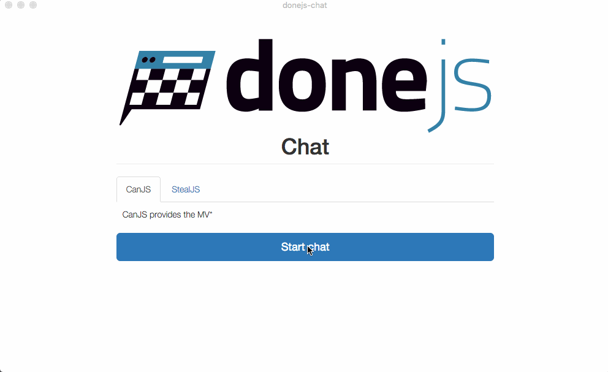
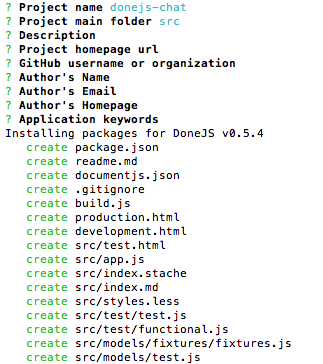
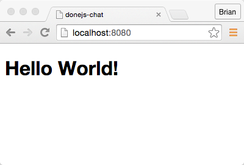
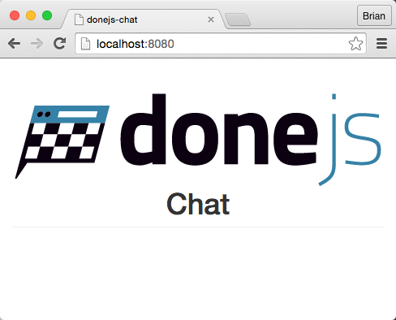
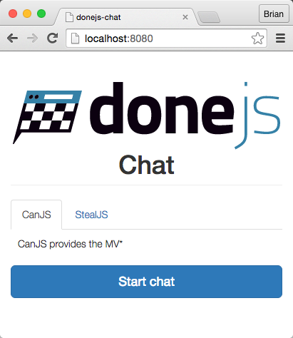
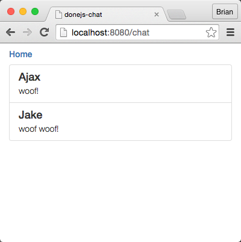
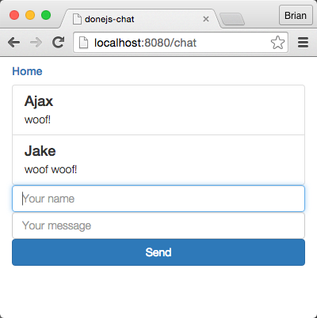
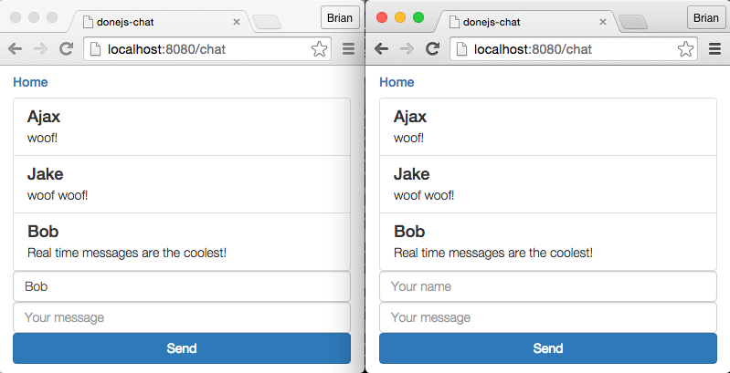
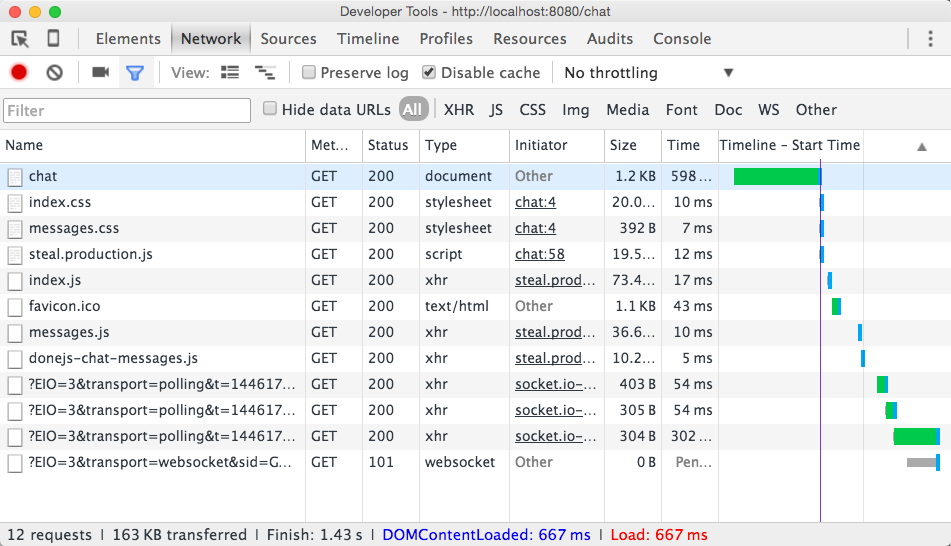

@page Guide Quick start guide
@parent DoneJS
@hide sidebar
@outline 2 ol
@description In this guide, we will create [chat.donejs.com](http://chat.donejs.com), a small real-time chat application with a homepage showing a tabs widget and a messages page that lets us send and receive messages in real-time:



In the first part of this guide we will install DoneJS, [generate a new application](Features.html#section=section_Generators) and start a server that provides [hot module swapping](Features.html#section=section_HotModuleSwapping) and [server-side rendering](Features.html#section=section_ServerSideRendered). We will then [import Bootstrap from NPM](Features.html#section=section_NPMPackages), create our [own custom HTML elements](Features.html#section=section_CustomHTMLElements) and [set up routing](Features.html#section=section_PrettyURL_swithPushstate) between the homepage and the chat messages page. After that, we will complete both pages by adding a tabs widget to the homepage and the ability to send messages and [receive real-time updates](Features.html#section=section_RealTimeConnected).

In the final parts of the guide we will make an [optimized, progressively loaded production build](Features.html#section=section_Progressiveloading) and [deploy it to a CDN](Features.html#section=section_DeploytoaCDN). We will conclude with creating a [mobile and desktop](Features.html#section=section_iOS_Android_andDesktopBuilds) version of the application.

If you run into any problems, let us know [on Gitter](https://gitter.im/donejs/donejs), we're happy to help out.

@body

## Setup

In this section, we will install DoneJS and generate a new application.

Before getting started, check out the [SettingUp] guide to make sure you have all of the prerequisites. DoneJS
officially supports [Node](https://nodejs.org) 0.10.x, 0.12.x, and IOjs, and
[npm](https://www.npmjs.com/) 2.x.  If you find errors, check your version with `node -v` and `npm -v`.

### Install DoneJS

To get started, let's install the DoneJS command line utility globally:

```
npm install -g donejs
```

### Generate the application

Then we'll create a new DoneJS application called `donejs-chat`:

```
donejs init donejs-chat
```

This will create a new folder called `donejs-chat` and in it generate our application. 

The initialization process will ask questions like the name of your application, the source folder, etc. We'll answer these with the default settings by hitting enter. 



This will install all of DoneJS's dependencies, including the following:

- [StealJS](http://stealjs.com) - ES6, CJS, and AMD module loader and builder
- [CanJS](http://canjs.com) - Custom elements and Model-View-ViewModel utilities
- [jQuery](http://jquery.com) - DOM helpers
- [jQuery++](http://jquerypp.com) - Extended DOM helpers
- [QUnit](https://qunitjs.com/) - Assertion library (optionally: [Mocha] or [Jasmine])
- [FuncUnit](http://funcunit.com) - Functional tests
- [Testee](https://github.com/bitovi/testee) - JavaScript Test runner
- [DocumentJS](http://documentjs.com) - Documentation

### Turn on development mode

DoneJS comes with its own development server, which hosts your development files and automatically [renders the application on the server](Features.html#section=section_ServerSideRendered). Development mode enables [hot module swapping](Features.html#section=section_HotModuleSwapping), which automatically reloads files in the browser and on the server as they change. 

To start it let's go into the `donejs-chat` application directory:

```
cd donejs-chat
```

We can start development mode by running:

```
donejs develop
```

The default port is `8080`. 

Go to [http://localhost:8080/](localhost:8080) to see our application showing a default homepage.



## Adding Bootstrap

DoneJS makes it easy to import other projects that are published on [NPM](https://npmjs.org). In this section we will install and add [Bootstrap](http://getbootstrap.com/) to the page and see DoneJS's [hot module swapping](Features.html#section=section_HotModuleSwapping) in action.

### Install the NPM package

Open a new terminal window so we can keep the DoneJS development server running. Then, install the [Bootstrap NPM package](https://www.npmjs.com/package/bootstrap) and save it as a dependency of our application like this:

```
npm install bootstrap --save
```

### Add it to the page

To see hot module swapping in action, let's update the main template to import Bootstrap's LESS file and also add some HTML that uses its styles. 

Update `src/index.stache` to look like this:

```html
<html>
  <head>
    <title>{{title}}</title>
    {{asset "css"}}
    {{asset "html5shiv"}}
  </head>
  <body>
    <can-import from="bootstrap/less/bootstrap.less!" />
    <can-import from="donejs-chat/styles.less!" />
    <can-import from="donejs-chat/app" export-as="viewModel" />

    <div class="container">
      <div class="row">
        <div class="col-sm-8 col-sm-offset-2">
          <h1 class="page-header text-center">
            
            <br>Chat
          </h1>
        </div>
      </div>
    </div>

    {{asset "inline-cache"}}

    {{#switch env.NODE_ENV}}
      {{#case "production"}}
        <script src="{{joinBase 'node_modules/steal/steal.production.js'}}"  main="donejs-chat/index.stache!done-autorender"></script>
      {{/case}}
      {{#default}}
        <script src="/node_modules/steal/steal.js"></script>
      {{/default}}
    {{/switch}}
  </body>
</html>
```

If you kept your browser window open at [http://localhost:8080/](localhost:8080) you should see the updated styles and content as soon as you save the file. 



Feel free to edit the HTML or `src/styles.less` to see how hot module swapping updates the page automatically.

## Routing and components

In this part we will create our own custom HTML elements - one for the homepage and another to display the chat messages. Then we will create routes to navigate between these two pages.

### Generate custom elements

We'll use a DoneJS [generator](/Features.html#section=section_Generators) to create custom components. The component generator is run by typing `donejs add component <file-or-folder> <component-name>`.

The homepage custom element (with the HTML tag name `chat-home`) won't be very big or complex, so we'll put everything into a single `.component` file. 

To generate it, run:

```
donejs add component home.component chat-home
```

The messages component (with the tag `chat-messages`) will be a little more complex, so we'll generate it using the [modlet file pattern](Features.html#section=section_Modlets).


Now run:

```
donejs add component messages chat-messages
```


Later we will update the generated files with the chat messages functionality.

### Navigate between pages

Routing works a bit differently than other libraries. In other libraries, you might declare routes and map those to controller-like actions.

DoneJS application [routes](http://canjs.com/docs/can.route.html) map URL strings (like /user/1) to properties on our application's view-model. In other words, our routes will just be a representation of the application state.

To learn more about routing visit the CanJS guide on [Application State and Routing](http://canjs.com/2.3-pre/guides/AppStateAndRouting.html).

First, let's update `src/home.component` with the original content from the homepage and a link to the chat messages page:

```html
<can-component tag="chat-home">
  <style type="less">
    display: block;

    h1.page-header { margin-top: 0; }
  </style>
  <template>
    <h1 class="page-header text-center">
      
      <br>Chat
    </h1>

    <a href="{{routeUrl page='chat' }}"
       class="btn btn-primary btn-block btn-lg">
      Start chat
    </a>
  </template>
</can-component>
```

[`routeUrl`](http://canjs.com/docs/can.stache.helpers.routeUrl.html) is a helper that populates the anchor's href with a URL that sets the application ViewModel's `page` property to `"chat"`. The AppViewModel is shown below.

Next, add a link to go back to the chat page by updating `src/messages/messages.stache` to:

```html
<h5><a href="{{routeUrl page='home'}}">Home</a></h5>
<p>{{message}}</p>
```

Then, add a routing rule for the `page` property in `src/app.js`:

```js
import AppMap from "can-ssr/app-map";
import route from "can/route/";
import 'can/map/define/';
import 'can/route/pushstate/';

const AppViewModel = AppMap.extend({
  define: {
    title: {
      value: 'donejs-chat',
      serialize: false
    }
  }
});

route('/:page', { page: 'home' });

export default AppViewModel;
```
@highlight 1,4,7-9

### Switch between pages

Finally, we'll glue both components together as separate pages in `src/index.stache`. This is done by adding dynamic imports for the `home.component` and `messages/` components and showing each import based on the `page` property.

Update `src/index.stache` to:

```html
<html>
  <head>
    <title>{{title}}</title>
    {{asset "css"}}
    {{asset "html5shiv"}}
  </head>
  <body>
    <can-import from="bootstrap/less/bootstrap.less!" />
    <can-import from="donejs-chat/styles.less!" />
    <can-import from="donejs-chat/app" export-as="viewModel" />

    <div class="container">
      <div class="row">
        <div class="col-sm-8 col-sm-offset-2">
          {{#eq page 'chat'}}
            <can-import from="donejs-chat/messages/">
              {{#if isPending}}
                Loading...
              {{else}}
                <chat-messages/>
              {{/if}}
            </can-import>
          {{else}}
            <can-import from="donejs-chat/home.component!">
              {{#if isPending}}
                Loading...
              {{else}}
                <chat-home/>
              {{/if}}
            </can-import>
          {{/eq}}
        </div>
      </div>
    </div>

    {{asset "inline-cache"}}

    {{#switch env.NODE_ENV}}
      {{#case "production"}}
        <script src="{{joinBase 'node_modules/steal/steal.production.js'}}"  main="donejs-chat/index.stache!done-autorender"></script>
      {{/case}}
      {{#default}}
        <script src="/node_modules/steal/steal.js"></script>
      {{/default}}
    {{/switch}}
  </body>
</html>
```

Now each component is being dynamically loaded while navigating between the home and messages page.  You should see the changes already in your browser.


Also, everything is [rendered on the server](Features.html#section=section_ServerSideRendered). If you reload the homepage at [localhost:8080](http://localhost:8080) you'll see the page's content right away, while the JavaScript is loading in the background. Viewing the source will show the dynamically inserted styles and the corresponding HTML.


## Homepage

Now that we can navigate between pages, we will finish implementing their functionality, starting with the homepage.


### Install bit-tabs

On the homepage, let's install and add [bit-tabs](https://github.com/bitovi-components/bit-tabs), a simple declarative tabs widget.

Run:

```
npm install bit-tabs --save
```

### Update the page

Then, import the unstyled custom elements from `bit-tabs/unstyled` (unstyled because we will use Bootstrap's styles) and add `<bit-tabs>` and `<bit-panel>` elements to the template. 

Update `src/home.component` to:

```html
<can-component tag="chat-home">
  <style type="less">
    display: block;

    bit-panel p {
      padding: 10px;
    }
  </style>
  <template>
    <can-import from="bit-tabs/unstyled" />
    <h1 class="page-header text-center">
      
      <br>Chat
    </h1>

    <bit-tabs tabs-class="nav nav-tabs">
      <bit-panel title="CanJS">
        <p>CanJS provides the MV*</p>
      </bit-panel>
      <bit-panel title="StealJS">
        <p>StealJS provides the infrastructure.</p>
      </bit-panel>
    </bit-tabs>

    <a href="{{routeUrl page='chat'}}"
       class="btn btn-primary btn-block btn-lg">
      Start chat
    </a>
  </template>
</can-component>
```

You'll notice tabs appear in the browser:



## Messages page

In this section we add live chat functionality to the messages page. We'll need to:

 * Create a messages model that connects to a RESTful API.
 * Add the ability to retrieve and list messages and create new messages.
 * Make the message list receive real-time updates from other clients.

### Generate Message model

To load messages from the server, we will use [can-connect's supermodel](http://connect.canjs.com/doc/can-connect%7Ccan%7Csuper-map.html). 

Generate a `message` supermodel like this:

```
donejs add supermodel message
```

When asked for the URL endpoint, set it to our remote RESTful API at `http://chat.donejs.com/api/messages`. The other questions can be answered with the default by hitting enter.


### Use the connection

The generated file is all that is needed to connect to our RESTful API. Use it by importing it and requesting a list of all messages with the `<message-model>` custom element. 

Update `src/messages/messages.stache` to:

```html
<can-import from="donejs-chat/models/message" />
<h5><a href="{{routeUrl page='home'}}">Home</a></h5>

<message-model get-list="{}" class="list-group">
  {{#each ./value}}
    <div class="list-group-item">
      <h4 class="list-group-item-heading">{{name}}</h4>
      <p class="list-group-item-text">{{body}}</p>
    </div>
  {{else}}
    <div class="list-group-item">
      <h4 class="list-group-item-heading">No messages</h4>
    </div>
  {{/each}}
</message-model>
```

If you open [localhost:8080/chat](http://localhost:8080/chat), you will see a list of messages from the server or the "No message" text.



### Create messages

Now let's add the form to create new messages. The form two-way binds the `name` and `message` properties to the component's view-model and calls `send()` when hitting the enter key in the message input. 

Update `src/messages/messages.stache` to look like this:

```html
<can-import from="donejs-chat/models/message" />
<h5><a href="{{routeUrl page='home'}}">Home</a></h5>

<message-model get-list="{}" class="list-group">
  {{#each ./value}}
    <div class="list-group-item">
      <h4 class="list-group-item-heading">{{name}}</h4>
      <p class="list-group-item-text">{{body}}</p>
    </div>
  {{else}}
    <div class="list-group-item">
      <h4 class="list-group-item-heading">No messages</h4>
    </div>
  {{/each}}
</message-model>

<form class="row" ($submit)="send(%event)">
  <div class="col-sm-3">
    <input type="text" class="form-control" placeholder="Your name"
           {($value)}="name"/>
  </div>
  <div class="col-sm-6">
    <input type="text" class="form-control" placeholder="Your message"
           {($value)}="body"/>
  </div>
  <div class="col-sm-3">
    <input type="submit" class="btn btn-primary btn-block" value="Send"/>
  </div>
</form>
```

Next we have to implement the `send()` method. Update `src/messages/messages.js` to this:

```js
import Component from 'can/component/';
import Map from 'can/map/';
import 'can/map/define/';
import './messages.less!';
import template from './messages.stache!';
import Message from '../models/message';

export const ViewModel = Map.extend({
  send(event) {
    event.preventDefault();

    new Message({
      name: this.attr('name'),
      body: this.attr('body')
    }).save().then(msg => this.attr('body', ''));
  }
});

export default Component.extend({
  tag: 'chat-messages',
  viewModel: ViewModel,
  template
});
```

The `send()` method takes the `name` and `message` properties from the view-model and creates a `Message` instance, saving it to the server. Once saved successfully, it sets the message to an empty string to reset the input field.

You can now enter your name and a message! It will automatically appear in our messages list.



In fact, all lists that are related to that model will be updated automatically whenever there is new, modified, or deleted data. [can-connect](http://connect.canjs.com/) automatically manages the lists, while also providing [caching and minimized data requests](Features.html#section=section_Cachingandminimaldatarequests).

You can see from your console that the localStorage cache is already populated with data:


### Enable a real-time connection

Right now our chat's messages update automatically with our own messages, but not with messages from other clients. The API server ([chat.donejs.com/api/messages](http://chat.donejs.com/api/messages)) provides a [Socket.io](http://socket.io/) server that sends out real-time updates for new, updated and deleted chat messages. 

To connect to it, first we'll install a socket.io connector, by running:

```
npm install steal-socket.io --save
```

Update `src/models/message.js` to:

```js
import can from 'can';
import superMap from 'can-connect/can/super-map/';
import tag from 'can-connect/can/tag/';
import 'can/map/define/define';
import io from 'steal-socket.io';

export const Message = can.Map.extend({
  define: {}
});

Message.List = can.List.extend({
  Map: Message
}, {});

export const messageConnection = superMap({
  url: 'http://chat.donejs.com/api/messages',
  idProp: 'id',
  Map: Message,
  List: Message.List,
  name: 'message'
});

tag('message-model', messageConnection);

const socket = io('http://chat.donejs.com');

socket.on('messages created',
  message => messageConnection.createInstance(message));
socket.on('messages updated',
  message => messageConnection.updateInstance(message));
socket.on('messages removed',
  message => messageConnection.destroyInstance(message));

export default Message;
```

This will listen to `messages <event>` events sent by the server and tell the connection to update all active lists of messages accordingly. Try opening another browser window to see receiving messages in real-time.



## Production build

Now that we implemented the complete chat functionality we can get our application ready for production.

### Run build

We can find the build configuration in `build.js` in the application folder. 

Everything is already set up, so we can simply make a build by running:

```
donejs build
```

The optimized bundles that load your JavaScript and CSS as fast as possible are sent to the `dist/` folder.

### Turn on production

To test the production build, close the current server (with `CTRL + C`) and start it with the environment (`NODE_ENV`) set to `production`:

```
NODE_ENV=production donejs start
```

If you're using Windows, you must first set the environmental variable:

1. For Windows **command prompt** you set with `set NODE_ENV=production`
1. For Windows **Powershell** you set it with `$env:NODE_ENV="production"`

Then run your application with `donejs start`.

If we now open [localhost:8080](http://localhost:8080/) again we can see the production bundles being loaded in the network tab of the developer tools. 



All DoneJS projects are extremely modular, which is why in development mode, you see 200 or more requests when loading the page (thanks to hot module swapping we only have to make those requests once). In production mode, we can only see about 10 requests and a significantly reduced file-size.

## Deploy

Now that we verified that our application works in production, we can deploy it to the web. In this section, we will use [Firebase](https://www.firebase.com/), a service that provides static file hosting and [Content Delivery Network](https://en.wikipedia.org/wiki/Content_delivery_network) (CDN) support, to automatically deploy and serve our application's static assets from a CDN.

### Set up Firebase

Sign up for free at [Firebase](https://www.firebase.com/). After you have an account go to [the account page](https://www.firebase.com/account/) and create an app called `donejs-chat-<user>` where `<user>` is your GitHub username. Write down the name of your app because you'll need it in the next section.

*Note: You'll get an error if your app name is too long, so pick something on the shorter side.*

When you deploy for the first time it will ask you to authorize, but first we need to configure the project.

### Configure DoneJS

Now we can add the Firebase deployment configuration to our `package.json` like this:

```js
"donejs": {
  "deploy": {
    "root": "dist",
    "services": {
      "production": {
        "type": "firebase",
        "config": {
          "firebase": "<appname>",
          "public": "./dist",
          "headers": [{
            "source": "/**",
            "headers": [{
              "key": "Access-Control-Allow-Origin",
              "value": "*"
            }]
          }]
        }
      }
    }
  }
}
```

Change the `<appname>` to the name of the application created when you set up the Firebase app.

And also update the production `baseURL` in the `system` section:

```
...
"system": {
  ...
  "envs": {
    "server-production": {
      "baseURL": "https://<appname>.firebaseapp.com/"
    }
  }
}
```

Again, make sure to replace the URL with your Firebase application name. Then we can deploy the application by running:

```
donejs build
donejs deploy
```

Static files are deployed to Firebase.


And verify that the application is loading from the CDN by loading it after running:

```
NODE_ENV=production donejs start
```

*Note: If you're using Windows, set the NODE_ENV variable as you did previously in the Production section.*

We should now see our assets being loaded from the Firebase CDN.


## Desktop and mobile apps

In the last part of this guide we will make mobile and desktop builds of our chat application, using [Cordova](https://cordova.apache.org/) and [nw.js](http://nwjs.io/).

### Cordova

To build the application as a Cordova based mobile application, you need to have each platform's SDK installed.
We'll be building an iOS app if you are a Mac user, and an Android app if you're a Windows user.

Mac users should download XCode from the AppStore and install the `ios-sim` package globally with:

```
npm install -g ios-sim
```

We will use these tools to create an iOS application that can be tested in the iOS simulator.

Windows users should install the [Android Studio](https://developer.android.com/sdk/index.html), which gives all of the tools we need.

Now we can install the DoneJS Cordova tools with:

```
donejs add cordova
```

Depending on your operating system you can accept most of the defaults, unless you would like to build for Android, which needs to be selected from the list of platforms.

To run the Cordova build and launch the simulator we can now run:

```
donejs build cordova
```

If everything went well, we should see the emulator running our application. 


Windows users will get instructions to download the latest version of the platform and to create a Virtual Device. Follow the instructions and then re-do the build. This will only happen the first time you build for Cordova.

### NW.js

To set up the desktop build, we have to add it to our application like this:

```
donejs add nw
```

We can answer most prompts with the default except for the version which needs to be set to the latest **stable version**. Set the version prompt to `0.12.3`. 


Then we can run the build like this:

```
donejs build nw
```

The OS X application can be opened with

```
cd build/donejs-chat/osx64
open donejs-chat.app
```

The Windows application can be opened with

```
.\build\donejs-chat\win64\donejs-chat.exe
```


## What's next?

In this guide we created a small chat application that connects to a remote API with DoneJS. It has routing between two pages and can send and receive messages in real-time. We built an optimized bundle for production and deployed it to a static file host and CDN. Last, we made builds of the application as a mobile and desktop application.

If you want to learn more about DoneJS - like how to create more complex custom elements and routes, write and automatically run tests, Continuous Integration and Continuous Deployment - head over to the [place-my-order Guide](./place-my-order.html).

## IE8 Support

This section is optional. Follow it only if you're interested in making applications that are compatible with IE8.

### Support CORS

Since our application uses cross domain requests we need to make a couple of changes to make it work in IE8 which doesn't support CORS. The first is to create a [jQuery prefilter](http://api.jquery.com/jquery.ajaxprefilter/) so all HTTP requests are marked as being cross domain. Create `src/prefilter.js`:

```js
import $ from "jquery";

$.ajaxPrefilter(function(options){
  options.crossDomain = true;
});
```

Next we need to install [jQuery transport](http://api.jquery.com/jquery.ajaxtransport/) that will perform our cross domain requests in IE8:

```
npm install jquery-transport-xdr --save
```

Finally import both of these modules in your messages model. Change `src/models/message.js` to:

```js
import can from 'can';
import superMap from 'can-connect/can/super-map/';
import tag from 'can-connect/can/tag/';
import 'can/map/define/define';
import io from 'steal-socket.io';
import 'jquery-transport-xdr';
import 'donejs-chat/prefilter';

export const Message = can.Map.extend({
  define: {}
});

Message.List = can.List.extend({
  Map: Message
}, {});

export const messageConnection = superMap({
  url: 'http://chat.donejs.com/api/messages',
  idProp: 'id',
  Map: Message,
  List: Message.List,
  name: 'message'
});

tag('message-model', messageConnection);

const socket = io('http://chat.donejs.com');

socket.on('messages created',
  order => messageConnection.createInstance(order));
socket.on('messages updated',
  order => messageConnection.updateInstance(order));
socket.on('messages removed',
  order => messageConnection.destroyInstance(order));

export default Message;
```

### Install jQuery 1.x

DoneJS comes with jQuery 2.x by default, but if you need to support IE8 the 1.x branch is necessary. You can switch by installing the right version:

```
npm install jquery@1.11.0 --save
```

Update your `build.js` file to make the compiled output work in IE:

```js
var buildPromise = stealTools.build({
  config: __dirname + "/package.json!npm",
  babelOptions: {
    loose: "es6.modules"
  }
}, {
  bundleAssets: true
});

...
```

And rebuild:

```
donejs build
```

The application will now work in IE8.
