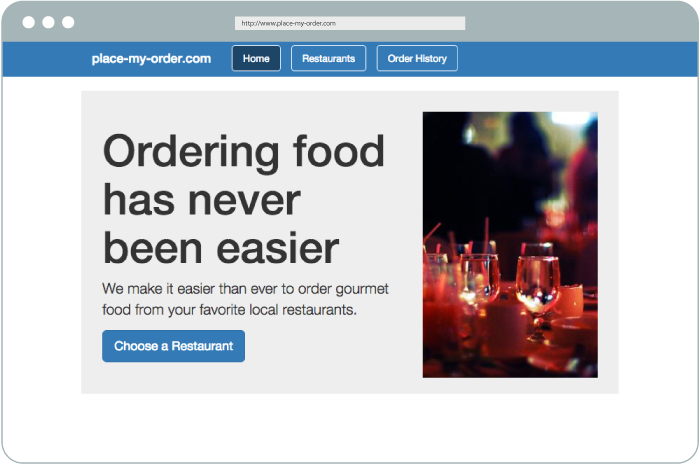
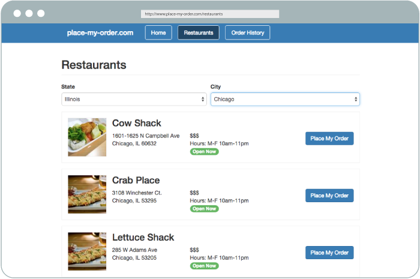

@page place-my-order
@parent DoneJS
@hide sidebar
@outline 2 ol
@description In this guide you will learn about all of [DoneJS' features]() by creating, testing, documenting, building and deploying [place-my-order.com](http://place-my-order.com), a restaurant menu and ordering application. The final result will look like this:





After the initial application setup, which includes a server that hosts and pre-renders the application, we will create several custom elements and bring them together using the application state and routes. Then we will learn how to retrieve data from the server using a RESTful API.

After that we will talk about what a view model is and how to identify, implement and test its functionality. Once we have unit tests running in the browser, we will automate running them locally from the command line and also on a continuous integration server. In the subsequent chapters, we will show how to easily import other modules into our application and how to set up a real-time connection.

Finally, we will describe how to build and deploy our application to the web, as a desktop application with nw.js, and as a mobile app with Cordova.


@body

## Set up the project

In this section we will create our DoneJS project and set up a RESTful API for the application to use.
You will need [NodeJS](http://nodejs.org) or [io.js](https://iojs.org/en/index.html) installed and your code editor of choice.

### Create the project

To get started, let's install the DoneJS command line utility globally:

```
npm install -g donejs
```

Then we can create a new DoneJS application:

```
donejs init place-my-order
```

The initialization process will ask you questions like the name of your application (set to `place-my-order`) and the source folder (set to `src`). The other questions can be skipped by hitting enter. This will install all of DoneJS' dependencies. The main project dependencies include:

- [StealJS](http://stealjs.com) - ES6, CJS, and AMD module loader and builder
- [CanJS](http://canjs.com) - Custom elements and Model-View-ViewModel utilities
- [jQuery](http://jquery.com) - DOM helpers
- [jQuery++](http://jquerypp.com) - Extended DOM helpers
- [QUnit](https://qunitjs.com/) or Mocha - Assertion library
- [FuncUnit](http://funcunit.com) - Functional tests
- Testee or Karma - Test runner
- [DocumentJS](http://documentjs.com) - Documentation

If we now go into the `place-my-order` folder with

```
cd place-my-order
```

We can see the following files:

```
├── .yo-rc.json
├── documentjs.json
├── package.json
├── readme.md
├── src/
|   ├── app.js
|   ├── index.stache
|   ├── index.html
|   ├── models/
|   |   ├── fixtures
|   |   |   ├── fixtures.js
|   |   ├── test.js
|   ├── styles.less
|   ├── test.html
|   ├── test/
|   |   ├── test.js
|   |   ├── functional.js
├── node_modules/
```

Let's have a quick look at the purpose of each:

- `.yo-rc.json` contains information for running the generators.
- `package.json` is the main configuration file that defines all our application dependencies and other settings.
- `test.html` is used to run all our tests.
- `documentjs.json` is the configuration file for generating documentation.
- `readme.md` is the readme file for your repository.
- `src` is the folder where all our development assets live in their own modlets (more about that later).
- `src/app.js` is the main application file, which exports the main application state.
- `src/index.stache` is the main client template that includes server-side rendering.
- `src/index.html` is the main client template to use if you want to opt out of server-side rendering.
- `src/models/` is the folder where models for the API connection will be put. It currently contains `fixtures/fixtures.js` which will reference all the specific models fixtures files (so that we can run model tests without the need for a running API server) and `test.js` which will later gather all the individual model test files.
- `src/styles.less` is the main application styles.
- `src/test/test.js` collects all individual component and model tests we will create throughout this guide and is loaded by `test.html`.
- `src/test/functional.js` will contain functional smoke tests for our application.

### Development mode

DoneJS comes with its own server, which hosts your development files and takes care of server-side rendering. DoneJS' development mode will also start a [live-reload](http://blog.bitovi.com/hot-module-replacement-comes-to-stealjs/) server that automatically reloads files in the browser as they change. You can start both by running:

```
donejs develop
```

The default port is 8080, so if we now go to [http://localhost:8080/](localhost:8080) we can see our application with a default homepage. If we change `src/index.stache` or `src/app.js` all changes will show up right away in the browser. Try it by changing the `message` property in `src/app.js`.

### Setup a service API

Single page applications usually communicate with a RESTful API and a websocket connection for real-time updates. This guide will not cover how to create a REST API. Instead, we'll just install and start an existing service API created specifically for use with this tutorial:

**Note**: Kill the server for now while we install a few dependencies (ctrl+c on Windows, cmd+c on Mac).

```
npm install place-my-order-api --save
```

Now we can add an API server start script into the `scripts` section of our `package.json` like this:

```js
"scripts": {
    "api": "place-my-order-api --port 7070",
```

Which allows us to start the server like:

```
donejs api
```

The first time it starts, the server will initialize some default data (restaurants and orders). Once started, you can verify that the data has been created and the service is running by going to [http://localhost:7070/restaurants](http://localhost:7070/restaurants), where we can see a JSON list of restaurant data. Keep this server running during development.

### Loading assets

Before we get to the code, we also need to install the `place-my-order-assets` package which contains the images and styles specifically for this tutorial's application:

```
npm install place-my-order-assets --save
```

Every DoneJS application consists of at least two files: 

 1. **A main template** (in this case `src/index.stache`) which contains the main template and links to the development or production assets
 1. **A main application file** (`src/app.js`) that initializes the application state and routes

`src/index.stache` was already created for us when we ran `donejs init`, so we can update it to reflect the below content:

```handlebars
<html>
  <head>
    <title>{{title}}</title>
    {{asset "css"}}
  </head>
  <body>
    <can-import from="place-my-order-assets" />
    <can-import from="place-my-order/styles.less!" />
    <can-import from="place-my-order/app" as="viewModel" />

    <h1>{{message}}</h1>

    {{asset "inline-cache"}}

    {{#switch @env.NODE_ENV}}
      {{#case "production"}}
        <script src="/node_modules/steal/steal.production.js"
          main="place-my-order/index.stache!done-autorender"></script>
      {{/case}}
      {{#default}}
        <script src="/node_modules/steal/steal.js"></script>
      {{/default}}
    {{/switch}}
  </body>
</html>
```

This is an HTML5 template that uses [can.stache](http://canjs.com/docs/can.stache.html) - a [Handlebars syntax](http://handlebarsjs.com/)-compatible view engine. It renders a `message` property from the application state.

`can-import` loads the template's dependencies:
 1. The `place-my-order-assets` package, which loads the LESS styles for the application
 1. `place-my-order/app`, which is the main application file 

The [asset](http://canjs.github.io/can-ssr/doc/can-ssr.helpers.asset.html) helper loads assets like CSS, cached data, and scripts, regardless of the current environment (development or production).

The main application file at `src/app.js` looks like this:

```
// src/app.js
import AppMap from 'can-ssr/app-map';
import route from 'can/route/';
import 'can/map/define/';

const AppViewModel = AppMap.extend({
  define: {
    message: {
      value: 'Hello World!'
    },
    title: {
      value: 'place-my-order',
      serialize: false
    }
  }
});

export default AppViewModel;
```

This initializes an [AppMap](http://canjs.github.io/can-ssr/doc/can-ssr.AppMap.html): a special object that acts as the application global state (with a default `message` property) and also plays a key role in enabling server side rendering.

### Starting the application

Now our application is good to go and we can start the server. We need to proxy the `place-my-order-api` server to `/api` on our server in order to avoid violating the same origin policy. This means that we need to modify the `start` script in our `package.json` from:

```js
"scripts": {
  "api": "place-my-order-api --port 7070",
  "start": "can-serve --port 8080",
```

To:

```js
"scripts": {
  "api": "place-my-order-api --port 7070",
  "start": "can-serve --proxy http://localhost:7070 --port 8080",
```

Then we can start the application with

```
donejs develop
```

Go to [http://localhost:8080](http://localhost:8080) to see the "hello world" message with the application styles loaded.

## Creating custom elements

One of the most important concepts in DoneJS is splitting up your application functionality into individual, self-contained modules. In the following section we will create separate components for the homepage, the restaurant list, and the order history page. After that, we will glue them all together using routes and the global application state.

There are two ways of creating components. For smaller components we can define all templates, styles and functionality in a single `.component` file (to learn more see [done-component](https://github.com/donejs/done-component)). Larger components can be split up into several separate files.

### Creating a homepage element

To generate a new component run:

```
donejs generate component home.component pmo-home
```

This will create a file at `src/home.component` containing the basic ingredients of a component. We will update it to reflect the below content:

```html
<can-component tag="pmo-home">
  <template>
     <div class="homepage">
      
      <h1>Ordering food has never been easier</h1>
      <p>
        We make it easier than ever to order gourmet food
        from your favorite local restaurants.
      </p>
      <p><a class="btn" href="/restaurants" role="button">Choose a Restaurant</a></p>
     </div>
  </template>
</can-component>
```

Here we created a [can.Component](http://canjs.com/docs/can.Component.html) named `pmo-home` using a [web-component](http://webcomponents.org/) style declaration. This particular component is just a basic template, it does not have much in the way of styles or functionality.

### Create the order history element

We'll create an initial version of order history that is very similar.

```
donejs generate component order/history.component pmo-order-history
```

And update `src/order/history.component`:

```
<can-component tag="pmo-order-history">
  <template>
    <div class="order-history">
      <div class="order header">
        <address>Name / Address / Phone</address>
        <div class="items">Order</div>
        <div class="total">Total</div>
        <div class="actions">Action</div>
      </div>
    </div>
  </template>
</can-component>
```

### Creating a restaurant list element

The restaurant list will contain more functionality, which is why we will split its template and component logic into separate files.

We can create a basic component like that by running:

```
donejs generate component restaurant/list pmo-restaurant-list
```

The component's files are collected in a single folder so that components can be easily tested, moved, and re-used. The folder structure looks like this:

```
├── node_modules
├── package.json
├── src/
|   ├── app.js
|   └── index.stache
|   ├── models
|   ├── order/
|   |   ├── history.component
|   ├── restaurant/
|   |   ├── list/
|   |   |   ├── list.html
|   |   |   ├── list.js
|   |   |   ├── list.less
|   |   |   ├── list.md
|   |   |   ├── list.stache
|   |   |   ├── list_test.js
|   |   |   ├── test.html
```

We will learn more about those files and add more functionality to this element later, but it already contains a fully functional component with a demo page (see [localhost:8080/src/restaurant/list/list.html](http://localhost:8080/src/restaurant/list/list.html)), a basic test (at [localhost:8080/src/restaurant/list/test.html](http://localhost:8080/src/restaurant/list/test.html)) and documentation placeholders.

## Setting up routing

In this part, we will create routes - URL patterns that load specific parts of our single page app. We'll also dynamically load the custom elements we created and integrate them in the application's main page.

### Create Routes

Routing works a bit differently than what you might be used to in other libraries. In other libraries, you might declare routes and map those to controller-like actions. 

DoneJS application [routes](http://canjs.com/docs/can.route.html) map URL strings (like /foo) to properties in our application state. In other words, our routes will just be a representation of the application state.

To learn more about routing visit the CanJS guide on [Application State and Routing](http://canjs.com/2.3-pre/guides/AppStateAndRouting.html).

To add our routes, change `src/app.js` to:

```js
import AppMap from 'can-ssr/app-map';
import route from 'can/route/';
import 'can/route/pushstate/';
import 'can/map/define/';

const AppViewModel = AppMap.extend({
  define: {
    title: {
      serialize: false,
      value: 'place-my-order'
    }
  }
});

route(':page', { page: 'home' });
route(':page/:slug', { slug: null });
route(':page/:slug/:action', { slug: null, action: null });

export default AppViewModel;
```

Now we have three routes available:

- `:page` captures urls like [http://localhost:8080/home](http://localhost:8080/home) and sets the `page` property on `AppViewModel` to `home` (which is also the default when visiting [http://localhost:8080/](http://localhost:8080/))
- `:page/:slug` matches restaurant links like [http://localhost:8080/restaurants/spago](http://localhost:8080/restaurants/spago) and sets `page` and `slug` (a URL friendly restaurant short name)
- `:page/:slug/:action` will be used to show the order page for a specific restaurant e.g. [http://localhost:8080/restaurants/spago/order](http://localhost:8080/restaurants/spago/order)

Its important to note that if any of these URLs are matched, AppViewModel, which is the application's global state, will contain these properties, even though they aren't present in the AppViewModel definition directly. Properties can be set on AppViewModel that aren't explicitly defined.

**Note**: Whenever we create new routes we also need to restart the development server. While the browser knows about the new routes as soon as you save the file, the server does not, so a restart is needed for them to work.

### Adding a header element

Now is also a good time to add a header element that links to the different routes we just defined. We can run

```
donejs generate component header.component pmo-header
```

and update `src/header.component` to:

```html
<can-component tag="pmo-header">
  <template>
     <can-import from="can/view/href/"/>
     <header>
       <nav>
         <h1>place-my-order.com</h1>
         <ul>
           <li class="{{#eq page 'home'}}active{{/eq}}">
             <a can-href="{page='home'}">Home</a>
           </li>
           <li class="{{#eq page 'restaurants'}}active{{/eq}}">
             <a can-href="{page='restaurants'}">Restaurants</a>
           </li>
           <li class="{{#eq page 'order-history'}}active{{/eq}}">
             <a can-href="{page='order-history'}">Order History</a>
           </li>
         </ul>
       </nav>
     </header>
  </template>
</can-component>
```

Here we use [can-href](http://canjs.com/2.3-pre/docs/can.view.href.html) to create links that will set values in the application state. For example, the first usage of can-href above will create a link based on the current routing rules ([http://localhost:8080/home](http://localhost:8080/home) in this case) that sets the `page` property to `home` when clicked.

We also use the Handlebars `eq` helper to make the appropriate link active.

### Create a loading indicator

To show that something is currently loading, let's create a `pmo-loading` component:

```
donejs generate component loading.component pmo-loading
```

Change `src/loading.component` to:

```html
<can-component tag="pmo-loading">
  <template>
    {{#eq state "resolved"}}
      <content></content>
    {{else}}
      <div class="loading"></div>
    {{/eq}}
  </template>
</can-component>
```

### Switch between components

Now we can glue all those individual components together in `src/index.stache`. What we want to do is - based on the current page (`home`, `restaurants` or `order-history`) - load the correct component and then initialize it.

Update `src/index.stache` to:

```html
<html>
  <head>
    <title>Place My Order</title>
    {{asset "css"}}
  </head>
  <body>
    <can-import from="place-my-order-assets" />
    <can-import from="place-my-order/app" as="viewModel" />

    <can-import from="place-my-order/loading.component!" />
    <can-import from="place-my-order/header.component!" />
    <pmo-header page="{page}"></pmo-header>

    {{#switch page}}
      {{#case "home"}}
        <can-import from="place-my-order/home.component!" can-tag="pmo-loading">
          <pmo-home></pmo-home>
        </can-import>
      {{/case}}
      {{#case "restaurants"}}
        <can-import from="place-my-order/restaurant/list/" can-tag="pmo-loading">
          <pmo-restaurant-list></pmo-restaurant-list>
        </can-import>
      {{/case}}
      {{#case "order-history"}}
        <can-import from="place-my-order/order/history.component!" can-tag="pmo-loading">
          <pmo-order-history></pmo-order-history>
        </can-import>
      {{/case}}
    {{/switch}}

    {{asset "inline-cache"}}

    {{#switch @env.NODE_ENV}}
      {{#case "production"}}
        <script src="/node_modules/steal/steal.production.js"
          main="place-my-order/index.stache!done-autorender"></script>
      {{/case}}
      {{#default}}
        <script src="/node_modules/steal/steal.js"></script>
      {{/default}}
    {{/switch}}
  </body>
</html>
```

Here we make a `switch` statement that checks for the current `page` property (part of the AppViewModel that makes up the scope object of this template) then progressively loads the component with [can-import](http://canjs.com/2.3-pre/docs/can%7Cview%7Cstache%7Csystem.import.html) and initializes it.

Setting `can-tag="pmo-loading"` inserts a `<pmo-loading>` loading indicator while the import is in progress. A can-import's view model is a promise object, so once it is done loading, it sets its `state` property to `resolved`.

Now if we reload [http://localhost:8080/](http://localhost:8080/), we can see the header and the home component and be able to navigate to the different pages through the header.

## Getting and Displaying Data from the Server

In this next part, we'll connect to the RESTful API that we set up with `place-my-order-api`, using the powerful data layer provided by [can-connect](http://connect.canjs.com/).

### Creating a restaurants connection

At the beginning of this guide we set up a REST API at [http://localhost:7070](http://localhost:7070) and told `can-serve` to proxy it to [http://localhost:8080/api](http://localhost:8080/api). 

To manage the restaurant data located at [http://localhost:8080/api/restaurants](http://localhost:8080/api/restaurants), we'll create a restaurant supermodel:

```js
donejs generate supermodel restaurant
```

Answer the question about the URL endpoint with `/api/restaurants` and the name of the id property with `_id`. 

We have now created a model and fixtures (for testing without an API) with a folder structure like this:

```
├── node_modules
├── package.json
├── src/
|   ├── app.js
|   └── index.stache
|   ├── models/
|   |   ├── fixtures/
|   |   |   ├── restaurant.js
|   |   ├── fixtures.js
|   |   ├── restaurant.js
|   |   ├── restaurant_test.js
|   |   ├── test.js
```

### Test the connection

To test the connection you can temporarily add the following to `src/app.js`:

```js
import Restaurant from './models/restaurant';

Restaurant.getList({}).then(restaurants => console.log(restaurants.attr()));
```

After reloading the homepage you should see the restaurant information logged in the console. Once you've verified, you can remove the test code.

### Add data to the page

Now we can update the `ViewModel` in `src/restaurant/list/list.js` to use [can.Map.define](http://canjs.com/docs/can.Map.prototype.define.html) to load all restaurants from the restaurant connection:

```js
import Component from 'can/component/';
import Map from 'can/map/';
import 'can/map/define/';
import template from './list.stache!';
import Restaurant from 'place-my-order/models/restaurant';

export var ViewModel = Map.extend({
  define: {
    restaurants: {
      value() {
        return Restaurant.getList({});
      }
    }
  }
});

export default Component.extend({
  tag: 'pmo-restaurant-list',
  viewModel: ViewModel,
  template: template
});
```

And update the template at `src/restaurant/list/list.stache` to use the [Promise](http://canjs.com/docs/can.Deferred.html) returned for the `restaurants` property to render the template:

```html
<div class="restaurants">
  <h2 class="page-header">Restaurants</h2>
  {{#if restaurants.isPending}}
    <div class="restaurant loading"></div>
  {{/if}}
  {{#if restaurants.isResolved}}
    {{#each restaurants.value}}
      <div class="restaurant">
        
        <h3>{{name}}</h3>
        {{#address}}
        <div class="address">
          {{street}}<br />{{city}}, {{state}} {{zip}}
        </div>
        {{/address}}

        <div class="hours-price">
          $$$<br />
          Hours: M-F 10am-11pm
          <span class="open-now">Open Now</span>
        </div>

        <a class="btn" can-href="{ page='restaurants' slug=slug }">Details</a>
        <br />
      </div>
    {{/each}}
  {{/if}}
</div>
```

By checking for `restaurants.isPending` and `restaurants.isResolved` we are able to show a loading indicator while the data are being retrieved. Once resolved, the actual restaurant list is available at `restaurants.value`. When navigating to the restaurants page now we can see a list of all restaurants.

Note the usage of `can-href` to set up a link that points to each restaurant. `slug=slug` is not wrapped in quotes because the helper will populate each restaurant's individual `slug` property in the URL created.

## Creating a unit-tested view model

In this section we will create a view model for the restaurant list functionality. 

We'll show a dropdown of all available US states. When the user selects a state, we'll show a list of cities. Once a city is selected, we'll load a list of all restaurants for that city. The end result will look like this:



### Identify view model state

First we need to identify the properties that our view model needs to provide. We want to load a list of states from the server and let the user select a single state. Then we do the same for cities and finally load the restaurant list for that selection.

All asynchronous requests return a Promise, so the data structure will look like this:

```js
{
 states: Promise<[State]>
 state: String "IL”,
 cities: Promise<[City]>,
 city: String "Chicago”,
 restaurants: Promise<[Restaurant]>
}
```

### Create dependent models

The API already provides a list of available [states](http://localhost:8080/api/states) and [cities](http://localhost:8080/api/cities) (`api/cities`). To load them we can create the corresponding models like we already did for Restaurants.

```
donejs generate supermodel state
```

When prompted, set the URL to `/api/states` and the id property to `short`.

```
donejs generate supermodel city
```

For city the URL is `/api/cities` and the id property is `name`. Now we can load a list of states and cities.

### Implement view model behavior

Now that we have identified the view model properties needed and have created the models necessary to load them, we can [define](http://canjs.com/docs/can.Map.prototype.define.html) the `states`, `state`, `cities` and `city` properties in the view model at `src/restaurant/list/list.js`:

```js
import Component from 'can/component/';
import Map from 'can/map/';
import 'can/map/define/';
import template from './list.stache!';
import Restaurant from 'place-my-order/models/restaurant';
import State from 'place-my-order/models/state';
import City from 'place-my-order/models/city';

export var ViewModel = Map.extend({
  define: {
    states: {
      get() {
        return State.getList({});
      }
    },
    state: {
      type: 'string',
      value: null,
      set() {
        // Remove the city when the state changes
        this.attr('city', null);
      }
    },
    cities: {
      get() {
        let state = this.attr('state');

        if(!state) {
          return null;
        }

        return City.getList({ state });
      }
    },
    city: {
      type: 'string',
      value: null
    },
    restaurants: {
      get() {
        let state = this.attr('state');
        let city = this.attr('city');

        if(state && city) {
          return Restaurant.getList({
            'address.state': state,
            'address.city': city
          });
        }

        return null;
      }
    }
  }
});

export default Component.extend({
  tag: 'pmo-restaurant-list',
  viewModel: ViewModel,
  template: template
});
```

Let's take a closer look at those properties:

- `states` will return a list of all available states by calling `State.getList({})`
- `state` is a string property set to `null` by default (no selection). Additionally, when `state` is changed we will remove the dependent `city` selection.
- `cities` will return `null` if no state has been selected. Otherwise, it will load all the cities for a given state by sending `state` as a query paramater (which will make a request like [http://localhost:8080/api/cities?state=IL](ttp://localhost:8080/api/cities?state=IL))
- `city` is a simple string, set to `null` by default
- `restaurants` will always be `null` unless both a `city` and a `state` are selected. If both are selected, it will set the `address.state` and `address.city` query parameters which will return a list of all restaurants whose address matches those parameters.

### Create a test

View models that are decoupled from the presentation layer are easy to test. We will use [QUnit](http://qunitjs.com/) as the testing framework by loading a StealJS-friendly wrapper (`steal-qunit`). The component generator created a fully working test page for the component, which can be opened at [http://localhost:8080/pmo/restaurant/list/test.html](http://localhost:8080/src/restaurant/list/test.html). Currently, the tests will fail because we changed the view model, but in this section we will create some unit tests for the new functionality.

#### Fixtures: Create fake data

Unit tests should be able to run by themselves without the need for an API server. This is where [fixtures](http://canjs.com/docs/can.fixture.html) come in. Fixtures allow us to mock requests to the REST API with data that we can use tests or demo pages. Default fixtures will be provided for every generated model. Now we'll add more realistic fake data by updating `src/models/fixtures/state.js` to:

```js
import fixture from 'can-connect/fixture/';

const store = fixture.store([
  { name: 'Calisota', short: 'CA' },
  { name: 'New Troy', short: 'NT'}
],{});

fixture({
  'GET /api/states': store.findAll,
  'GET /api/states/{short}': store.findOne,
  'POST /api/states': store.create,
  'PUT /api/states/{short}': store.update,
  'DELETE /api/states/{short}': store.destroy
});

export default store;
```

Update `src/models/fixtures/city.js` to look like:

```js
import fixture from 'can-connect/fixture/';

const store = fixture.store([
  { state: 'CA', name: 'Casadina' },
  { state: 'NT', name: 'Alberny' }
],{});

fixture({
  'GET /api/cities': store.findAll,
  'GET /api/cities/{name}': store.findOne,
  'POST /api/cities': store.create,
  'PUT /api/cities/{name}': store.update,
  'DELETE /api/cities/{name}': store.destroy
});

export default store;
```

And we also need to provide a restaurant list according to the selected city and state in `src/models/fixtures/restaurant.js`:

```js
import fixture from 'can-connect/fixture/';

const store = fixture.store([{
  _id: 1,
  name: 'Cheese City',
  slug:'cheese-city',
  address: {
    city: 'Casadina',
    state: 'CA'
  },
  images: {
    banner: "node_modules/place-my-order-assets/images/1-banner.jpg",
    owner: "node_modules/place-my-order-assets/images/2-owner.jpg",
    thumbnail: "node_modules/place-my-order-assets/images/3-thumbnail.jpg"
  }
}, {
  _id: 2,
  name: 'Crab Barn',
  slug:'crab-barn',
  address: {
    city: 'Alberny',
    state: 'NT'
  },
  images: {
    banner: "node_modules/place-my-order-assets/images/2-banner.jpg",
    owner: "node_modules/place-my-order-assets/images/3-owner.jpg",
    thumbnail: "node_modules/place-my-order-assets/images/2-thumbnail.jpg"
  }
}],{
  "address.city": function(restaurantValue, paramValue, restaurant){
    return restaurant.address.city === paramValue;
  },
  "address.state": function(restaurantValue, paramValue, restaurant){
    return restaurant.address.state === paramValue;
  }
});

fixture({
  'GET /api/restaurants': store.findAll,
  'GET /api/restaurants/{id}': store.findOne,
  'POST /api/restaurants': store.create,
  'PUT /api/restaurants/{id}': store.update,
  'DELETE /api/restaurants/{id}': store.destroy
});

export default store;
```

#### Test the view model

With fake data in place, we can test our view model by changing `src/restaurant/list/list_test.js` to:

```
import QUnit from 'steal-qunit';
import cityStore from 'place-my-order/models/fixtures/city';
import stateStore from 'place-my-order/models/fixtures/state';
import restaurantStore from 'place-my-order/models/fixtures/restaurant';
import { ViewModel } from './list';

QUnit.module('place-my-order/restaurant/list', {
  beforeEach() {
    localStorage.clear();
  }
});

QUnit.asyncTest('loads all states', function() {
  var vm = new ViewModel();
  var expectedSates = stateStore.findAll({});

  vm.attr('states').then(states => {
    QUnit.deepEqual(states.attr(), expectedSates.data, 'Got all states');
    QUnit.start();
  });
});

QUnit.asyncTest('setting a state loads its cities', function() {
  var vm = new ViewModel();
  var expectedCities = cityStore.findAll({data: {state: "CA"}}).data;

  QUnit.equal(vm.attr('cities'), null, '');
  vm.attr('state', 'CA');
  vm.attr('cities').then(cities => {
    QUnit.deepEqual(cities.attr(), expectedCities);
    QUnit.start();
  });
});

QUnit.asyncTest('changing a state resets city', function() {
  var vm = new ViewModel();
  var expectedCities = cityStore.findAll({data: {state: "CA"}}).data;

  QUnit.equal(vm.attr('cities'), null, '');
  vm.attr('state', 'CA');
  vm.attr('cities').then(cities => {
    QUnit.deepEqual(cities.attr(), expectedCities);
    vm.attr('state', 'NT');
    QUnit.equal(vm.attr('city'), null);
    QUnit.start();
  });
});

QUnit.asyncTest('setting state and city loads a list of its restaurants', function() {
  var vm = new ViewModel();
  var expectedRestaurants = restaurantStore.findAll({
    data: {"address.city": "Alberny"}
  }).data;

  vm.attr('state', 'NT');
  vm.attr('city', 'Alberny');

  vm.attr('restaurants').then(restaurants => {
    QUnit.deepEqual(restaurants.attr(), expectedRestaurants);
    QUnit.start();
  });
});
```

These unit tests are comparing expected data (what we we defined in the fixtures) with actual data (how the view model methods are behaving). Visit [http://localhost:8080/src/restaurant/list/test.html](http://localhost:8080/src/restaurant/list/test.html) to see all tests passing.

### Write the template

Now that our view model is implemented and tested, we'll update the restaurant list template to support the city/state selection functionality.

Update `src/restaurant/list/list.stache` to:

```
<div class="restaurants">
  <h2 class="page-header">Restaurants</h2>
  <form class="form">
    <div class="form-group">
      <label>State</label>
      <select can-value="{state}" {{#if states.isPending}}disabled{{/if}}>
        {{#if states.isPending}}
          <option value="">Loading...</option>
        {{else}}
          {{^if state}}
          <option value="">Choose a state</option>
          {{/if}}
          {{#each states.value}}
          <option value="{{short}}">{{name}}</option>
          {{/each}}
        {{/if}}
      </select>
    </div>
    <div class="form-group">
      <label>City</label>
      <select can-value="city" {{^if state}}disabled{{/if}}>
        {{#if cities.isPending}}
          <option value="">Loading...</option>
        {{else}}
          {{^if city}}
          <option value="">Choose a city</option>
          {{/if}}
          {{#each cities.value}}
          <option>{{name}}</option>
          {{/each}}
        {{/if}}
      </select>
    </div>
  </form>

  {{#if restaurants.isPending}}
  <div class="restaurant loading"></div>
  {{/if}}

  {{#if restaurants.isResolved}}
    {{#each restaurants.value}}
    <div class="restaurant">
      
      <h3>{{name}}</h3>
      {{#address}}
      <div class="address">
        {{street}}<br />{{city}}, {{state}} {{zip}}
      </div>
      {{/address}}

      <div class="hours-price">
        $$$<br />
        Hours: M-F 10am-11pm
        <span class="open-now">Open Now</span>
      </div>

      <a class="btn" can-href="{ page='restaurants' slug=slug }">Place My Order</a>
      <br />
    </div>
    {{/each}}
  {{/if}}
</div>
```

Some things worth pointing out:

- Since `states` and `cities` return a promise, we can check the promise's status via `isResolved` and `isPending` and once resolved get the actual value with `states.value` and `cities.value`. This also allows us to easily show loading indicators and disable the select fields while loading data.
- The `state` and `city` properties are bound to their select fields via [can-value](http://canjs.com/docs/can.view.bindings.can-value.html)

Now we have a component that lets us select state and city and displays the appropriate restaurant list.

### Update the demo page

We already have an existing demo page at [src/restaurant/list/list.html](http://localhost:8080/src/restaurant/list/list.html). We'll update it to load fixtures so it can demonstrate the use of the pmo-restaurnt-list component:

```html
<script type="text/stache" can-autorender>
  <can-import from="place-my-order-assets" />
  <can-import from="place-my-order/models/fixtures/" />
  <can-import from="place-my-order/restaurant/list/" />
  <pmo-restaurant-list></pmo-restaurant-list>
</script>
<script src="../../../node_modules/steal/steal.js"
        main="can/view/autorender/"></script>
```

View the demo page at [http://localhost:8080/src/restaurant/list/list.html](http://localhost:8080/src/restaurant/list/list.html) .

## Setup automated tests and continuous integration (CI)

In this chapter we will automate running the tests so that they can be used in a [continuous integration]() environment. We will use [TravisCI](https://travis-ci.org/) as the CI server.

### Creating a global test page

We already worked with an individual component test page in [src/restaurant/list/test.html](http://localhost:8080/src/restaurant/list/test.html) but we also have a global test page available at [src/test.html](http://localhost:8080/src/test.html). All tests are being loaded in `src/test.js`. Since we do not tests our models at the moment, let's remove the `import 'src/models/test'` part so that it looks like this:

```js
import QUnit from 'steal-qunit';

import 'src/restaurant/list/list_test';
```

If you now go to [http://localhost:8080/src/test.html](http://localhost:8080/src/test.html) we still see all restaurant list tests passing but we will add more here later on.

### Using a test runner

The tests can be automated with any test runner that supports running QUnit tests. We will use [Testee]() which makes it easy to run those tests in any browser from the command line without much configuration. In fact, everything needed to automatically run the `src/test.html` page in Firefox is already set up and we can launch the tests by running:

```
donejs test
```

To see the tests passing on the command line.

### Setting continuous integration (Travis CI)

The way our application is set up, all a continuous integration server has to do is clone the application repository, run `npm install`, and then run `npm test`. There are many open source CI servers (the most popular one probably [Jenkins](https://jenkins-ci.org/) and) many hosted solutions.

We will use TravisCI as our hosted solution because it is free for open source projects. After signing up with GitHub, we have to enable the place-my-order repository in the Travis CI account settings and add the following `.travis.yml` to our project root:

```
language: node_js
node_js: node
script: npm start & npm test
before_install:
  - "export DISPLAY=:99.0"
  - "sh -e /etc/init.d/xvfb start"
```

By default Travis CI runs `npm test` but we will also need our server running (for the functional tests) so we set it in the `script` section. `before_install` sets up a window system to run Firefox. Now every time we push to our repository on GitHub, the tests will be run automatically.

## Nested routes

Until now we've used three top level routes: `home`, `restaurants` and `order-history`. We did however also define two additional routes in `src/app.js` which looked like:

```js
route(':page/:slug', { slug: null });
route(':page/:slug/:action', { slug: null, action: null });
```

We want to use those routes when we are in the `restaurants` page. The relevant section in `src/index.stache` currently looks like this:

```html
{{#case "restaurants"}}
  <can-import from="src/restaurant/list/">
    <pmo-restaurant-list></pmo-restaurant-list>
  </can-import>
{{/case}}
```

We want to support two additional routes:

- `restaurants/:slug`, which shows a details page for the restaurant with `slug` being a URL friendly short name for the restaurant
- `restaurants/:slug/order`, which shows the menu of the current restaurant and allows us to make a selection and then send our order.

### Create additional components

To make this happen, we need two more components. First, the `pmo-restaurant-details` component which loads the restaurant (based on the `slug`) and then displays its information.

```
donejs generate component restaurant/details.component pmo-restaurant-details
```

And change `src/restaurant/details.component` to:

```html
<can-import from="place-my-order/models/restaurant"/>
<can-component tag="pmo-restaurant-details">
  <template>
    <restaurant-model get="{ _id=slug }">
      {{#if isPending}}
        <div class="loading"></div>
      {{else}}
      {{#value}}
      <div class="restaurant-header"
          style="background-image: url(/{{images.banner}});">
        <div class="background">
          <h2>{{name}}</h2>

          {{#address}}
          <div class="address">
            {{street}}<br />{{city}}, {{state}} {{zip}}
          </div>
          {{/address}}

          <div class="hours-price">
            $$$<br />
            Hours: M-F 10am-11pm
            <span class="open-now">Open Now</span>
          </div>

          <br />
        </div>
      </div>

      <div class="restaurant-content">
        <h3>The best food this side of the Mississippi</h3>

        <p class="description">
          
          Description for {{name}}
        </p>
        <p class="order-link">
          <a class="btn" can-href="{ page='restaurants' slug=slug action='order'}">
            Order from {{name}}
          </a>
        </p>
      </div>
      {{/value}}
      {{/if}}
    </restaurant-model>
  </template>
</can-component>
```

The order component will be a little more complex, which is why we will put it into its own folder:

```
donejs generate component order/new pmo-order-new
```

For now, we will just use placeholder content and implement the functionality in
the following chapters.

### Add to the main template

Now we can add those components to the main template (at `src/index.stache`) with conditions based on the routes that we want to match. Change the section which contains

```html
{{#case "restaurants"}}
  <can-import from="place-my-order/restaurant/list/">
    <pmo-restaurant-list></pmo-restaurant-list>
  </can-import>
{{/case}}
```

To:

```html
{{#case "restaurants"}}
  {{#if slug}}
    {{#switch action}}
      {{#case 'order'}}
        <can-import from="place-my-order/order/new/" can-tag="pmo-loading">
          <pmo-order-new slug="{slug}"></pmo-order-new>
        </can-import>
      {{/case}}

      {{#default}}
        <can-import from="place-my-order/restaurant/details.component!" can-tag="pmo-loading">
          <pmo-restaurant-details></pmo-restaurant-details>
        </can-import>
      {{/default}}
    {{/switch}}
  {{else}}
    <can-import from="place-my-order/restaurant/list/" can-tag="pmo-loading">
      <pmo-restaurant-list></pmo-restaurant-list>
    </can-import>
  {{/if}}
{{/case}}
```

Here we are adding some more conditions if `page` is set to `restaurants`:

- When there is no `slug` set, show the original restaurant list
- When `slug` is set but no `action`, show the restaurant details
- When `slug` is set and `action` is `order`, show the order component for that restaurant

## Importing other projects

The NPM integration of StealJS makes it very easy to share and import other components. One thing we want to do when showing the `pmo-order-new` component is have a tab to choose between the lunch and dinner menu. The good news is that there is already a [bit-tabs](https://github.com/bitovi-components/bit-tabs) component which does exactly that. Let's add it as a project dependency with:

```
npm install bit-tabs --save
```

And then integrate it into `src/order/new/new.stache`:

```html
<div class="order-form">
  <h2>Order here</h2>
  <can-import from="bit-tabs/unstyled"/>

  <bit-tabs tabs-class="nav nav-tabs">
    <bit-panel title="Lunch menu">
      This is the lunch menu
    </bit-panel>
    <bit-panel title="Dinner menu">
      This is the dinner menu
    </bit-panel>
  </bit-tabs>
</div>
```

Here we just import the `unstyled` module from the `bit-tabs` package using `can-import` which will then provide the `bit-tabs` and `bit-panel` custom elements.

## Creating data

In this section, we will update the order component to be able to select restaurant menu items and submit a new order for a restaurant.

### Updating the order model

First, let's look at the restaurant data we get back from the server. It looks like this:

```js
{
  "_id": "5571e03daf2cdb6205000001",
  "name": "Cheese Curd City",
  "slug": "cheese-curd-city",
  "images": {
    "thumbnail": "images/1-thumbnail.jpg",
    "owner": "images/1-owner.jpg",
    "banner": "images/2-banner.jpg"
  },
  "menu": {
    "lunch": [
      {
        "name": "Spinach Fennel Watercress Ravioli",
        "price": 35.99
      },
      {
        "name": "Chicken with Tomato Carrot Chutney Sauce",
        "price": 45.99
      },
      {
        "name": "Onion fries",
        "price": 15.99
      }
    ],
    "dinner": [
      {
        "name": "Gunthorp Chicken",
        "price": 21.99
      },
      {
        "name": "Herring in Lavender Dill Reduction",
        "price": 45.99
      },
      {
        "name": "Roasted Salmon",
        "price": 23.99
      }
    ]
  },
  "address": {
    "street": "1601-1625 N Campbell Ave",
    "city": "Green Bay",
    "state": "WI",
    "zip": "60045"
  }
}
```

We have a `menu` property which provides a `lunch` and `dinner` option (which will show later inside the tabs we set up in the previous chapter later). We want to be able to add and remove items from the order, check if an item is in the order already, set a default order status (`new`), and be able to calculate the order total. For that to happen, we need to create a new `order` model:

```
donejs generate supermodel order
```

Like the restaurant model, the URL is `/api/orders` and the id property is `_id`. To select menu items, we need to add some additional functionality to `src/models/order.js`:

```js
import superMap from 'can-connect/can/super-map/';
import tag from 'can-connect/can/tag/';
import List from 'can/list/';
import Map from 'can/map/';
import 'can/map/define/';

const ItemsList = List.extend({}, {
  has: function(item) {
    return this.indexOf(item) !== -1;
  },

  toggle: function(item) {
    var index = this.indexOf(item);

    if (index !== -1) {
      this.splice(index, 1);
    } else {
      this.push(item);
    }
  }
});

let Order = Map.extend({
  define: {
    status: {
      value: 'new'
    },
    items: {
      Value: ItemsList
    },
    total: {
      get() {
        let total = 0.0;
        this.attr('items').forEach(item => total += parseFloat(item.attr('price')));
        return total.toFixed(2);
      }
    }
  },

  markAs(status) {
    this.attr('status', status);
    this.save();
  }
});

export const connection = superMap({
  url: '/api/orders',
  idProp: '_id',
  Map: Order,
  List: Order.List,
  name: 'orders'
});

tag('order-model', connection);

export default Order;
```

Here we define an `ItemsList` which allows us to toggle menu items and check if they are already in the order. We set up ItemsList as the Value of the items property of an order so we can use its has function and toggle directly in the template. We also set a default value for status and a getter for calculating the order total which adds up all the item prices. We also create another `<order-model>` tag to load orders in the order history template later.

### Implement the view model

Now we can update the view model in `src/order/new/new.js`:

```js
import Component from 'can/component/component';
import Map from 'can/map/';
import 'can/map/define/';
import template from './new.stache!';
import Restaurant from 'place-my-order/models/restaurant';
import Order from 'place-my-order/models/order';

export const ViewModel = Map.extend({
  define: {
    slug: {
      type: 'string'
    },
    order: {
      Value: Order
    },
    saveStatus: {
      Value: Object
    },
    canPlaceOrder: {
      get() {
        let items = this.attr('order.items');
        return items.attr('length');
      }
    }
  },

  placeOrder() {
    let order = this.attr('order');
    order.attr('restaurant', this.attr('restaurant._id'));
    this.attr('saveStatus', order.save());
    return false;
  },

  startNewOrder() {
    this.attr('order', new Order());
    this.attr('saveStatus', null);
    return false;
  }
});

export default Component.extend({
  tag: 'pmo-order-new',
  viewModel: ViewModel,
  template
});
```

Here we just define the properties that we need: `slug`, `order`, `canPlaceOrder` - which we will use to enable/disable the submit button - and `saveStatus`, which will become a Deferred once the order is submitted. `placeOrder` updates the order with the restaurant information and saves the current order. `startNewOrder` allows us to submit another order.

### Write the template

First, let's implement a small order confirmation component with

```
donejs generate component order/details.component pmo-order-details
```

and changing `src/order/details.component` to:

```html
<can-component tag="pmo-order-details">
  <template>
    {{#order}}
      <h3>Thanks for your order {{name}}!</h3>
      <div><label class="control-label">Confirmation Number: {{_id}}</label></div>

      <h4>Items ordered:</h4>
      <ul class="list-group panel">
        {{#each items}}
          <li class="list-group-item">
            <label>
              {{name}} <span class="badge">${{price}}</span>
            </label>
          </li>
        {{/each}}

        <li class="list-group-item">
          <label>Total <span class="badge">${{total}}</span></label>
        </li>
      </ul>

      <div><label class="control-label">Phone: {{phone}}</label></div>
      <div><label class="control-label">Address: {{address}}</label></div>
    {{/order}}
  </template>
</can-component>
```

Now we can import that component and update `src/order/new/new.stache` to:

```html
<can-import from="bit-tabs/unstyled"/>
<can-import from="place-my-order/order/details.component!" />

<div class="order-form">
  <restaurant-model get="{ _id=slug }" #restaurant="{value}">
    {{#if isPending}}
      <div class="loading"></div>
    {{else}}
      {{#value}}
        {{#if saveStatus.isResolved}}
          <pmo-order-details order="{saveStatus.value}"></pmo-order-details>
          <p><a href="javascript://" (click)="{startNewOrder}">Place another order</a></p>
        {{else}}
          <h3>Order from {{name}}</h3>

          <form (submit)="{placeOrder}">
            <bit-tabs tabs-class="nav nav-tabs">
              <p class="info {{^if order.items.length}}text-error{{else}}text-success{{/if}}">
                {{^if order.items.length}}
                  Please choose an item
                {{else}}
                  {{order.items.length}} selected
                {{/if}}
              </p>
              <bit-panel title="Lunch menu">
                <ul class="list-group">
                  {{#each menu.lunch}}
                    <li class="list-group-item">
                      <label>
                        <input type="checkbox"
                          (change)="{order.items.toggle this}"
                          {{#if order.items.has}}checked{{/if}}>
                        {{name}} <span class="badge">${{price}}</span>
                      </label>
                    </li>
                  {{/each}}
                </ul>
              </bit-panel>
              <bit-panel title="Dinner menu">
                <ul class="list-group">
                  {{#each menu.dinner}}
                    <li class="list-group-item">
                      <label>
                        <input type="checkbox"
                          (change)="{order.items.toggle this}"
                          {{#if order.items.has}}checked{{/if}}>
                        {{name}} <span class="badge">${{price}}</span>
                      </label>
                    </li>
                  {{/each}}
                </ul>
              </bit-panel>
            </bit-tabs>

            <div class="form-group">
              <label class="control-label">Name:</label>
              <input name="name" type="text" class="form-control" can-value="{order.name}">
              <p>Please enter your name.</p>
            </div>
            <div class="form-group">
              <label class="control-label">Address:</label>
              <input name="address" type="text" class="form-control" can-value="{order.address}">
              <p class="help-text">Please enter your address.</p>
            </div>
            <div class="form-group">
              <label class="control-label">Phone:</label>
              <input name="phone" type="text" class="form-control" can-value="{order.phone}">
              <p class="help-text">Please enter your phone number.</p>
            </div>
            <div class="submit">
              <h4>Total: ${{order.total}}</h4>
              {{#if saveStatus.isPending}}
                <div class="loading"></div>
              {{else}}
                <button type="submit" {{^if canPlaceOrder}}disabled{{/if}} class="btn">Place My Order!</button>
              {{/if}}
            </div>
          </form>
        {{/if}}
      {{/value}}
    {{/if}}
  </restaurant-model>
</div>
```

This is a longer template so lets walk through it:

- `<can-import from="place-my-order/order/details.component!" />` loads the order details component we previously created
- `<restaurant-model get="{ _id=slug }">` loads a restaurant based on the slug value passed to the component
- If the `saveStatus` deferred is resolved we show the `pmo-order-details` component with that order
- Otherwise we will show the order form with the `bit-tabs` panels we implemented in the previous chapter and iterate over each menu item]
- `(submit)="{placeOrder}"` will call `placeOrder` from our view model when the form is submitted
- The interesting part for showing a menu item is the checkbox `<input type="checkbox" (change)="{order.items.toggle this}" {{#if order.items.has}}checked{{/if}}>`
  - `(change)` binds to the checkbox change event and runs `order.items.toggle` which toggles the item from `ItemList`, which we created in the model
  - `order.item.has` sets the checked status to whether or not this item is in the order
- Then we show form elements for name, address, and phone number, which are bound to the order model using [can-value](http://canjs.com/docs/can.view.bindings.can-value.html)
- Finally we disable the button with `{{^if canPlaceOrder}}disabled{{/if}}` which calls `canPlaceOrder` from the view model and returns false if no menu items are selected.

## Set up a real-time connection

can-connect makes it very easy to implement real-time functionality. It is capable of listening to notifications from the server when server data has been created, updated, or removed. This is usually accomplished via [websockets](https://en.wikipedia.org/wiki/WebSocket), which allow sending push notifications to a client.

### Adding real-time events to a model

The `place-my-order-api` module uses the [Feathers](http://feathersjs.com/) NodeJS framework, which in addition to providing a REST API, sends those events in the form of a websocket event like `orders created`. To make the order page update in real-time, all we need to do is add listeners for those events to `src/models/order.js` and in the handler notify the order connection.

**Note**: Stop your development server so we can install socket.io, a little bit of configuration is needed to make it work. Unlike most of our code, socket.io is exclusively a feature for the browser, but our application also runs in Node. StealJS provides the ability to ignore a module and to set configuration on each environment. Update your package.json, adding the following to the `"system"` object:

```json
{
  "system": {
    ...
    "map": {
      "socket.io-client": "socket.io-client/socket.io"
    },
    "meta": {
      "socket.io-client/socket.io": {
        "format": "global"
      }
    },
    "envs": {
      "server-development": {
        "map": {
          "socket.io-client/socket.io": "@empty"
        }
      }
    }
  }
}
```

```
npm install socket.io-client --save
```

Now you can restart your server with `donejs develop` and visit the order page. In `src/models/order.js` add:

```js
import io from 'socket.io-client';

// io will be undefined when running on the server.
if(io) {
  const socket = io();

  socket.on('orders created', order => connection.createInstance(order));
  socket.on('orders updated', order => connection.updateInstance(order));
  socket.on('orders removed', order => connection.destroyInstance(order));
}
```

### Update the template

That's all the JavaScript we need to implement real-time functionality. All the rest can be done by creating the `pmo-order-list` component with:

```
donejs generate component order/list.component pmo-order-list
```

Changing `src/order/list.component` to:

```html
<can-component tag="pmo-order-list">
  <template>
    <h4>{{title}}</h4>

    {{#if orders.isPending}}
     <div class="loading"></div>
    {{else}}
      {{#each orders.value}}
      <div class="order {{status}}">
        <address>
          {{name}} <br />{{address}} <br />{{phone}}
        </address>

        <div class="items">
          <ul>
            {{#each items}}<li>{{name}}</li>{{/each}}
          </ul>
        </div>

        <div class="total">${{total}}</div>

        <div class="actions">
          {{#eq status 'new'}}
          <span class="badge">New Order!</span>
          <p class="action">
            Mark as:
            <a href="javascript://" can-click="{markAs 'preparing'}">
              Preparing
            </a>
          </p>
          {{/eq}}

          {{#eq status 'preparing'}}
          <span class="badge">Preparing</span>
          <p class="action">
            Mark as:
            <a href="javascript://"  can-click="{markAs 'delivery'}">
              Out for delivery
            </a>
          </p>
          {{/eq}}

          {{#eq status 'delivery'}}
          <span class="badge">Out for delivery</span>
          <p class="action">
            Mark as:
            <a href="javascript://"  can-click="{markAs 'delivered'}">
              Delivered
            </a>
          </p>
          {{/eq}}

          {{#eq status 'delivered'}}
          <span class="badge">Delivered</span>
          {{/eq}}

          <p class="action">
            <a href="javascript://"  can-click="{destroy}">Delete</a>
          </p>
        </div>
      </div>
      {{/each}}

      {{^if orders.value.length}}
      <div class="order empty">{{emptyMessage}}</div>
      {{/if}}
    {{/if}}
  </template>
</can-component>
```

And in the order history template by updating `src/order/history.component` to:

```html
<can-component tag="pmo-order-history">
  <template>
    <can-import from="place-my-order/models/order" />

    <div class="order-history">
      <div class="order header">
        <address>Name / Address / Phone</address>
        <div class="items">Order</div>
        <div class="total">Total</div>
        <div class="actions">Action</div>
      </div>

      <can-import from="place-my-order/order/list.component!" can-tag="pmo-loading">
        <order-model getList="{status='new'}">
          <pmo-order-list
            orders="{.}"
            status="new"
            title="New Orders"
            empty-message="No new orders">
          </pmo-order-list>
        </order-model>

        <order-model getList="{status='preparing'}">
          <pmo-order-list
            orders="{.}"
            status="preparing"
            title="Preparing"
            empty-message="No orders preparing">
          </pmo-order-list>
        </order-model>

        <order-model getList="{status='delivery'}">
          <pmo-order-list
            orders="{.}"
            status="delivery"
            title="In delivery"
            empty-message="No orders in delivery">
          </pmo-order-list>
        </order-model>

        <order-model getList="{status='delivered'}">
          <pmo-order-list
            orders="{.}"
            status="delivered"
            title="Delivered"
            empty-message="No delivered orders">
          </pmo-order-list>
        </order-model>
      </can-import>

    </div>
  </template>
</can-component>
```

First we import the order model and then just call `<order-model getList="{status='<status>'}">` for each order status. That's it. If we now open the order page we see some already completed default orders. Keeping the page open and placing a new order from another browser or device will update our order page automatically.

## Create documentation

Documenting our code is very important to quickly get other developers up to speed. [DocumentJS](http://documentjs.com/) makes documenting code easier. It will generate a full documentation page from Markdown files and code comments in our project.

### Configuring DocumentJS

When we initialized the application all the infrastructure necessary to generate the documentation has already been set up. New modlet components will be added automatically. We can generate the documentation with:

```
donejs document
```

### Documenting a module

Let's add the documentation for a module. Let's use `src/order/new/new.js` and update it with some inline comments that describe what our view model properties are supposed to do:

```js
import Component from 'can/component/component';
import Map from 'can/map/';
import 'can/map/define/';
import template from './new.stache!';
import Restaurant from 'place-my-order/models/restaurant';
import Order from 'place-my-order/models/order';

/**
 * @add order/new
 */
export const ViewModel = Map.extend({
  define: {
    /**
     * @property {String} slug
     *
     * The restaurants slug (short name). Will
     * be used to request the actual restaurant.
     */
    slug: {
      type: 'string'
    },
    /**
     * @property {place-my-order/models/order} order
     *
     * The order that is being processed. Will
     * be an empty new order inititally.
     */
    order: {
      Value: Order
    },
    /**
     * @property {can.Deferred} saveStatus
     *
     * A deferred that contains the status of the order when
     * it is being saved.
     */
    saveStatus: {
      Value: Object
    },
    /**
     * @property {Boolean} canPlaceOrder
     *
     * A flag to enable / disable the "Place my order" button.
     */
    canPlaceOrder: {
      get() {
        let items = this.attr('order.items');
        return items.attr('length');
      }
    }
  },

  /**
   * @function placeOrder
   *
   * Save the current order and update the status Deferred.
   *
   * @return {boolean} false to prevent the form submission
   */
  placeOrder() {
    let order = this.attr('order');
    this.attr('saveStatus', order.save());
    return false;
  },

  /**
   * @function startNewOrder
   *
   * Resets the order form, so a new order can be placed.
   *
   * @return {boolean} false to prevent the form submission
   */
  startNewOrder: function() {
    this.attr('order', new Order());
    this.attr('saveStatus', null);
    return false;
  }
});

export default Component.extend({
  tag: 'pmo-order-new',
  viewModel: ViewModel,
  template
});
```

If we now run `donejs document` again, we will see the module show up in the menu bar and will be able to navigate through the different properties.

## Production builds

Now we're ready to create a production build; go ahead and kill your development server, we won't need it from here on.

Before creating a production build we need to update the `package.json` to add some configuration. Replace the following in the **"system"** section; what it does is:

* Makes the vdom be a dependency of jquery on the server, to facilitate server side rendering.
* Makes the vdom be ignored in the browser.
* Creates a *sideBundle* for the vdom so that the progressive bundling algorithm (talked about in the next section) isn't affected by it.

```json
"system": {
  "main": "place-my-order/index.stache!done-autorender",
  "directories": {
    "lib": "src"
  },
  "configDependencies": [
    "live-reload"
  ],
  "npmIgnore": [
    "documentjs",
    "testee",
    "donejs-deploy",
    "yeoman-generator",
    "generator-donejs"
  ],
  "map": {
    "socket.io-client": "socket.io-client/socket.io"
  },
  "meta": {
    "socket.io-client/socket.io": {
      "format": "global"
    }
  },
  "envs": {
    "server-development": {
      "map": {
        "socket.io-client": "@empty"
      }
    },
    "server-production": {
      "map": {
        "socket.io-client": "@empty"
      }
    }
  }
}
```

### Progressive loading

Our `index.stache` contains a can-import tag for each of the pages we have implemented. These can-imports which have nested html will be progressively loaded; the restaurant list page's JavaScript and CSS will only be loaded when the user visits that page.

### Bundling your app

To bundle our application for production we create a build script. We could use [Grunt](http://gruntjs.com/) or [Gulp](http://gulpjs.com/), but in this example let's simply create a `build.js` file:

#### build.js

```js
var stealTools = require("steal-tools");

stealTools.build({
  config: __dirname + "/package.json!npm"
});
```

Then run the script:

```
node build
```

This will build the application to a `dist/` folder in the project's base directory.

From here your application is ready to be used in production. Enable production mode by setting the `NODE_ENV` variable:

```
NODE_ENV=production npm start
```

Refresh your browser to see the application load in production.

### Building to iOS and Android

Using [steal-cordova](https://www.npmjs.com/package/steal-cordova) we can easily turn our web application into a [Cordova](https://cordova.apache.org/) app that runs in iOS and Android.

First install steal-cordova as a devDependency:

```shell
npm install steal-cordova --save-dev
```

Then update build.js to make Cordova builds when provided the **cordova** argument:

```js
var stealTools = require("steal-tools");

stealTools.build({
  config: __dirname + "/package.json!npm"
});
```

becomes:

```js
var stealTools = require("steal-tools");

var buildPromise = stealTools.build({
  config: __dirname + "/package.json!npm"
});

var cordovaOptions = {
  buildDir: "./build/cordova",
  id: "com.donejs.placemyorder",
  name: "PlaceMyOrder",
  platforms: ["ios", "android"],
  index: __dirname + "/app.html",
  glob: [
    "node_modules/steal/steal.production.js",
    "node_modules/place-my-order-assets/images/**/*"
  ]
};

var stealCordova = require("steal-cordova")(cordovaOptions);

// Check if the cordova option is passed.
var buildCordova = process.argv.indexOf("cordova") > 0;

if(buildCordova) {

  buildPromise = buildPromise.then(stealCordova.build);

}
```

Unlike your web app which runs from a server, Cordova (and NW.js) apps need a html file. Copy/paste this into an app.html

```html
<html>
  <head><title>Place My Order</title></head>
  <body>
    <script load-bundles env="cordova-production" src="node_modules/steal/steal.production.js" main="place-my-order/index.stache!done-autorender"></script>
  </body>
</html>
```

This allows us to build a Cordova app with:

```shell
node build cordova
```

steal-cordova can also be used to launch an emulator after the build is complete. Change:

```js
buildPromise.then(stealCordova.build);
```

to:

```js
buildPromise.then(stealCordova.build).then(stealCordova.ios.emulate);
```

Which will launch the iOS emulator. Substitute `android` for the Android emulator.

#### AJAX

When not running in a traditional browser environment, AJAX requests need to be made
to an external URL. The module `steal-platform` aids in detecting environments like Cordova
so special behavior can be added.  Install the module:

```
npm install steal-platform --save
```

Create a file: `src/service-base-url.js` and place this code:

```js
import platform from "steal-platform";

let baseUrl = '';

if(platform.isCordova || platform.isNW) {
  baseUrl = 'http://place-my-order.com';
}

export default baseUrl;
```

This detects if the environment running your app is either Cordova or NW.js and if so sets the baseUrl to place-my-order.com so that all AJAX requests will be made there.

Our models will also need to be updated to use the baseUrl. For example in `src/models/state` do:

```js
import baseUrl from '../service-base-url';

superMap({
  url: baseUrl + '/api/states',
  ...
});
```

#### Routing

We can also use `steal-platform` to switch to hashchange routing for Cordova apps. Cordova (and NW.js) do not work with pushstate routing, so we can conditionally fallback. Add this to `src/app.js`:

```js
import platform from 'steal-platform';

if(platform.isCordova || platform.isNW) {
  route.defaultBinding = 'hashchange';
}
```

### Building to NW.js

[steal-nw](https://github.com/stealjs/steal-nw) is a module that makes it easy to create [NW.js](http://nwjs.io/) applications.

Install steal-nw as a devDependency:

```shell
npm install steal-nw --save-dev
```

Update build.js [created above](#section_Bundlingyourapp) to include building a NW.js package:

```js
var nwOptions = {
  buildDir: "./build",
  platforms: ["osx"],
  files: [
    "package.json",
    "app.html",

    "node_modules/steal/steal.production.js",
    "node_modules/place-my-order-assets/images/**/*"
  ]
};

var stealNw = require("steal-nw");

// Check if the cordova option is passed.
var buildNW = process.argv.indexOf("nw") > 0;

if(buildNW) {
  buildPromise = buildPromise.then(function(buildResult){
    stealNw(nwOptions, buildResult);
  });
}
```

And finally update package.json. There are two things we need to change:

1. The "main" must be "app.html". This is the same `.html` file we created for the Cordova build.

2. We can set "window" options to match the application layout. Let's update the size of the window:

```json
{
  "main": "app.html",

  ...

  "window": {
    "width": 1060,
    "height": 625
  }
}
```

Next, if using pushstate routing, we need to update our routes to use hash-based routing because NW.js runs within the file protocol. If you haven't already installed `steal-platform`, do so now. Then in `src/app.js` module add the following condition:

```js
import platform from 'steal-platform';

if(platform.isCordova || platform.isNW) {
  route.defaultBinding = "hashchange";
}
```

This will set can.route to use hash urls, which is needed in both Cordova and NW.js environments.

Now we can build to NW.js with `node build nw`. Once the build is complete the binaries for each platform are available at `build/place-my-order/`.


## Deploying

### Bundling assets

Likely you have assets in your project other than your JavaScript and CSS that you will need to deploy to production. Place My Order has these assets saved to another project, you can view them at `node_modules/place-my-order-assets/images`.

StealTools comes with the ability to bundle all of your static assets into a folder that can be deployed to production by itself. Think if it as a zip file that contains everything your app needs to run in production.

To use this capability add an option to your build script to enable it. Change:

```js
var buildPromise = stealTools.build({
  config: __dirname + "/package.json!npm"
});
```

to:

```js
var buildPromise = stealTools.build({
  config: __dirname + "/package.json!npm"
}, {
  bundleAssets: {
    infer: false,
    glob: "node_modules/place-my-order-assets/images/**/*"
  }
});
```


StealTools will find all of the assets you reference in your CSS and copy them to the dist folder. By default StealTools will set your [bundlesPath](http://stealjs.com/docs/System.bundlesPath.html) to `dist/bundles`, and will place the place-my-order-assets images in `dist/node_modules/place-my-order/assets/images`. bundleAssets preserves the path of your assets so that their locations are the same relative to the base url in both development and production.

### Deploy to a CDN

The __donejs__ command supports deploying your assets to [AWS S3](http://aws.amazon.com/s3/) and [Divshot](https://divshot.com/). For this example, we are going to deploy to Divshot.  This requires you to first create a free account on [Divshot](https://divshot.com). Divshot allows Github or Google to authenticate your account, but we recommend you take the email and password route.  This will make it easier to create an Divshot API token.

After you've created a free account, next edit your package.json to add Divshot as a deployment target. You will give your application a unique name that will act as the subdomain. You can name it anything you want, but we'll use "place-my-order" here. You might call yours "place-my-order-tom" if your name's Tom. Name it whatever you want, just remember what you chose because you'll have to know this later.

```json
{
  "name": "place-my-order"

  ...

  "donejs": {
    "deploy": {
      "root": "dist",
      "services": {
        "production": {
          "type": "divshot",
          "config": {
            "name": "place-my-order",
            "headers": {
              "/**": {
                "Access-Control-Allow-Origin": "*"
              }
            }
          }
        }
      }
    }
  }
}
```

The `services` property is a list of deploy targets. You can name these whatever you like but we will use "production". The `config.name` specifies the Divshot application name. With regards to Divshot, the "environment" property is not provided, so the name of the service is used in its stead. If the name of a Divshot service is not equal to "development", "staging", or "production" you will be warned, and the environment will default to "development".

Now do your first deployment with the donejs command:

```
donejs deploy
```

The command-line interface will walk you through getting an access token that will be saved to your user's home directory and deploy your static assets.

The `production` service will be selected whether or not you provide the name of the service as an argument because there is only one service configured.  Optionally, if you have more than one service configured, you could add a `"default": true` property to a particular service to specify it as the default service selected when an argument is not provided.

Next, update your package.json to set the baseURL that will be used in production, by setting the "envs" config, it should be something like:

```json
{
  "system": {
    "envs": {
      "production": {
        "baseURL": "https://place-my-order.divshot.io/"
      }
    },
    ...
  }
}
```

**Note**: Your baseURL will be something different, it will include the **name** you gave to your app in the previous section.

Now your assets will live on a CDN. You can update your `index.stache` template to use the CDN to load Steal; all of assets will also come from there. Use the same app name that you used in the previous section. **Important**: Again, swap out "place-my-order.divshot.io" here for the name of your app.

```html
{{#switch @env.NODE_ENV}}
  {{#case "production"}}
    <script src="https://place-my-order.divshot.io/node_modules/steal/steal.production.js"
      main="place-my-order/index.stache!done-autorender"></script>
  {{/case}}

  {{#default}}
    <script src="/node_modules/steal/steal.js"></script>
  {{/default}}
{{/switch}}
```

Now do one last build and deploy your code, which is finally ready to run on Divshot:

```
node build
donejs deploy
```

### Deploy your Node code

At this point your application has been deployed to a CDN. This contains StealJS, your production bundles and CSS, and any images or other static files. You still need to deploy your server code in order to gain the benefit of server-side rendering.

Download the [Heroku CLI](https://devcenter.heroku.com/articles/heroku-command) which will be used to deploy.

After you've installed it, login by running:

```
heroku login
```

Create a new app by running:

```
heroku create
```

This will return the url where your app can be viewed. Before you open it you'll need to update the NODE_ENV variable:

```
heroku config:set NODE_ENV=production
```

Add a new `Procfile` that tells Heroku what to launch as the app's server. Since we are using can-serve our Procfile just looks like this:

```
web: node_modules/.bin/can-serve --proxy http://place-my-order.com/api
```

Since Heroku needs the build artifacts we need to commit those before pushing to Heroku, I always do this in a separate branch:

```
git checkout -b deploy
git add -f dist
git commit -m "Deploying to Heroku"
```

And finally do an initial deploy.

```
git push heroku deploy:master
```

Any time in the future you want to deploy simply push to the heroku remote.

### Continuous Deployment

Previously we set up Travis CI [for automated testing](http://donejs.com/Guide.html#section_Settingcontinuousintegration_TravisCI_) of our application code as we developed, but Travis (and other CI solutions) can also be used to deploy your code to production once tests have passed.

Open your `.travis.yml` file and add a new `deploy` key that looks like this:

```yaml
before_deploy:
  - "git config --global user.email \"me@example.com\""
  - "git config --global user.name \"PMO deploy bot\""
  - "node build"
  - "git add dist/ --force"
  - "git commit -m \"Updating build.\""
  - "node_modules/.bin/donejs-deploy"
deploy:
  skip_cleanup: true
  provider: "heroku"
  app: my-app
```

You can find the name of the app by running `heroku apps:info`.

In order to deploy to Heroku you need to provide Travis with your Heroku API key. From the cli:

```
travis encrypt $(heroku auth:token) --add deploy.api_key
```

In order for Travis to be able to deploy your static assets you need to provide it the access token you generated before. This token will be stored in `~/.divshot/config/user.json`.  Install the [TravisCI cli](https://github.com/travis-ci/travis.rb#readme) which will generated encrypted environment variables that can be set on Travis. Run the command:

```
travis encrypt DIVSHOT_TOKEN=token --add
```

Where `token` is found in `~/.divshot/config/user.json`. This will add an encrypted version of the token to your .travis.yml file.

Now any time a build succeeds when pushing to `master` the application will be deployed to Heroku and static assets to Divshot's CDN.