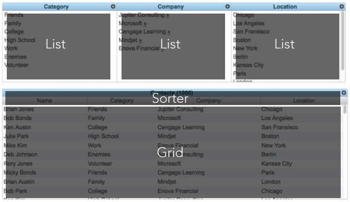

@page contacts Contacts
@parent examples 1

# Contacts

The contacts is a tutorial application that introduces and explains step-by-step how to architect a JavascriptMVC 3.0 style application.

This tutorial describes:

* Installing and running the application
* The application's structure and organization
* How the application's widgets were designed
* The anatomy of the application's widgets
* How we glued the application's widgets together using event-oriented-architecture

Using techniques we will cover in this tutorial, you will learn how to build an application that is very modular, testable, and easy to add-on to.

The contacts is a lightweight application that allows users to add and organize their friend's contact information.

## Setup

The application source is hosted by [GitHub](http://www.github.com); you can either download the application using GetJS
	
	./js steal/getjs contacts

or clone the code using the following commands:

	$ git clone https://github.com/jupiterjs/contacts
    $ cd contacts
    $ git submodule update --init

Once you get the application from GitHub you should have structure similar to below. 

	/todo [top-level, the GitHub repo]
  		/jquery
    		/class
    		/controller
    		/model
    		/view
    		jquery.js
    		...
  		/steal
    		/build
    		/generate
    		js
    		js.bat
    		steal.js
    		...
  		/funcunit
    		/qunit
      		qunit.js
      		...
    	/scripts
    		/test
    		funcunit.html
    		funcunit.js
    		qunit.html
    		...
  		/contacts
    		/scripts
    		/test
			/models
			/fixtures
			/views
    		funcunit.html
    		qunit.html
    		contacts.css
    		contacts.js
    		...
		contacts.html

To run the application, simply double click _contacts.html_ in the root folder.  We will be using fixtures to simulate the server responses so running it in a server configuration really isn’t necessary.

## Organizing Modules

The application is organized in a sense that everything is a widget.  This is a slightly different approach than applications are typically organized, as a big application with widgets in them.  This pattern and organization technique allows us to get the most re-use out of the widgets.  As we continue to build on the application, we simply just add more widgets.   

As you begin to build your application, a common practice I use is to look at the application and start splitting up the UI elements into widgets.  Below is a layout of the contact's widgets with their respective names over them.

Widgets are typically in two different categories; specific to the app, in this case contacts, or can be used in other projects.  The widgets that are more generic and can be used in other applications, I create a folder named the name of the organization I'm developing these widgets for.  Additionally, if I'm using a third-party widget library I would create another top-level folder for that repository.

This application is broken down into 3 main namespaces; these are: 

* MXUI
* jupiter
* contacts

### MXUI

MXUI, formally known as jQueryMX User Interface, is a widget library managed by Jupiter Consulting group.  It contains a set of low-level widgets that help you accomplish annoying things developers often have to face when building complex widgets.  It’s not intended to be another jQuery widget library but instead simple widgets and utilities to help you build the bigger picture.  

One example of a MXUI widget we are using in this application is: MXUI.Data.List.  List is a simple widget that given a model it will list the results.  Additionally, List will listen for update and destroy events to update the list accordingly.  In the next section, we will talk about developing highly reusable widgets like this one.

This is just one of many widgets you will find the library including several others like: Grid, List, Menuable, and many more. This project is open source and available on [GitHub](https://github.com/jupiterjs/mxui).

### Jupiter

Jupiter is where independent widgets and utilities go that could be used in ANY application.  These widgets should NOT be coupled to the contacts widget and would be very generic in nature so that you might re-use them on another project.  

One example of a widget we are using in this application is the _jupiter/style/style.js_.  Style is a widget that will style headers and box elements using jQueryUI CSS classes.

	steal('jquery').then(function($){
		var style$ = jQuery.sub();
		style$.extend(style$.fn,{
			box : function(){
				return this.addClass('ui-widget ui-widget-content ui-corner-all')
				},
				header : function(){
					return this.addClass('ui-helper-reset ui-state-active')
					},
					$ : function(){
						return $(this);
					}
					});
					$.fn.style$ = function(){
						return style$(this)
					}
				})

As you can see this could be used in any application you might be leveraging the jQueryUI CSS themes.  

### Contacts

The contacts widget is the primary widget in the application.  This widget will be where the application starts and will act as a master controller gluing all the widgets together.  When this widget is added to the page it will bring all the secondary widgets with it and then begin initializing them with the appropriate settings for the application.

	$.Controller("Contacts.Controller", {
		init: function(){
			
			this.params = new Mxui.Data();
			
			$("#category .list_wrapper").mxui_data_list({
				model : Contacts.Models.Category,
				show : "//contacts/views/categoryList",
				create: "//contacts/views/categoryCreate"
			});
				
			$("#location .list_wrapper").mxui_data_list({
				model : Contacts.Models.Location,
				show : "//contacts/views/categoryList",
				create: "//contacts/views/categoryCreate"
			});

The contacts widget will also listen for events on the widgets it initialized using JavascriptMVC event delegation to help facilitate cross-widget communication.

	"#category .list_wrapper activate": function(el, ev, item){
		this.params.attr("categoryId", item.id);
	}, 
	"#category .list_wrapper deactivate": function(el, ev, item){
		this.params.attr("categoryId", null);
	}

In the next section, we will touch more on the pattern used to facilitate this cross-widget communication.

Additionally in the contacts widget, you will find the building blocks of any JavascriptMVC application; models for communication with the server, fixtures for simulating AJAX responses from the server, and functional tests for testing the application as a whole.

## Designing Modules

Widgets in general should be dumb to whats going on around them. They should encapsulate all the logic that revolves around making them work internally and a provide a easy-to-use API for developers to use.  The first step in designing a widget is to define the input/outputs.

* Inputs - the parameters you pass the widget for it to initialize.  They can be required or optional based on your implementation. In jQuery's sense, these could be some of the default options you pass to your widget.  For example, a grid widget might have inputs such as: paging, sorting, and columns.

* Outputs - result of the widget's interaction.  Since widget's don't typical return a output directly; instead they typically wait for user input.  Therefore, we leverage callback parameters and/or listen for events to be triggered on the widget for our output.  Examples of widget output include: changed, created, destroyed.

Let's examine the inputs the _MXUI.Data.Grid_ uses for its input/outputs.

## Anatomy of the List Module

The category, location, and company are all filters for primary contacts grid.  Upon clicking one of these filters, the grid is then filtered using the selection.  These 3 filter all leverage _MXUI.Data.List_. 

We slightly touched on the list in an above topic when talking about the MXUI library but to reiterate, the List is a simple widget that given a model it will list the results and listen for updates to the items to update and/or destroy the UI. 

	$("#category .list_wrapper").mxui_data_list({
		model : Contacts.Models.Category,
		show : "//contacts/views/categoryList",
		create: "//contacts/views/categoryCreate"
	})

When initialized, you pass the List your model to which it will be listing the items from.  Since all models have a standard API designed after a _RESTful_ architecture for fetching items, we leverage that by executing a _findAll_.

	this.options.model.findAll(this.options.params, this.callback('list'))

If you look in our models, you won’t see any code sense we encapsulated all this into the base model for you.  If you dig through _jquery/model/model.js_ you will find this code.

	return function(params, success, error){
		return ajax(str || this.shortName+"s.json", 
			params, 
			success, 
			error, 
			fixture.call(this,"s"),
			get",
			"json "+this._shortName+".models");

Also in the initialization code, you will find we pass a show view.  After the model has completed its _findAll_, we will take those results and draw the UI from them.

	this.element.html(this.options.list,{
		items : this.options.sort ? items.sort(this.options.sort) : items,
		options: this.options
	});

Rarely ever after you draw a list will it stay the same.  Fortunately, List will listen for updates and deletes of items using the model that was passed to it to keep its list up-to-date as the application is used.

	"{model} updated" : function(model, ev, item){
    	var el = item.elements(this.element).html(this.options.show, item);
    	if(this.options.updated){
        	this.options.updated(this.element, el, item)
    	}
	},

In the next topic, we will discuss using this type of observer architecture so don’t fret if you’re not sure about the last bit of code.

As items are clicked in the list, we listen for these events using event delegation and apply a selected visual state to the item.

    ".item {activateEvent}" : function(el, ev){
		if(el.hasClass("activated")){
			this._deactivate(el)
		} else {
			var old = this.find(".activated");
			this._deactivate(old);
			this._activate(el);
		}
	},
	_deactivate: function(el){
		el.removeClass("activated");
		el.trigger("deactivate", el.model());
	},
	_activate: function(el){
		el.addClass("activated");
		el.trigger("activate", el.model());
	}
	
You might notice in the above code, we trigger a _activate_ event rather than a _click_ event when we call the activate method.  We want to create a abstraction layer and trigger one event since multiple events such as _click_ and _keydown_ will essentially do the same thing, activate a item.  For more information on this you can read the [Controller](http://edge.javascriptmvc.com/jmvc/docs.html#!mvc.controller) documentation.  The contacts master widget listens for this _activate_ event and reacts accordingly on.  In the next topic, I will discuss this type of event-oriented-architecture more in-depth.

The mission of this widget was simple; create a list of things that updates itself as the items change.  Yet you and I have probably wrote this a dozen times in our applications we have created ourselves.  The key to unlocking the unlimited potential of re-use is to create a widget with the simplest and most generic API as possible.  This exemplifies these traits by only passing a model and view.  The widget does the rest of the magic, making for a very elegant implementation in your application.

Another example that leverages List is our [Todo Application](http://javascriptmvc.com/todo/).

## Gluing Modules Together

The contacts application is broken down into 4 main modules: 

* Category
* Company
* Locations
* Contacts

These main modules were designed in a sense they could all operate independently from each other, so now to finish off the application we have to glue them all together.  To accomplish this feat, we are going to leverage event-oriented-architecture to integrate them into the application but at the same time keep them decoupled from each other.

### Event-oriented-architecture

Traditional widget architecture often involves passing around callbacks.  

	$('div').modal({
		closeCallback: windowClosed,
		showCallback: windowOpened
	});

This type of architecture in not desirable for many reasons, such as:

* The widget should be as dumb as possible.  Therefore, when you pass a callback your widget becomes coupled to its parent widget because it becomes aware of the context it’s used.  Secondly, if you have your widget listening for various DOM events from child widgets, you are coupling it as well.

* When you pass callbacks, only one other widget can listen for that callback.  It creates a 1-to-1 architecture, which limits the scalability of the application.

* Passing callbacks clutters the API and becomes a burdensome for new developers trying to learn all the callbacks available for the widget.

Another approach that traditional widget architecture uses is triggering DOM events when actions are completed.  This is also not desirable because:

* The widget should be as dumb as possible.  If you have your widget listening for various DOM events from child widgets, you are coupling it.

* DOM Events can introduce an extra communication point with the controller layer that isn’t always necessary.  Sometimes, you might want to simply talk directly to the model layer.  For instance, in our grid in the contacts application when you page to the next page, we want update the model directly passing the new filter.

Events are defined as significant change in state.  EOA is a pattern that is defined by the detection and consumption of these changes in state.   Rather than taking the traditional architecture approach that I slated above and inheriting its flaws, we decided to craft the contacts application using this EOA architecture. 

### Examples of EOA

As items are clicked in the list, the list bubbles the activate event to the master contact widget passing an instance of the item’s model that was selected.  

	el.trigger("activate", el.model());

_Pro Tip:  Because we bound instances of models using EJS, in our controller code we can call .model() on the element that was bound to retrieve the model._

	<% for(var i =0 ; i < items.length;i ++){ %>
  		<li <%= items[i]%> >

The contacts widget then observes this change in state using event delegation and updates the grid parameters.

	"#category .list_wrapper activate": function(el, ev, item){
		this.params.attr("categoryId", item.id);
	}
	

The grid parameters are a model instance that is defined in _MXUI.Data_.  This model model has some preset attributes, defaults, and helper methods for using when listing items in widgets such as a grid.  It defines things such as: 

* limit - the maximum number of items to come back
* offset – the current “page” we might be on
* count – the total number of items

In the sample code above you see we do _attr_ on this model object to updates the model instance’s current parameters.  The JavascriptMVC Model implements an observer pattern so as changes are made to its attributes, widgets can listen for the _updated_ event to be trigger and react accordingly.  

In our case, the grid is listening for changes of the attributes.  When we triggered the activate above and changes the _categoryId_ of the params object the grid observes this change and consequently executes a new AJAX request to update its view. 

	"{params} updated.attr" : function(params, ev, attr, val){
		if(attr !== 'count'){
			//want to throttle for rapid updates
			clearTimeout(this.newRequestTimer,100)
			this.newRequestTimer = setTimeout(this.callback('newRequest', attr, val))
		}
	},
	
	newRequest : function(attr, val){
		var clear = true; 
		if(!this.options.newPageClears && attr == "offset"){ // if offset changes and we have newPageClears false
			clear = false;
		} 
		this.options.model.findAll(this.options.params.attrs(), this.callback('list', clear))
	}

### Model Events

Model events are events that are fired when CRUD operations (create/update/delete) occur on a model instance.

Earlier in the article, I teased you with a glimpse of the model events used in the List design section.  We were mentioning how the list would keep itself up-to-date listening for created, updated, and destroyed events from the model.

	"{model} updated" : function(model, ev, item){
    	var el = item.elements(this.element).html(this.options.show, item);
    	if(this.options.updated){
        	this.options.updated(this.element, el, item)
    	}
	}

In this example, as model changes are made, such as an update to a contact name; we listen for these changes in the List and update the UI accordingly.

## Wrap-up

In this article, we peeled back some of the layers that comprise the contacts application and JavascriptMVC.  By now, you should have a good understanding of how the contacts application works.  

Additionally, we explored how you can structure and organize your application for making the most of widget re-use. How to design widgets that are very modular, testable, and have easy-to-use APIs.  Finally, we covered how to glue your new found widgets together without coupling them using event-oriented-architecture.